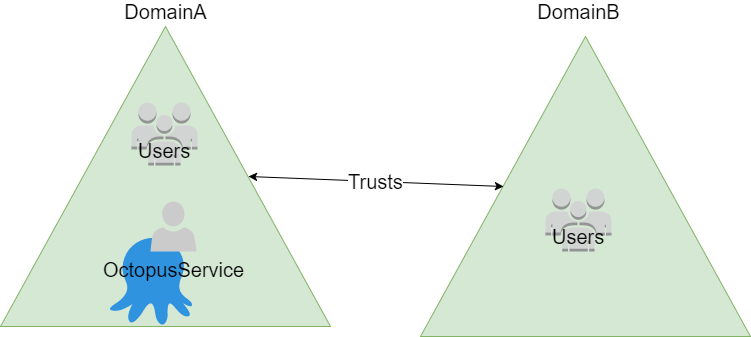
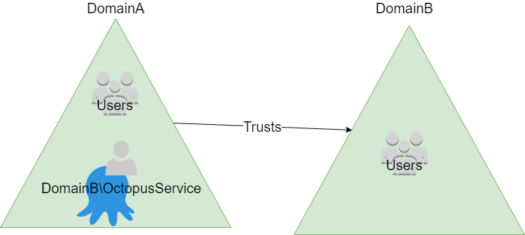

Octopus Deploy can use Windows credentials to identify users. This option is chosen during installation of the Octopus Deploy server, or can be configured later.

:::hint
**Domain user required during setup**
When you go through the Octopus setup wizard, or run the commands below to switch to AD authentication mode, make sure you are signed in to Windows as a domain user. If you are signed in as a local user account on the machine (a non-domain user) you won't be able to query Active Directory, so setup will fail.
:::

## Active Directory sign in options {#ActiveDirectoryauthentication-ActiveDirectorysigninoptions}

If you are using Active Directory Authentication with Octopus, there are two ways to sign in.

1. Integrated authentication
2. Forms-based

## Integrated authentication {#ActiveDirectoryauthentication-Integratedauthentication}

The easiest way to sign in when using Active Directory is to click the *sign in with your Microsoft Windows account* link.


This will instruct the Octopus server to issue a browser challenge. If you are signed in on Windows, your Windows credentials will be automatically used to sign you in.

By default, Octopus issues an NTLM challenge to the browser, but you can configure Octopus to use other authentication schemes using the command line:

**Changing authentication schemes**

```bash
Octopus.Server.exe service --stop
Octopus.Server.exe configure --webAuthenticationScheme=IntegratedWindowsAuthentication
Octopus.Server.exe service --start
```

You can use `IntegratedWindowsAuthentication` to instruct Octopus to use Kerberos instead. [Read about other supported values](https://msdn.microsoft.com/en-us/library/system.net.authenticationschemes(v=vs.110).aspx).

:::hint
**How it works**
Octopus is built on top of HTTP.sys, the same kernel driver that IIS is built on top of. You may be familiar with "Integrated Windows Authentication" in IIS; this is actually provided by HTTP.sys. This means that Octopus supports the same challenge-based sign-in mechanisms that IIS supports, including Integrated Windows Authentication.

When the link is clicked, it redirects to a page which is configured to tell HTTP.sys to issue the browser challenge. The browser and HTTP.sys negotiate the authentication just like an IIS website would. The user principal is then passed to Octopus. Octopus will then query Active Directory for other information about the user.
:::

## Forms-based authentication with Active Directory {#ActiveDirectoryauthentication-Forms-basedauthenticationwithActiveDirectory}

Octopus also lets users sign in by entering their Active Directory credentials manually using the HTML form. This is useful if users sometimes need to authenticate with a different account than the one they are signed in to Windows as, or if network configuration prevents integrated authentication from working correctly.


:::hint
**How it works**
Using this option, the credentials are posted back to the Octopus server, and Octopus validates them against Active Directory by invoking the Windows API `LogonUser()` function. If that is successful, Octopus will then query Active Directory for information about the user.

Keep in mind that if your Octopus server isn't [configured to use HTTPS](/docs/how-to/expose-the-octopus-web-portal-over-https.md), these are posted in plain text (just like signing in to any other website).
:::

If the Octopus Deploy server and its users are on the **same domain**, it is sufficient to provide a simple username in this field, for example *paul**.*User Principal Names, of the form *user@domain.com* are also accepted in this scenario.

If the server and its users are on different domains, or **many domains** are in use, the *DOMAIN\user* username format must be provided for users who are not a member of the domain the server is in.

See below for more details and examples related to Trusted Domains.

:::hint
Users will receive the error "**Username not found.  UPN format may not be supported for your domain configuration."** if they have entered a UPN and their details could not be located in the domain. This could occur because the UPN really doesn't exist, or it exists in a domain other than the one the Octopus Deploy server is in (which as stated above is not supported).
:::

Forms-based authentication can also be disabled:

**Disabling HTML form sign-in**

```bash
Octopus.Server.exe service --stop
Octopus.Server.exe configure --allowFormsAuthenticationForDomainUsers=false
Octopus.Server.exe service --start
```

This will result in integrated sign in being the only option:


## Switching between username/password and Active Directory authentication {#ActiveDirectoryauthentication-Switchingbetweenusername/passwordandActiveDirectoryauthentication}

It is possible to reconfigure an existing Octopus Deploy server to use a different authentication mode.

:::problem
**User accounts are distinct**
In versions prior to 3.5, Octopus Deploy maintains different User records for Active Directory and username/password accounts. That is, a user *paul* created with username/password authentication will be a different account to the user *paul* found in Active Directory. This means that after switching between authentication types, teams and preferences will need to be reconfigured.

When switching from username/password to Active Directory, after running the below commands you will find that duplicate accounts are created the first time an Active Directory user logs into Octopus Deploy. The pre-existing account should be either be deleted directly after the switch, or deleted after the user logs in for the first time using the Active Directory account. The Active Directory provisioned account will be recognizable as *paul*@domain compared to *paul*.

In 3.5 the User records are handled differently, [learn more](/docs/administration/authentication-providers/index.md#AuthenticationProviders-usersandauthprovidersUsersandAuthenticationProviders).
:::

### To select Active Directory authentication {#ActiveDirectoryauthentication-ToselectActiveDirectoryauthentication}

To switch from username/password authentication to Active Directory authentication, use the following script from an administrative command prompt on the Octopus Server:

**Selecting Active Directory authentication**

```bash
Octopus.Server.exe service --stop
Octopus.Server.exe configure --webAuthenticationMode=Domain
Octopus.Server.exe admin --username=YOURUSERNAME
Octopus.Server.exe service --start
```

The text `YOURUSERNAME` should be your Active Directory account name, in either **user@domain** or **domain\user** format (see [Authentication Providers](/docs/administration/authentication-providers/index.md)).

### To select username/password authentication {#ActiveDirectoryauthentication-Toselectusername/passwordauthentication}

To switch from Active Directory authentication to username/password authentication, use the following script from an administrative command prompt on the Octopus Server:

**Switching to username/password authentication**

```bash
Octopus.Server.exe service --stop
Octopus.Server.exe configure --webAuthenticationMode=UsernamePassword
Octopus.Server.exe admin --username=YOURUSERNAME
Octopus.Server.exe service --start
```

### To specify a custom container {#ActiveDirectoryauthentication-Tospecifyacustomcontainer}

In Octopus Deploy version 2.5.11 and newer you can specify a custom container to use for AD Authentication. This feature addresses the issue of authenticating with Active Directory where the Users container is not in default location and permissions prevent queries as a result. Specifying the container will result in the container being used as the root of the context. The container is the distinguished name of a container object. All queries are performed under this root which can be useful in a more restricted environment. This may be the solution if you see a "The specified directory service attribute or value does not exist" error when using Active Directory authentication.

**Setting a custom container**

```bash
Octopus.Server.exe service --stop
Octopus.Server.exe configure --activeDirectoryContainer "CN=Users,DC=GPN,DC=COM"
Octopus.Server.exe service --start
```

Where `"CN=Users,DC=GPN,DC=COM"` should be replaced with your Container.

### Trusted Domains {#ActiveDirectoryauthentication-TrustedDomains}

Using Trusted Domains is supported by Octopus Deploy.  Users from the domain the Octopus Deploy server is a member of will always be allowed to log in.  Users from domains that the Octopus Deploy server's domain trusts will also be able to log in.

The following diagram illustrates a typical configuration when there is a 2 way trust between the domains.



In this configuration the Octopus server is executing as a service account from the same domain that the machine is a member of. When logging in, users from DomainA can use their AD username or UPN whereas users from DomainB must use *DOMAIN\user* username format. This is required so that the API calls Octopus makes can locate the domain controller for the correct domain (DomainB in this example).

Another common scenario is to have a 1 way trust between the domains. This configuration is illustrated in the following diagram



In this example, DomainA trusts DomainB. Given that both domains trust users from DomainB, the Octopus service should be configured to run as an account from DomainB. If the service was configured to run as an account from DomainA then users from DomainB wouldn't be able to log in and Octopus wouldn't be able to query group information from DomainB.

Learn about [configuring Teams to utilize Trusted Domains](/docs/administration/managing-users-and-teams/external-groups-and-roles.md).

### Troubleshooting {#ActiveDirectoryauthentication-Troubleshooting}

For more information on troubleshooting, see [Troubleshooting Active Directory integration](/docs/administration/authentication-providers/troubleshooting-active-directory-integration.md).
