:::hint
Azure Active Directory (AAD) authentication is available in Octopus Deploy 3.5 and later
:::

To use Azure Active Directory (AAD) authentication with Octopus you will need to get a few pieces lined up just right:

1. Configure AAD to trust your Octopus Deploy instance (by setting it up as an App in AAD)
2. Optionally map AAD Users into Roles so you the users can be automatically connected to Octopus Teams.
3. Configure your Octopus Deploy instance to trust and use AAD as an Identity Provider.

## Configuring Azure Active Directory (AAD) {#AzureADauthentication-ConfiguringAzureActiveDirectory(AAD)}

The first steps are to configure your Azure Active Directory to trust your instance of Octopus Deploy by configuring an App in your AAD.

### Configure Octopus Deploy as an App in your AAD {#AzureADauthentication-ConfigureOctopusDeployasanAppinyourAAD}

The following instructions are based on the "[new](https://portal.azure.com)" Azure Portal's **Azure Active Directory** service because the "old" portal at [https://manage.windowsazure.com](https://manage.windowsazure.com) is no longer in use by Microsoft Azure.

:::success
**Get the right permissions for your Azure Active Directory tenant before starting**
In order to configure the your instance of Octopus Deploy as an App, you will need administrator permissions to the desired Azure Active Directory tenant in your subscription.
:::

1. Login to the "[new](https://portal.azure.com)" Azure Portal, click on your account positioned at the top-right of the screen, then select your desired directory.

   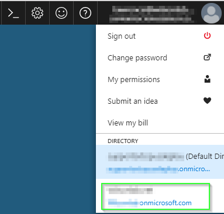

2. Click the **All services** button and select the **Azure Active Directory** service.

   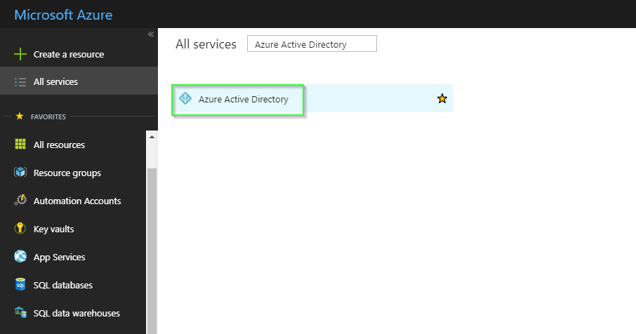

3. Select **App registrations** then choose **New application registration**

   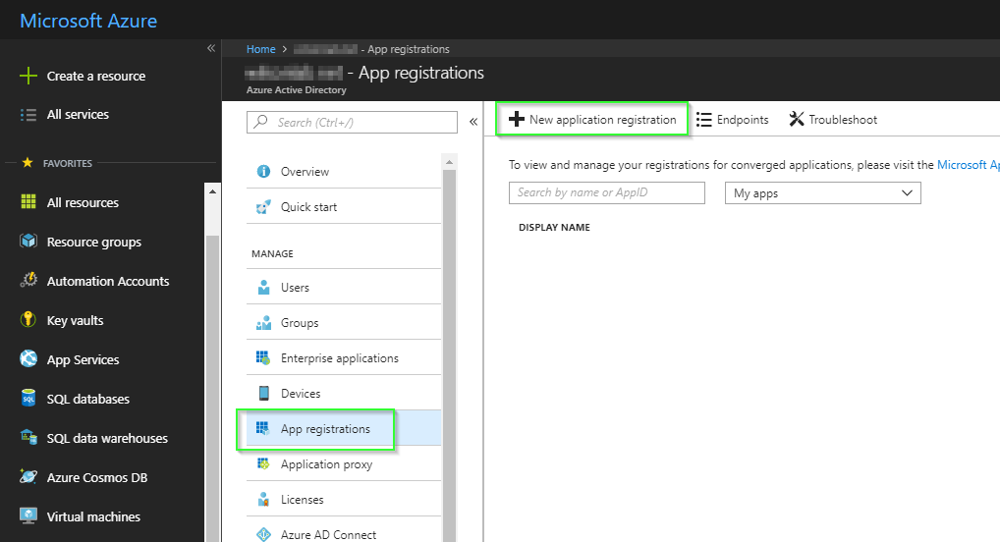

4. Choose a **Name** like *Octopus Deploy*, specify **Application Type** of *Web app/API*, and enter a value for **Sign-On URL** like *https://octopus.example.com* Then click **Create**. 
 - The value you specify for Name will appear at the top of the Azure authentication page when the users are entering their credentials.
 - The value you specify for Sign-On URL should be a public URL to your own Octopus Server.
 
   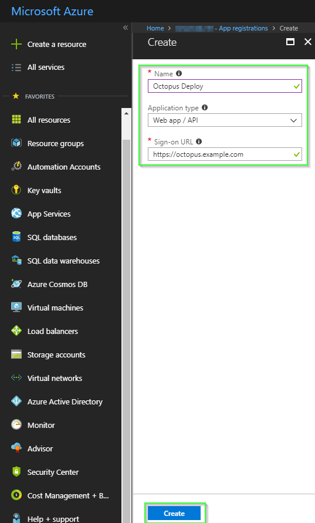

#### Configuring trusted Reply URLs {#AzureADauthentication-ConfiguringtrustedReplyURLs}

During the authentication with Azure AD, the user will be directed to an Azure page to enter their credentials. As part of the authentication flow, Octopus passes a Reply URL to tell Azure where to POST the user's security token. This URL must be added to a trusted whitelist in the App configuration or the authentication flow will be terminated by Azure.

1. Find your new App registration in AzureAD.
To ensure your new App registration appears in the list, you will need to set the filter to **All apps**.
   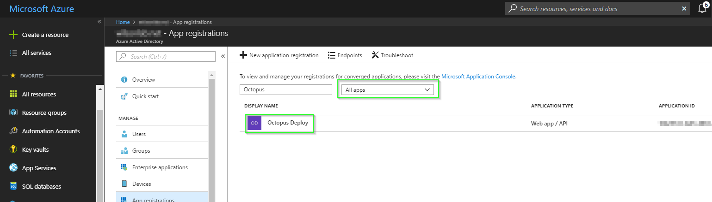

2. Select **Settings** and choose **Reply URLs**. Under the Reply URLs section, enter the public URL to your Octopus Server with `/api/users/authenticatedToken/AzureAD` attached to the end.
In our example this would be `https://octopus.example.com/api/users/authenticatedToken/AzureAD`

   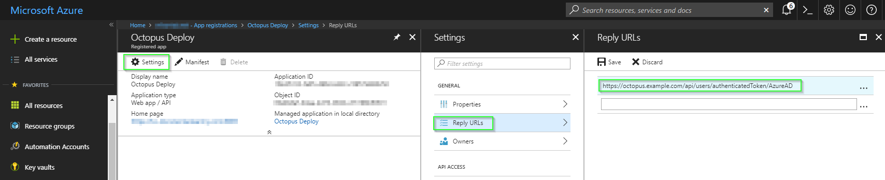

Please take care when adding this URL! They are **case-sensitive** and can be sensitive to trailing **slash** characters. The specification highly recommends using SSL to ensure the security and integrity of your tokens. You can use `http` here if you do not have SSL enabled on the public interface of your Octopus Server. Please beware of the security implications in accepting a security token over an insecure channel.


#### Mapping AAD Users into Octopus Teams (optional) {#AzureADauthentication-MappingRolesMappingAADUsersintoOctopusTeams(optional)}

If you want to manage user/team membership via AAD, you will need to configure Roles for your App.  To add a Role(s) you will need to edit the App's manifest.

1. Under the App Registration, select **Manifest** and select **Edit** to modify your manifest as required.

  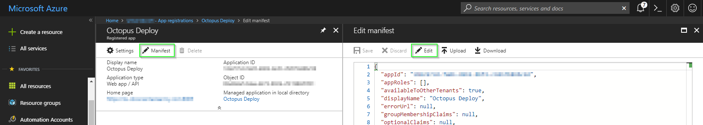

The example below illustrates two roles, one for administrators and one for application testers.

:::success
Make sure you replace `NEWGUID` with a generated guid.
:::

```json
{
  "appId": "myAppGuid",
  "appRoles": [
	{
		"id": "NEWGUID",
		"allowedMemberTypes": ["User"],
		"description": "Octopus Administrators",
		"displayName": "Octopus Admins",
		"isEnabled": true,
		"value": "octopusAdmins"
	},
	{
		"id": "NEWGUID",
		"allowedMemberTypes": ["User"],
		"description": "Octopus Testers",
		"displayName": "Octopus Testers",
		"isEnabled": true,
		"value": "octopusTesters"
	}
  ]
}
```

Once you have completed editing the manifest, select the **Save** option.

  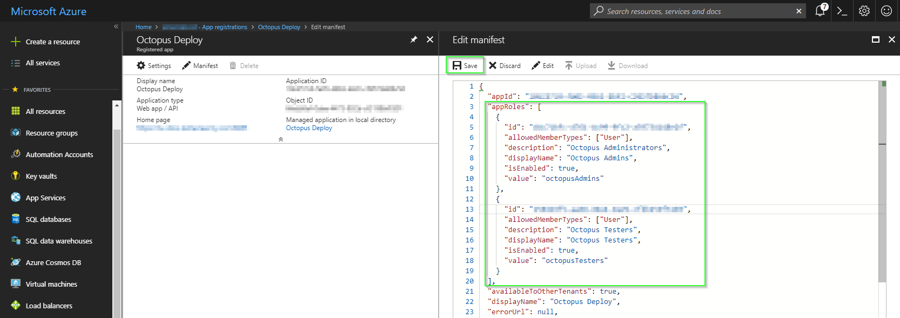
  

:::hint
The **value** property is the most important one. This value becomes the external Role ID you will use later on when [adding this role to a Team](/docs/administration/managing-users-and-teams/index.md) in Octopus Deploy.
:::

:::success
**Want a more advanced manifest?**
For more advanced scenarios, please see the [Azure manifest file documentation](https://azure.microsoft.com/en-us/documentation/articles/active-directory-application-manifest/).
:::

#### Setting up users and groups in Azure AD {#AzureADauthentication-SettingupusersandgroupsinAzureAD}

Once the App Role(s) have been defined, users/groups from Azure AD may be mapped into these Roles.

 1. Under the App Registration, select your App registrations name under **Managed application in local directory**.

  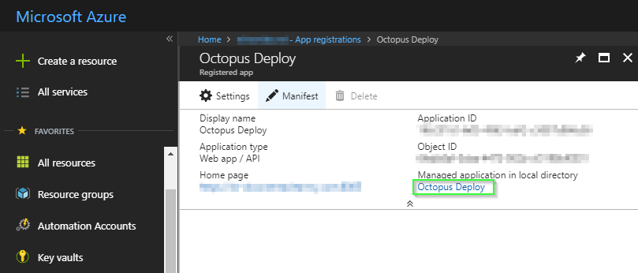

2. Choose **Users and groups** and select **Add user** to create a new role assignment.

3. Select the users which you would like to assign roles to. Next, under **Select Role** specify one of the AppRoles that you added to the App registration manifest.

  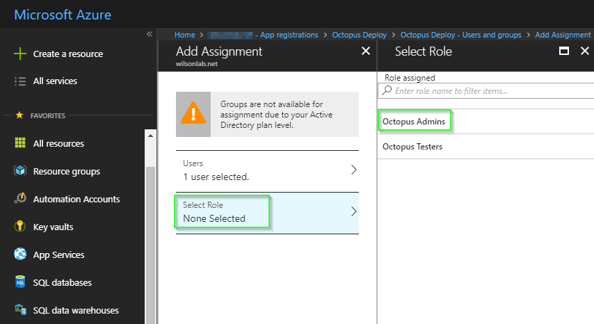
  
4. To save your changes, select the **Assign** button.

:::hint
If you only have one Role it will be automatically assigned. If you have **multiple** Roles a popup will appear when you click the **Assign** button so you can select the Role to assign.
:::

## Configuring Octopus Deploy Server {#AzureADauthentication-ConfiguringOctopusDeployServer}


### Get the Client ID and Issuer {#AzureADauthentication-GettheClientIDandIssuer}

There are two values you will need from the Azure AD configuration to complete the Octopus configuration: the **Client ID** and **Issuer**.

#### Using the Azure portal {#AzureADauthentication-UsingthemodernAzureportal}

1. In the Azure portal, the **Application ID** in your App's **Essentials section** is your **Client ID**

  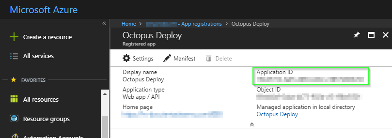

2. The GUID for the **Issuer** is your Azure Active Directory Tenant ID which can be found in the **Properties** sheet of Azure Actice Directory

 

### Setting the Client ID and Issuer into Octopus Deploy {#AzureADauthentication-SettingtheClientIDandIssuerintoOctopusDeploy}

:::success
Your **Client ID** should be a GUID.

Your **Issuer** should be a URL like `https://login.microsoftonline.com/GUID` where the GUID is a special GUID identifying your Azure Active Directory tenant.
:::

Once you have those values, run the following from a command prompt in the folder where you installed Octopus Server:

```powershell
Octopus.Server.exe configure --azureADIsEnabled=true --azureADIssuer=Issuer --azureADClientId=ClientID

#Eg:
# Octopus.Server.exe configure --azureADIsEnabled=true --azureADIssuer=https://login.microsoftonline.com/12341234-xxxx-xxxx-xxxx-xxxxxxxxxxxx --azureADClientId=43214321-xxxx-xxxx-xxxx-xxxxxxxxxxxx
```

Alternatively these settings can be defined through the user interface by selecting {{Configuration,Settings,Azure AD}} and populating the fields `Issuer`, `ClientId` and `IsEnabled`.


### Assign App registration roles to Octopus Teams (Optional) {#AzureADauthentication-SettingtheClientIDandIssuerintoOctopusDeploy}

If you followed the optional steps for modifying the App registration's manifest to include new roles, you can assign them to **Teams** in the Octopus Portal.

1. Open the Octopus Portal and select {{Configuration,Teams}} 

2. Either Create a new **Team** or select an existing one.

3. Under the **Members** section, select the option **Add External Group/Role**
 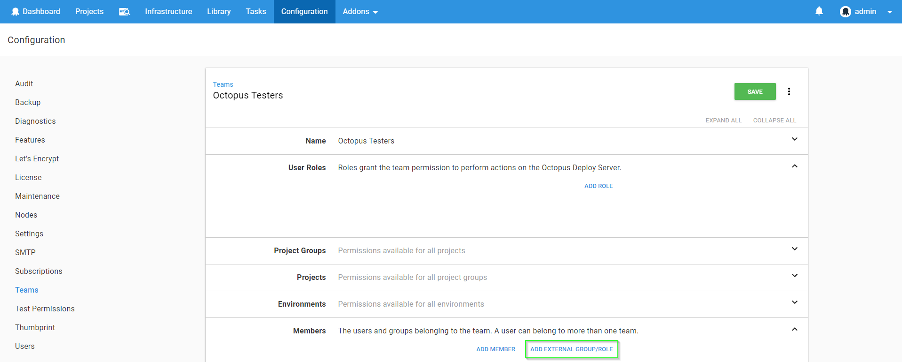
 
4. Enter the details from your App registration's manifest. In this example we need to supply `octopusTesters` as the **Group/Role ID** and `Octopus Testers` as the **Display Name** 
 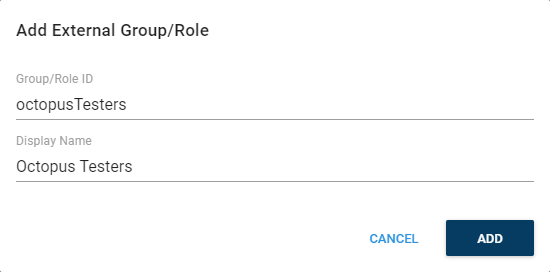

5. Save your changes by clicking the **Save** button.

### Octopus user accounts are still required {#AzureADauthentication-Octopususeraccountsarestillrequired}

Even if you are using an external identity provider, Octopus still requires a [user account](/docs/administration/managing-users-and-teams/index.md) so you can assign those people to Octopus teams and subsequently grant permissions to Octopus resources. Octopus will automatically create a [user account](/docs/administration/managing-users-and-teams/index.md) based on the profile information returned in the security token, which includes an **Identifier**, **Name**, and **Email Address**.

:::hint
**How Octopus matches external identities to user accounts**
When the security token is returned from the external identity provider, Octopus looks for a user account with a **matching Identifier**. If there is no match, Octopus looks for a user account with a **matching Email Address**. If a user account is found, the External Identifier will be added to the user account for next time. If a user account is not found, Octopus will create one using the profile information in the security token.
:::

:::success
**Already have Octopus user accounts?**
If you already have Octopus user accounts and you want to enable external authentication, simply make sure the Email Address matches in both Octopus and the external identity provider. This means your existing users will be able to sign in using an external identity provider and still belong to the same teams in Octopus.
:::

### Getting permissions

!include <admin-user>

## What next? {#AzureADauthentication-Whatnext?}

Now you're using an external identity provider it is easy to increase your security. You could consider configuring [Multi-Factor Authentication](https://docs.microsoft.com/en-us/azure/multi-factor-authentication/multi-factor-authentication) - after all Octopus Deploy has access to your production environments!

You should also consider disabling any authentication providers you aren't using, like Username and Password authentication which can now be disabled since Octopus Deploy 3.5.

## Troubleshooting {#AzureADauthentication-Troubleshooting}

We do our best to log warnings to your Octopus Server log whenever possible. If you are having difficulty configuring Octopus to authenticate with Azure Active Directory, be sure to check your [server logs](/docs/support/log-files.md) for warnings.

### Double and Triple check your configuration {#AzureADauthentication-DoubleandTriplecheckyourconfiguration}

Unfortunately security-related configuration is sensitive to everything. Make sure:

- you don't have any typos or copy-paste errors
- remember things are case-sensitive
- remember to remove or add slash characters as we've instructed - they matter too!

### Check OpenID Connect metadata is working {#AzureADauthentication-CheckOpenIDConnectmetadataisworking}

You can see the OpenID Connect metadata by going to the Issuer address in your browser adding`/.well-known/openid-configuration` to the end. In our example this would have been something like `https://login.microsoftonline.com/b91ebf6a-84be-4c6f-97f3-32a1d0a11c8a/.well-known/openid-configuration`

### Inspect the contents of the security token {#AzureADauthentication-Inspectthecontentsofthesecuritytoken}

Sometimes the contents of the security token sent back by Azure AD aren't exactly the way Octopus expected, especially certain claims which may be missing or named differently. This will usually result in the Azure AD user incorrectly mapping to a different Octopus User than expected. The best way to diagnose this is to inspect the JSON Web Token (JWT) which is sent from Azure AD to Octopus via your browser. To inspect the contents of your security token:

1. Open the Developer Tools of your browser and enable Network logging making sure the network logging is preserved across requests.
2. In Chrome Dev Tools this is called "Preserve Log".

   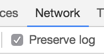

3. Attempt to sign into Octopus using Azure AD and find the HTTP POST coming back to your Octopus instance from Azure AD on a route like `/api/users/authenticatedToken/azureAD`. You should see an `id_token` field in the HTTP POST body.
4. Grab the contents of the `id_token` field and paste that into [https://jwt.io/](https://jwt.io/) which will decode the token for you.

   

5. Don't worry if jwt.io complains about the token signature, it doesn't support RS256 which is used by Azure AD.
6. Octopus uses most of the data to validate the token, but primarily uses the `sub`, `email` and `name` claims. If these claims are not present you will likely see unexpected behavior.

### Get in touch with our support team {#AzureADauthentication-Getintouchwithoursupportteam}

If you aren't able to resolve the authentication problems yourself using these troubleshooting tips, please reach out to our [support team](https://octopus.com/support) with:

1. The contents of your OpenID Connect Metadata or the link to download it (see above) - this can be different for each Azure AD App.
2. A copy of the decoded payload for some security tokens (see above) - perhaps some are working as expected and others are not.
3. A screenshot of the Octopus User Accounts including their username, email address and name.
