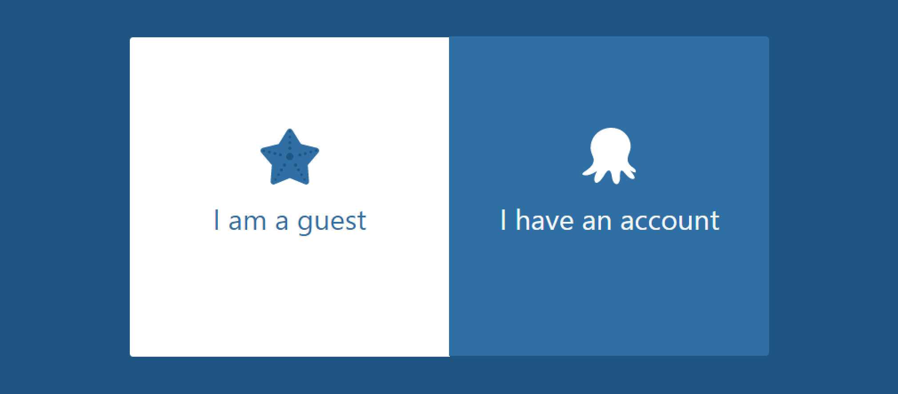
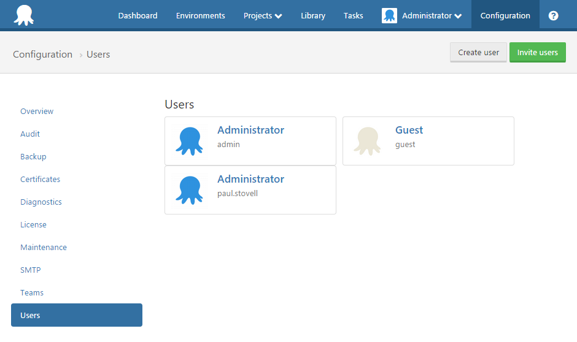
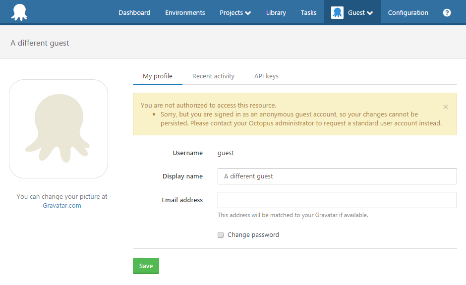

Sometimes you may wish to allow users to access your Octopus server, without requiring them to create an account. Octopus provides the ability to configure a special guest login for your Octopus Deploy server.

When guest login is enabled, the sign in page for the Octopus web portal will present users with a choice to either sign in as a guest, or to sign in with their standard account:



## Enable Guest user via UI {#Guestlogin-Enableguestlogin}

In Octopus 4.0 we added the ability to enable your guest account via the UI. The option can be found under Configuration -> Settings -> Guest Login. From there you can select the `Is Enabled` button the active the the Guest account.


The guest account will now be activated and added to your Octopus Users.

## Guest user permissions {#Guestlogin-Guestuserpermissions}

The guest user is created as a standard user managed by Octopus. If you are using Active Directory authentication, you don't need a matching AD user account. The user is automatically added to the **Everyone** team. The guest user can be found in the **Users** tab in the **Configuration** area:



As with any standard user, you can [assign the guest account to different teams](/docs/administration/managing-users-and-teams/index.md) to give them permissions to view projects or environments.

:::success
**Guest is read-only**
The guest user is designed to be used by multiple people, so it has one additional limitation that other users do not have: the account is completely read-only, despite any roles it might be granted.

For example, you could assign the guest user to your **Octopus Administrators** team, which normally gives the user full access to everything. However for the guest account, this will be read-only - they will be able to view all settings, but they won't be able to change anything. They can't even change their profile settings! Any attempt to make any changes will result in the following message:


:::

:::warning
Please note, if you do add the guest user to your **Octopus Administrators** team, they will be able to view **all** settings and configuration. This includes viewing the license key, viewing the private keys for any uploaded certificates and potentially other information you dont want readable. Depending on your use case, you may want to create a custom role instead.
:::

## Configuring guest login {#Guestlogin-Configuringguestlogin}

Octopus Server can be configured to enable or disable guest access via the command line, as follows:

```powershell
Octopus.Server.exe configure --instance=[your_instance_name] --guestLoginEnabled=true
```
