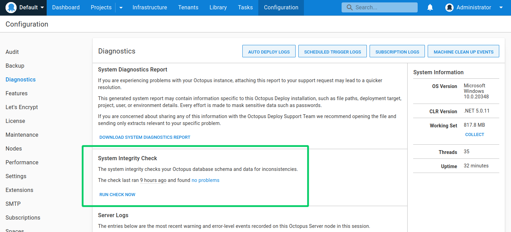

To store environments, projects, variables, releases, and deployment history, Octopus Deploy uses a Microsoft SQL Server database.

## Install Octopus Server {#Octopusdatabase-InstallingOctopusServer}{#installing}

Octopus Server requires access to a SQL Server to use for storing relational data. You can create the database ahead of time, or you can let the installer create the database on your behalf. Refer to [SQL Server Database requirements](/docs/installation/sql-server-database.md) for more information on the SQL Server editions supported by Octopus Deploy and installation instructions.

## Routine maintenance {#maintenance}

:::hint
This section only applies to self-hosted versions of Octopus Server, [Octopus Cloud](/docs/octopus-cloud/index.md) instances perform database maintenance in the background without user interaction.
:::

You are responsible for the routine maintenance of your Octopus database. Performance problems with your SQL Server will make Octopus run and feel slow and sluggish. You should implement a routine maintenance plan for your Octopus database. Here is a [sure guide](https://oc.to/SQLServerMaintenanceGuide) (free e-book) for maintaining SQL Server.

That being said, Octopus will perform minimal routine maintenance of the database for you. In particular, it will periodically run the following tasks:
* Reorganize and rebuild heavily fragmented indexes (this operation is done in the background without any downtime when running on Azure SQL or SQL Enterprise).
* Update query optimization statistics for all tables.

If your database server does not support online index reorganization, Octopus will perform index maintenance every time your Octopus Deploy instance is updated.

The schedules for these tasks can be configured via **{{Configuration, Settings, SQL Maintenance}}**. Each schedule is defined as a [cron expression](https://en.wikipedia.org/wiki/Cron#Overview). These settings can also be overridden via the following environment variables: `OCTOPUS__Sql__IsMaintenanceEnabled`, `OCTOPUS__Sql__IndexMaintenanceSchedule`, `OCTOPUS__Sql__StatisticsUpdateSchedule`.

If you already perform your own scheduled maintenance, and would like Octopus to not do this for you, then you can also disable database maintenance via **{{Configuration, Settings, SQL Maintenance}}**.

### Database backups {#Octopusdatabase-DatabaseBackups}{#backups}

You are responsible for taking database backups and testing your disaster recovery plans. Refer to [Backup and restore](/docs/administration/data/backup-and-restore.md) for more information about backing up Octopus Deploy and recovering from failure.

### High availability databases {#Octopusdatabase-highavailability}{#highavailability}

If you are looking for a highly-available database solution, we recommend using [Always On Availability Groups](https://docs.microsoft.com/en-us/sql/database-engine/availability-groups/windows/overview-of-always-on-availability-groups-sql-server?view=sql-server-2017). Unfortunately, Octopus Server does not support running against a SQL database with Database Mirroring or SQL Replication enabled.  

## Schema {#schema}

Octopus should be given its own database - the database should not be shared with any other applications. Octopus Server maintains its own schema - it will create the initial database schema upon installation, and it will update the schema when you upgrade Octopus Server.

The System Integrity Check at **{{Configuration,Diagnostics}}** will let you know if the database schema has drifted from its intended state.

### Modifying the schema {#modifying-the-schema}

If you customize the Octopus database it may cause problems when upgrading Octopus Server, and make your installation difficult to support. There are certain scenarios where you can modify the schema safely (indexes, statistics), and other scenarios which will cause Octopus Server to fail (tables, views, stored procedures, functions).

### Index recommendations

Each installation of Octopus Deploy will have different data and usage patterns. Some of our customers have huge environments and a few projects, others have many projects deploying to small environments. Some customers may create hundreds of releases each day, whilst others deploy releases every few days. As a result, the Database Engine Tuning Advisor, or hosted offerings like Azure SQL Database, may suggest performance optimizations like creating additional indexes.

**Feel free to create database indexes which suit your scenario, but please understand the impact of modifying the schema.**

We make certain assumptions about the database schema when you upgrade Octopus Server, and the presence (or absence) of indexes may cause your upgrade to fail. The upgrade process will automatically detect any "additional indexes" and then log warnings about the extra indexes.

If you feel like an index would benefit everyone using Octopus, please contact our [support team](https://octopus.com/support) so we can consider making that index part of the standard database schema.

:::hint
**Azure SQL Database automatic index management**
To ensure that you are aware of which Indexes exist so that you can drop/recreate them between upgrades, we suggest disabling the Azure SQL feature to [automatically apply performance recommendations](https://azure.microsoft.com/en-us/documentation/articles/sql-database-advisor-portal/#enable-automatic-index-management), and apply the recommendations manually instead.
:::
