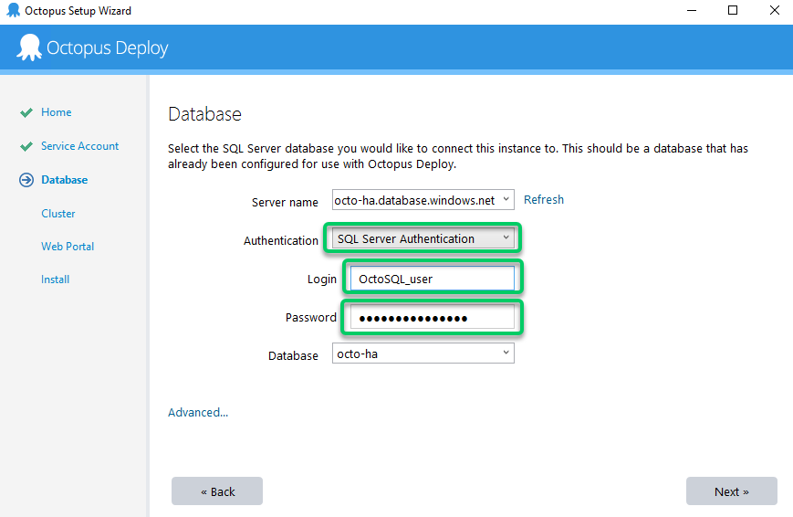
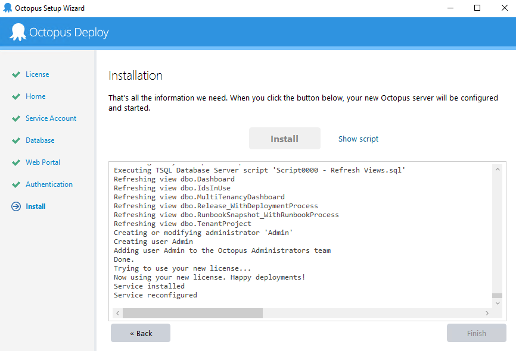

With the servers provisioned, and the shared storage and database now available, you can now set up each of the Octopus Server nodes. An Octopus High Availability configuration requires at least two nodes, and has been tested with up to eight nodes.

This document covers the configuration of Octopus **without Active Directory** and assumes the following:

- You've planned and implemented your Infrastructure for Octopus and it's ready to be configured for High Availability without Active Directory.
- No Service accounts will be used for authentication to Storage or SQL
- SQL Authentication will be used over Windows Authentication
- You are configuring Octopus on a cloud provider or in a DMZ

:::hint
**Not a Windows cluster**
While multiple Octopus Server nodes form a logical "cluster" of servers, Octopus nodes do not require Windows Server Failover Clustering. They should be standalone servers and they can be on-Premises, in Azure or AWS.
:::

## Configure the first node

On the first Octopus Server node, [download the Octopus Server MSI](https://octopus.com/downloads), or you can install Octopus using [Chocolatey](https://community.chocolatey.org/packages/OctopusDeploy) and walk through the setup wizard. Use the Getting Started wizard to configure the first Octopus node:


:::hint
The Octopus home directory is local to each specific node, and **should not be shared** between nodes. This is usually located at `C:\Octopus`.
:::


Since each node will use shared storage, ensure you use a service account that has permission to access the shared database:


Configure the shared SQL database using **SQL Authentication**:



Follow the rest of the setup guide, and install the first node.



Once the Octopus Server has been configured, from Octopus Manager, copy the Master Key - you will need this to set up the additional nodes.


Finally, you need to tell Octopus to store artifacts, task logs and packages in the shared storage that you provisioned, that way each Octopus node can see the same files. To do this, you'll need to use the command line:

### Configure shared storage

There are two options for configuring shared storage: setting the root shared storage directory, or setting each directory individually.

:::warning
The first option was added in **2020.2.15**. If using an earlier version then you will need to use the second option and set each folder path individually.
:::

Set the root shared storage directory when all of the shared directories will reside under the same root. Each shared directory will reside in a sub-directory under the directory that you specify:

```powershell
Octopus.Server.exe path --clusterShared \\OctoShared\OctopusData
```

Setting the root shared storage directory is the recommend approach because any future shared paths will automatically appear in this directory without being explicity configured. The other option is to set each directory individually:

```powershell
Octopus.Server.exe path --artifacts \\Octoshared\OctopusData\Artifacts
Octopus.Server.exe path --taskLogs \\Octoshared\OctopusData\TaskLogs
Octopus.Server.exe path --nugetRepository \\Octoshared\OctopusData\Packages
Octopus.Server.exe path --telemetry \\Octoshared\OctopusData\Telemetry
```

Note that all paths are not required to be in the same file share(s).

No matter which option you choose, the configuration is stored in the database, so you only have to perform this once - other nodes will read it from the database.

## Configure the second and additional nodes

Once the first node has been created and started, you can add the additional nodes. Again, install the Octopus Server MSI or [Chocolatey](https://community.chocolatey.org/packages/OctopusDeploy), but instead of using the Getting Started wizard, use the link to add this server as a node for the cluster:


Connect to the same shared SQL database:


On the Cluster details page, enter the Master Key from the original node:


Complete the setup wizard. You'll now have a second node in the cluster!
