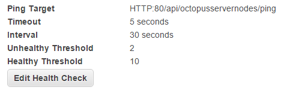

This section walks through the different options and considerations for the components required to set up Octopus High Availability in [Microsoft Azure](https://azure.microsoft.com/en-us/).

:::hint
If you are setting Octopus up on AWS or on-premises please see the following guides:

- [AWS](/docs/administration/high-availability/design/octopus-for-high-availability-on-aws.md)
- [On-Premises](/docs/administration/high-availability/design/octopus-for-high-availability-on-premises.md)
:::

## Setting up Octopus: High availability

For the sake of simplicity, this guide assumes that all of the servers are hosted in Azure.

:::hint
**Some assembly required**
A single server Octopus installation is straightforward; Octopus High Availability is designed for mission-critical enterprise scenarios and depends heavily on infrastructure and Windows components. At a minimum:

- You should be familiar with SQL Server failover clustering or Azure SQL or have DBAs available to create and manage the database.
- You should be familiar with SANs and Azure Files or other approaches to sharing storage between servers.
- You should be familiar with load balancing for applications.

**Note on Iaas:**
If you are using [IaaS](https://en.wikipedia.org/wiki/Infrastructure_as_a_service) in Azure then the [On-Premises](/docs/administration/high-availability/design/octopus-for-high-availability-on-premises.md) guide might be a better approach for you as you may have your Domain Controllers, SQL Database Server, and load balancers in the cloud.
:::

### Compute

For a highly available Octopus configuration, you need a minimum of two Virtual Machines in Azure. There are several items to consider when provisioning your Octopus Virtual Machines in Azure:

- [Number and type of deployment targets](/docs/infrastructure/deployment-targets/index.md)
- [Retention Policies](/docs/administration/retention-policies/index.md)
- [Number of concurrent tasks](/docs/support/increase-the-octopus-server-task-cap.md)

Each organization has different requirements when it comes to choosing the right Virtual Machine to run Octopus on. We recommend looking at the range of [Azure Virtual Machine sizes](https://docs.microsoft.com/en-us/azure/virtual-machines/sizes-general) and selecting the size most suitable for your requirements.

### Database

Each Octopus Server node stores project, environment, and deployment-related data in a shared Microsoft SQL Server Database. Since this database is shared, it's important that the database server is also highly available. To host the Octopus SQL database in Azure, there are two options that you should consider:

- [SQL Server on a Virtual Machine](https://docs.microsoft.com/en-us/azure/virtual-machines/windows/sql/virtual-machines-windows-sql-server-iaas-overview/)
- [Azure SQL Database as a Service](https://docs.microsoft.com/en-us/azure/sql-database/sql-database-technical-overview/)

From the Octopus perspective, how the database is made highly available is really up to you; to Octopus, it's just a connection string. We are not experts on SQL Server high availability, so if you have an on-site DBA team, we recommend using them. There are many [options for high availability with SQL Server](https://msdn.microsoft.com/en-us/library/ms190202.aspx), and [Brent Ozar also has a fantastic set of resources on SQL Server Failover Clustering](http://www.brentozar.com/sql/sql-server-failover-cluster/) if you are looking for an introduction and practical guide to setting it up.

Octopus High Availability works with:

- [SQL Server Failover Clusters](https://docs.microsoft.com/en-us/sql/sql-server/failover-clusters/high-availability-solutions-sql-server)
- [SQL Server AlwaysOn Availability Groups](https://docs.microsoft.com/en-us/sql/database-engine/availability-groups/windows/overview-of-always-on-availability-groups-sql-server)
- [Azure SQL Database](https://azure.microsoft.com/services/sql-database/)

:::warning
Octopus High Availability has not been tested with Log Shipping or Database Mirroring and does not support SQL Server replication. [More information](/docs/administration/data/octopus-database/index.md)
:::

See also the [SQL Server Database](/docs/installation/sql-server-database.md) page, which explains the editions and versions of SQL Server that Octopus supports and explains the requirements for how the database must be configured.

### Shared storage

Octopus stores several files that are not suitable to store in the database. These include:

- Packages used by the [built-in repository](/docs/packaging-applications/package-repositories/built-in-repository/index.md). These packages can often be very large in size.
- [Artifacts](docs/projects/deployment-process/artifacts.md) collected during a deployment. Teams using Octopus sometimes use this feature to collect large log files and other files from machines during a deployment.
- Task logs are text files that store all of the log output from deployments and other tasks.

As with the database, from the Octopus perspective, you'll tell the Octopus Servers where to store them as a file path within your operating system. Octopus doesn't care what technology you use to present the shared storage; it could be a mapped network drive or a UNC path to a file share. Each of these three types of data can be stored in a different place.

Whichever way you provide the shared storage, there are a few considerations to keep in mind:

- To Octopus, it needs to appear as a mapped network drive (e.g. `D:\`) or a UNC path to a file share (e.g. `\\server\path`).
- The service account that Octopus runs needs **full control** over the directory.
- Drives are mapped per-user, so you should map the drive using the same service account that Octopus is running under.

If your Octopus Server is running in Microsoft Azure, you can use [Azure File Storage](https://docs.microsoft.com/en-us/azure/storage/files/storage-files-introduction); it just presents a file share over SMB 3.0.

#### Azure Files

If your Octopus Server is running in Microsoft Azure, there is only one solution unless you have a [DFS Replica](https://docs.microsoft.com/en-us/windows-server/storage/dfs-replication/dfsr-overview) in Azure. That solution is [Azure File Storage](https://docs.microsoft.com/en-us/azure/storage/files/storage-files-introduction) which presents a file share over SMB 3.0 that will is shared across all of your Octopus servers.

After you have created your File Share, the best option is to add the Azure File Share as a [symbolic link](https://en.wikipedia.org/wiki/Symbolic_link) pointing at a local folder, for example `C:\Octopus\` for the Artifacts, Packages, and TaskLogs which need to be available to all nodes.

Run the PowerShell below before installing Octopus, substituting the placeholders with your own values:

````PowerShell
# Add the Authentication for the symbolic links. You can get this from the Azure Portal.

cmdkey /add:octostorage.file.core.windows.net /user:Azure\octostorage /pass:XXXXXXXXXXXXXX

# Add Octopus folder to add symbolic links

New-Item -ItemType directory -Path C:\Octopus
New-Item -ItemType directory -Path C:\Octopus\Artifacts
New-Item -ItemType directory -Path C:\Octopus\Packages
New-Item -ItemType directory -Path C:\Octopus\TaskLogs

# Add the Symbolic Links. Do this before installing Octopus.

mklink /D C:\Octopus\TaskLogs \\octostorage.file.core.windows.net\octoha\TaskLogs
mklink /D C:\Octopus\Artifacts \\octostorage.file.core.windows.net\octoha\Artifacts
mklink /D C:\Octopus\Packages \\octostorage.file.core.windows.net\octoha\Packages
````

[Install Octopus](/docs/installation/index.md) and then run the following:

````powershell
# Set the path
& 'C:\Program Files\Octopus Deploy\Octopus\Octopus.Server.exe' path --artifacts "C:\Octopus\Artifacts"
& 'C:\Program Files\Octopus Deploy\Octopus\Octopus.Server.exe' path --taskLogs "C:\Octopus\TaskLogs"
& 'C:\Program Files\Octopus Deploy\Octopus\Octopus.Server.exe' path --nugetRepository "C:\Octopus\Packages"
````

### Load balancing in Azure

To distribute HTTP load among Octopus Server nodes with a single point of access, we recommended using an HTTP load balancer. We typically recommend using a round-robin (or similar) approach for sharing traffic between the nodes in your cluster.

Octopus Server provides a health check endpoint for your load balancer to ping: `/api/octopusservernodes/ping`.



Making a standard `HTTP GET` request to this URL on your Octopus Server nodes will return:

- HTTP Status Code `200 OK` as long as the Octopus Server node is online and not in [drain mode](#drain).
- HTTP Status Code `418 I'm a teapot` when the Octopus Server node is online, but it is currently in [drain mode](#drain) preparing for maintenance.
- Anything else indicates the Octopus Server node is offline, or something has gone wrong with this node.

:::hint
The Octopus Server node configuration is also returned as JSON in the HTTP response body.
:::

Azure has a wide range of [load balancers](https://docs.microsoft.com/en-us/azure/architecture/guide/technology-choices/load-balancing-overview) that will work with Octopus in a highly-available configuration:

- [Azure Traffic Manager](https://docs.microsoft.com/en-us/azure/traffic-manager/traffic-manager-overview)
- [Azure Application Gateway](https://docs.microsoft.com/en-us/azure/application-gateway/overview)
- [Azure Load Balancer](https://docs.microsoft.com/en-us/azure/load-balancer/load-balancer-overview)
- [Azure Front Door](https://docs.microsoft.com/en-us/azure/frontdoor/front-door-overview)
- [Kemp LoadMaster](https://kemptechnologies.com/uk/solutions/microsoft-load-balancing/loadmaster-azure/)
- [F5 Big-IP Virtual Edition](https://www.f5.com/partners/technology-alliances/microsoft-azure)

### Authentication providers

We recommend [Active Directory](https://en.wikipedia.org/wiki/Active_Directory) for most installations. For this to work in Azure you need a domain controller setup locally in Azure.  Please see our [authentication provider compatibility section](/docs/security/authentication/auth-provider-compatibility.md) for a full list of supported authentication providers.

If you're hosting in Azure with Domain Controllers, it would be a similar setup as described in our [on-premises](/docs/administration/high-availability/design/octopus-for-high-availability-on-premises.md) guide.

## Polling Tentacles with HA

!include <polling-tentacles-and-ha>

### Connecting Polling Tentacles

!include <polling-tentacles-and-ha-connecting>

#### Using a unique address

!include <polling-tentacles-connection-same-port>

#### Using a unique port

!include <polling-tentacles-connection-different-ports>

### Registering Polling Tentacles

!include <polling-tentacles-and-ha-registering>