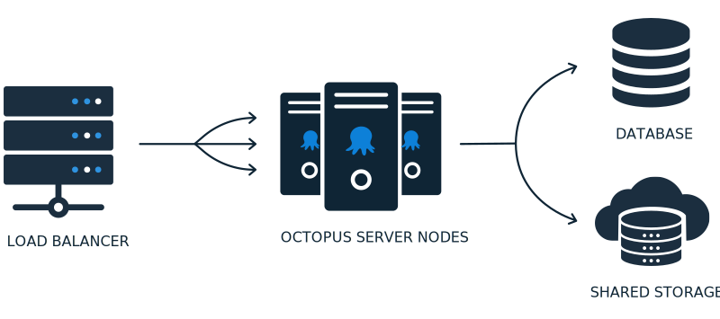

Octopus: High Availability (HA) enables you to run multiple Octopus Servers, distributing load and tasks between them. We designed it for enterprises that need to deploy around the clock and rely on the Octopus Server being available.

An Octopus: HA configuration requires four main components:

- **A load balancer**
  This will direct user traffic bound for the Octopus web interface between the different Octopus Server nodes.
- **Octopus Server nodes**
  These run the Octopus Server windows service. They serve user traffic and orchestrate deployments.
- **A database**
  Most data used by the Octopus Server nodes is stored in this database.
- **Shared storage**
  Some larger files - like [packages](/docs/packaging-applications/package-repositories/index.md), artifacts, and deployment task logs - aren't suitable to be stored in the database, and so must be stored in a shared folder available to all nodes.

## Designing Highly-Available Octopus

There are several ways to configure High Availability for Octopus and this differs based on where you host Octopus. We have created guides that will help you design the best solution for your installation. This section walks through the different options and considerations for setting up Octopus and how you can incorporate each of the components making them Highly-Available, whether it's using on-premises servers or cloud infrastructure such as AWS or Azure.

- [Designing Octopus for High Availability On-Premises](/docs/administration/high-availability/design/octopus-for-high-availability-on-premises.md)
- [Designing Octopus for High Availability in Azure](/docs/administration/high-availability/design/octopus-for-high-availability-on-azure.md)
- [Designing Octopus for High Availability in AWS](/docs/administration/high-availability/design/octopus-for-high-availability-on-aws.md)

## Configuring Octopus High Availability

When you have selected the approach for Octopus High Availability and provisioned any infrastructure, the next step is to configure Octopus for High Availability. This section includes guides on configuring Octopus for High Availability with and without Active Directory.

- [Configuring High Availability](/docs/administration/high-availability/configure/index.md)

## Migrating to High Availability

Most organizations start with a stand-alone Octopus installation as part of a Proof of Concept. We make it straight-forward to take your existing Octopus installation and make it highly-available.

- [Migrating to High-Availability](/docs/administration/high-availability/migrate/index.md)

## Maintain nodes

One great benefit of a Highly-Available Octopus instance is the ability to update and restart one or more nodes, while still allowing the rest of the Octopus Deploy cluster to keep serving requests and performing deployments. 

This section contains useful information on how to maintain the nodes in your Octopus High Availability cluster, along with specific things to know when running a Highly-Available Octopus instance

- [Maintaining High Availability nodes](/docs/administration/high-availability/maintain/maintain-high-availability-nodes.md)

## Load balancing

There are plenty of options when it comes to choosing a load balancer to direct user traffic between each of the Octopus Server nodes. This section contains information on how to set up third-party load balancers for use with an Octopus Highly-Available setup:

- [Load balancing](/docs/administration/high-availability/load-balancing/index.md)

## Troubleshooting

If you're running into issues with your Highly Available Octopus Deploy install then please use our Troubleshooting pages.

- [Troubleshooting High Availability](/docs/administration/high-availability/troubleshoot/index.md)
