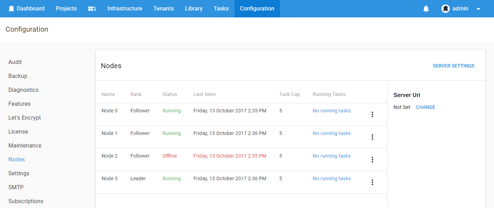

Managing the nodes in your Octopus Server High Availability cluster can be done on the **Nodes** tab in the **Configuration** area:


Information regarding each of your nodes is displayed here.  You can see:

- **Rank**: follower or leader
- **Last seen**: the last time the node checked in
- **Tasks**: the number of task currently running on the node
- **Task cap**: the maximum number of tasks that may run on the node
- **Drain**: on or off depending on if the node can execute new tasks

## Rank {#ManagingHighAvailabilityNodes-Rank}

The nodes in your Octopus Server High Availability cluster can be either a leader or a follower.  Only one node can be the cluster leader and the rest of the nodes will be followers.  Some maintenance and scheduled tasks will only run on the cluster leader, such as:

- applying retention policy
- cleaning the package cache
- initiating Tentacle health checks (though the actual health check may be run by any node)
- re-indexing the built-in NuGet package repository

If your leader node goes offline or into drain mode, one of your followers will become the new leader.

**Example**

```text
Node A joins the High Availability cluster and becomes *leader*

Node B joins the High Availability cluster and becomes *follower*

Node C joins the High Availability cluster and becomes *follower*

Node B is placed in [Maintenance Mode](/docs/administration/maintenance-mode.md) so cannot become *leader*

Node A goes offline

Node C elects itself *leader*
```

## Last seen {#ManagingHighAvailabilityNodes-Lastseen}

Octopus Server nodes will check-in at regular intervals.  If an Octopus Server node goes offline a warning will be displayed and the time that it went offline can be determined by looking at the **last seen** field.



## Tasks {#ManagingHighAvailabilityNodes-Tasks}

Each Octopus Server node will execute tasks as they are queued. The **tasks** field displays the number of tasks currently running on that node. Following the active tasks link will display more information about all of the tasks for that node.

## Task cap {#ManagingHighAvailabilityNodes-Taskcap}

Each Octopus Server node can execute a maximum number of tasks in parallel.  This is to prevent death by multi-tasking. The **task cap** allows you to configure the maximum number of tasks for each node.  If more tasks are created than the total available task cap, the tasks will queue for up to a day until an Octopus Server node is available to execute the task.

You may consider setting a low cap for your Octopus Servers on poorer hardware or have a dedicated UI node with a low task cap to improve UI performance.

## Drain {#ManagingHighAvailabilityNodes-Drain}

The drain toggle can be used to prevent an Octopus Server node from executing any new tasks.  While draining:

- an Octopus Server node will finish running any tasks is it currently executing and then idle
- a leader will relinquish its leadership rank
- a follower will not become leader
- the Octopus Server ping url will not return 200 OK

## Load balancing {#ManagingHighAvailabilityNodes-Loadbalancing}

To distribute HTTP load among Octopus Server nodes with a single point of access it is recommend to use an HTTP load balancer. We typically recommend using a round-robin (or similar) approach for sharing traffic between the nodes in your cluster.

Octopus Server provides a health check endpoint for your load balancer to ping: `/api/octopusservernodes/ping`


Making a standard `HTTP GET` request to this URL on your Octopus Server nodes will return:

- HTTP Status Code `200 OK` as long as the Octopus Server node is online and not in [drain mode](#ManagingHighAvailabilityNodes-Drain).
- HTTP Status Code `418 I'm a teapot` when the Octopus Server node is online, but it is currently in [drain mode](#ManagingHighAvailabilityNodes-Drain) preparing for maintenance.
- Anything else indicates the Octopus Server node is offline, or something has gone wrong with this node.

:::hint
The Octopus Server node configuration is also returned as JSON in the HTTP response body.
:::

## Example procedure: installing Windows Updates {#ManagingHighAvailabilityNodes-Exampleprocedure:installingWindowsUpdates}

One of the great benefits of High Availability is the ability to perform maintenance on one node, while allowing other nodes to continue to perform deployments or server users.

For example, imagine it is time to install Windows Updates on one node. The process would be:

1. Use the *Drain* feature on the **Nodes** page to tell the node to continue executing any deployments that it is currently running, but not to start any new deployments (other nodes in the cluster will take over)
2. Once the node isn't executing any more deployments, remove it from the load balancer
3. Install updates, restart the node, etc. as required
4. Add the node back to the load balancer
5. Disable the *Drain* feature, so that the node can now execute deployments again
