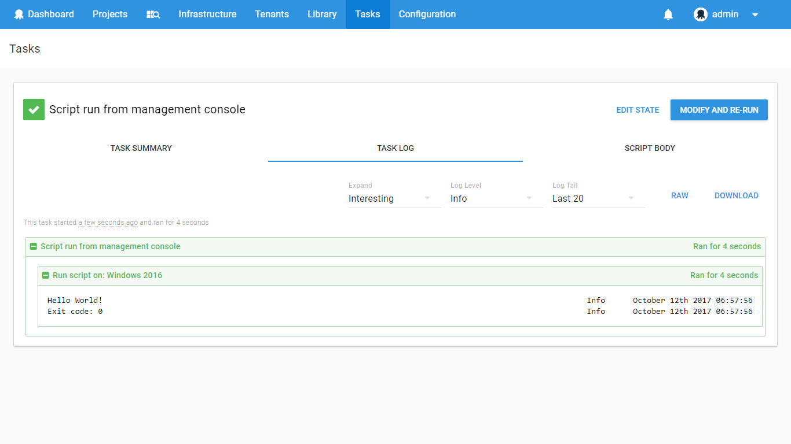
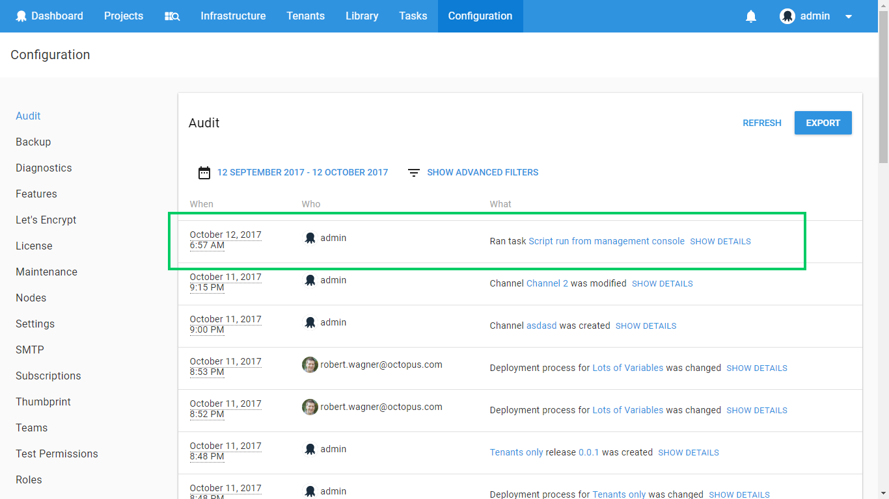

Octopus is designed to make deployment a repeatable process, avoiding the human error that is introduced when software is configured by hand, or in an ad-hoc fashion. Projects, deployment processes, releases, and deployments are all important concepts for realizing this aim.

When managing a large environment of machines, however, it is occasionally necessary to perform one-off management tasks.

- Run-away processes need to be terminated.
- Machines need to be rebooted.
- Information needs to be collected.

For these situations, the Octopus **Script Console** can be used.

## Using the Script Console

The Script Console can be found under the Tasks area:

Inside the Script Console, you can choose whether to run your script on a specific server, or a number of servers by role/environment.

When you run the script, you'll be taken to the task output page which shows the progress and any output from the script:

The **Script Body** tab can be used to see the contents of the script, and you can use the **Modify and re-run** button in the overflow menu to change or run the script again.

## Collecting Artifacts {#ScriptConsole-Collectingartifacts}

Sometimes you might like to collect files from each of the machines as part of your script. To do this, see the section on [artifacts](/docs/deployment-process/artifacts.md).

## Audit Records {#ScriptConsole-Auditrecords}

Besides making it easy to run a script on many servers, the other advantage of using the Script Console is auditing. Ad-hoc scripts run via the Script Console will appear in the [Audit](/docs/administration/managing-users-and-teams/auditing.md) tab in the Configuration area.

## Ask Octopus

What this Ask Octopus episode where we discuss the script console.

<iframe width="560" height="315" src="https://www.youtube.com/embed/tcPtD14f0_I?start=26" frameborder="0" allow="accelerometer; autoplay; encrypted-media; gyroscope; picture-in-picture" allowfullscreen></iframe>
