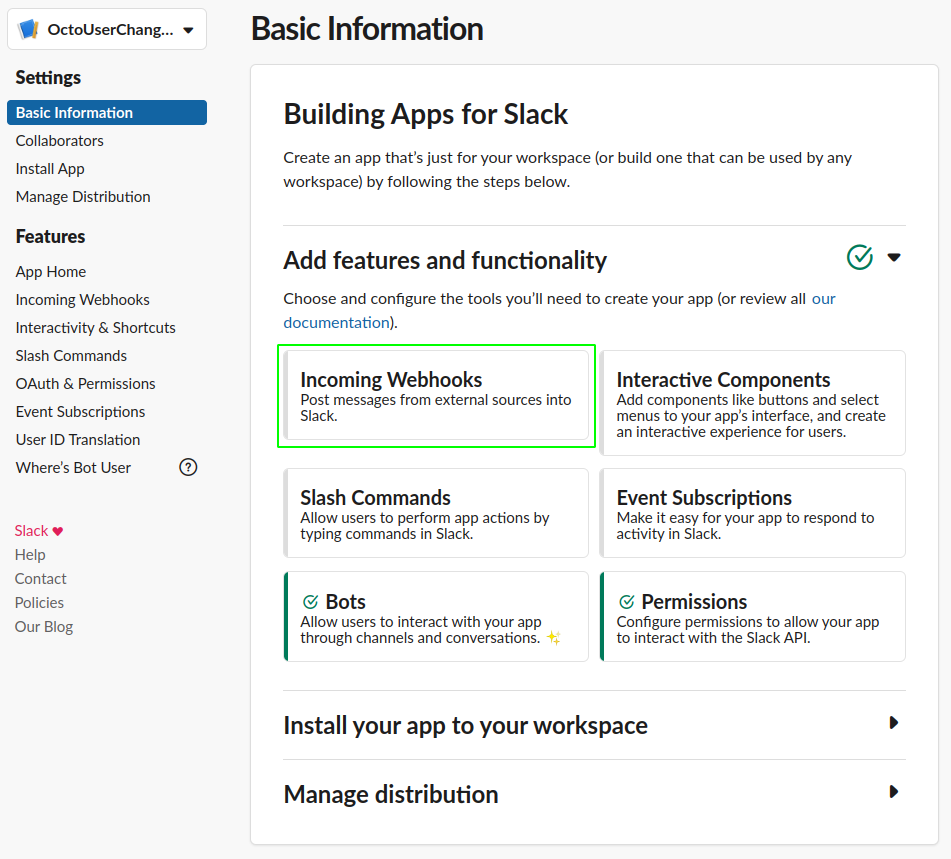
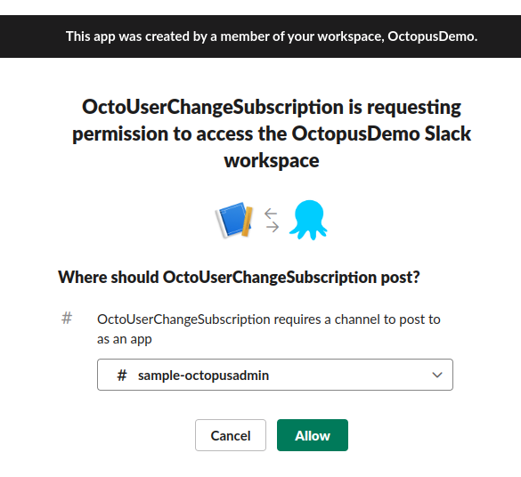
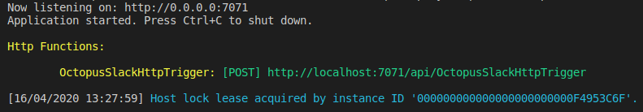
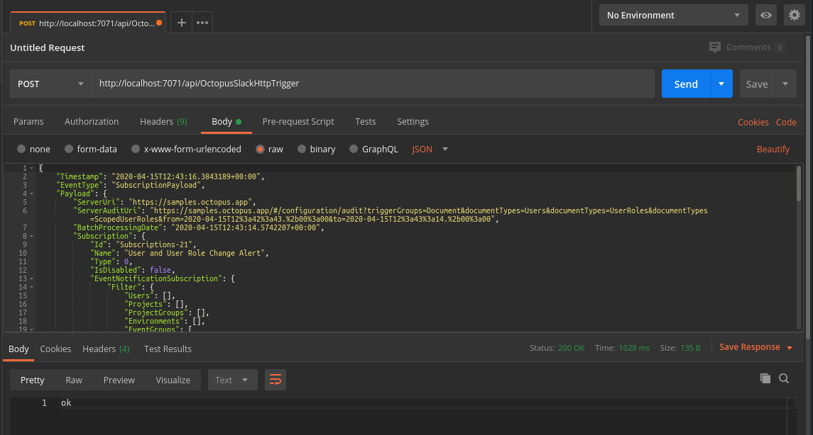
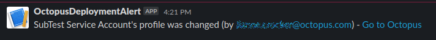

To get a message sent to a [Slack](https://slack.com/) Workspace there needs to be a few things in place:

- Configure Octopus Deploy subscription to send a webhook
- Configure a Slack App
- Setup something in between the two to consume the webhook from Octopus and forward a message on to Slack

:::hint
A number of technologies can be used to consume the webhook from Octopus, this document will use an [Azure Function App](https://docs.microsoft.com/en-us/azure/azure-functions/).  One alternative is to use Firebase Cloud Functions, this is described in a blog [here](https://octopus.com/blog/notifications-with-subscriptions-and-webhooks).
:::

## Configure Octopus subscription to send a webhook

Configure a subscription in Octopus to send any events that occur against the `User`, `User Role`, and `Scoped User Role` documents.  


As a starting point, the Payload URL is set to a value I have setup on  [RequestBin](https://requestbin.com/), this will enables a way to see the JSON getting sent by Octopus before building the function.

## Configure your Slack app

In order to get a URL to send the message through to Slack, a Slack app has to be configured.  

1. Go to the [**Your Apps**](https://api.slack.com/apps) and click **Create New App**

2. Enter a useful **App Name** and select the relevant Development Slack Workspace and click **Create App**


3. Select **Incoming Webhooks** from the **Add features and functionality** section


4. Click to **Add New Webhook to Workspace**


5. Select the channel to post the messages to.


6. Take a copy of the Webhook URL, this is the value for the `SLACK_URI_APIKEY` environment variable on the Azure Function App.


## Create an Azure Function App 

### Create the Function App in Azure

The Function App can be created via the [Azure Portal](https://portal.azure.com), and [ARM Template](https://azure.microsoft.com/en-gb/resources/templates/) or with the [Azure CLI ](https://docs.microsoft.com/en-us/cli/azure/?view=azure-cli-latest).

To use the Azure CLI, first, create the Resource Group to contain the Function App.  

```bash
az group create -l westeurope -n OctopusFunctions
```

Then the storage account for the Function App to use.

```bash
az storage account create -n octofuncstorage -g OctopusFunctions --sku Standard_LRS -l westeurope
```

Now create the Function App itself.

```bash
az functionapp create -g OctopusFunctions -n SubscriptionHandler -s octofuncstorage --functions-version 3 --runtime dotnet  --consumption-plan-location westeurope
```

### Write the Function App code

:::hint
The code for this can be found [here](http://g.octopushq.com/SamplesSubscriptionsRepo)
:::

The Octopus subscription has been created and set up to send data to RequestBin.  Here's the resulting JSON payload following creation of a new Service Account user

```json
{
    "Timestamp": "2020-04-16T15:19:42.5410789+00:00",
    "EventType": "SubscriptionPayload",
    "Payload": {
        "ServerUri": "https://samples.octopus.app",
        "ServerAuditUri": "https://samples.octopus.app/#/configuration/audit?triggerGroups=Document&documentTypes=Users&documentTypes=UserRoles&documentTypes=ScopedUserRoles&from=2020-04-16T15%3a19%3a11.%2b00%3a00&to=2020-04-16T15%3a19%3a42.%2b00%3a00",
        "BatchProcessingDate": "2020-04-16T15:19:42.3149941+00:00",
        "Subscription": {
            "Id": "Subscriptions-21",
            "Name": "User and User Role Change Alert",
            "Type": 0,
            "IsDisabled": false,
            "EventNotificationSubscription": {
                "Filter": {
                    "Users": [],
                    "Projects": [],
                    "ProjectGroups": [],
                    "Environments": [],
                    "EventGroups": [
                        "Document"
                    ],
                    "EventCategories": [],
                    "EventAgents": [],
                    "Tenants": [],
                    "Tags": [],
                    "DocumentTypes": [
                        "Users",
                        "UserRoles",
                        "ScopedUserRoles"
                    ]
                },
                "EmailTeams": [],
                "EmailFrequencyPeriod": "01:00:00",
                "EmailPriority": 0,
                "EmailDigestLastProcessed": null,
                "EmailDigestLastProcessedEventAutoId": null,
                "EmailShowDatesInTimeZoneId": "UTC",
                "WebhookURI": "https://enfs8ljij6xqc.x.pipedream.net",
                "WebhookTeams": [],
                "WebhookTimeout": "00:00:10",
                "WebhookHeaderKey": null,
                "WebhookHeaderValue": null,
                "WebhookLastProcessed": "2020-04-16T15:19:11.3637275+00:00",
                "WebhookLastProcessedEventAutoId": 53624
            },
            "SpaceId": "Spaces-142",
            "Links": {
                "Self": {}
            }
        },
        "Event": {
            "Id": "Events-55136",
            "RelatedDocumentIds": [
                "Users-322"
            ],
            "Category": "Created",
            "UserId": "Users-27",
            "Username": "lianne.crocker@octopus.com",
            "IsService": false,
            "IdentityEstablishedWith": "Session cookie",
            "UserAgent": "OctopusClient-js/2020.2.2",
            "Occurred": "2020-04-16T15:19:14.9925786+00:00",
            "Message": "User SubTest Service Account has been created ",
            "MessageHtml": "User <a href='#/configuration/users/Users-322'>SubTest Service Account</a> has been created ",
            "MessageReferences": [
                {
                    "ReferencedDocumentId": "Users-322",
                    "StartIndex": 5,
                    "Length": 23
                }
            ],
            "Comments": null,
            "Details": null,
            "SpaceId": null,
            "Links": {
                "Self": {}
            }
        },
        "BatchId": "b2bdb09f-872a-4bc1-8272-ab2334de3660",
        "TotalEventsInBatch": 2,
        "EventNumberInBatch": 1
    }
}
```

The items that will be used in the Slack message for this example are:

- Payload.Event.Message
- Payload.Event.SpaceId
- Payload.Event.Username
- Payload.ServerUri


:::hint
If you're using [VS Code](https://docs.microsoft.com/en-us/azure/azure-functions/functions-develop-vs-code?tabs=csharp) to write the code, you'll need to install the [Azure Functions Core Tools](https://github.com/Azure/azure-functions-core-tools) to enable debugging of your function.
:::

To use these items easily, create a class `OctoMessage` to hold them.

```c#
using System;
using Newtonsoft.Json;

namespace Octopus
{
    [JsonConverter(typeof(JsonPathConverter))]
    public class OctoMessage
    {
        [JsonProperty("Payload.Event.Message")]
        public string Message {get;set;}
        
        [JsonProperty("Payload.Event.SpaceId")]
        public string SpaceId {get;set;}

        [JsonProperty("Payload.Event.Username")]
        public string Username {get;set;}

        [JsonProperty("Payload.ServerUri")]
        public string ServerUri{get;set;}

        public string GetSpaceUrl(){
            return string.Format("{0}/app#/{1}",ServerUri,SpaceId);
        }        
    }
}
```

Add a class `SlackClient` to take the message data and send it through to Slack.

```c#
public class SlackClient
{
    private readonly Uri _uri;
    private readonly Encoding _encoding = new UTF8Encoding();
    
    public SlackClient(string slackUrlWithAccessToken)
    {
        _uri = new Uri(slackUrlWithAccessToken);
    }
    
    public string PostMessage(string text)
    {
        Payload payload = new Payload()
        {
            Text = text
        };
        
        return PostMessage(payload);
    }
    
    public string PostMessage(Payload payload)
    {
        string payloadJson = JsonConvert.SerializeObject(payload);
        
        using (WebClient client = new WebClient())
        {
            var data = new NameValueCollection();
            data["payload"] = payloadJson;
    
            var response = client.UploadValues(_uri, "POST", data);
            
            return _encoding.GetString(response);
        }
    }
}
```

The main class of the function, `OctopusSlackHttpTrigger`, will receive the HTTP message, take the request message body and deserialize it into an `OctoMessage` object.  Then it will build the message text and send it through to Slack using a `SlackClient` object. 

```c#
public static class OctopusSlackHttpTrigger
{
    [FunctionName("OctopusSlackHttpTrigger")]
    public static async Task<IActionResult> Run(
        [HttpTrigger(AuthorizationLevel.Function, "post", Route = null)] HttpRequest req,
        ILogger log)
    {
        var client = new SlackClient(Environment.GetEnvironmentVariable("SLACK_URI_APIKEY"));

        var data = await new StreamReader(req.Body).ReadToEndAsync();
        
        var octoMessage = JsonConvert.DeserializeObject<OctoMessage>(data);
        var slackMessage = string.Format(
                                "{0} (by {1}) - <{2}|Go to Octopus>", 
                                octoMessage.Message, 
                                octoMessage.Username,
                                octoMessage.GetSpaceUrl());

        try
        {
            var responseText = client.PostMessage(text: slackMessage);                
            return new OkObjectResult(responseText);
        }
        catch (System.Exception ex)
        {
            log.LogError(ex.Message);
            return new BadRequestObjectResult(ex.Message);
        }
    }
}
```

### Test the Azure App Function

Before pushing this to Azure it can be tested locally.  The `Run` method uses the environment variable of `SLACK_URI_APIKEY`, this is the value copied when the Slack app was set up.  In order to use this value when debugging locally, add the value to the `local.settings.json` file.

```json
{
  "IsEncrypted": false,
  "Values": {
    "AzureWebJobsStorage": "",
    "FUNCTIONS_WORKER_RUNTIME": "dotnet",
    "SLACK_URI_APIKEY":"https://hooks.slack.com/services/XXXXXXXX/XXXXXX/XXXXXXXXXXXXXXX"
  }
}

```

Hit F5 to compile and run the app, a URL will be output to the Terminal that can be set a `POST` test request.



[Postman](https://www.postman.com/) can be used to send a test request, passing in a test JSON payload. 



It's returned a `200 OK` and there is a message in Slack!


### Build the Azure App Function

This example uses [Github Actions](https://github.com/features/actions) to build the function code, package it, and push it to Octopus, where it will be deployed to Azure from. 


The build yml can be found in `.github/workflows/AzureSlackFunction.yaml` [here](http://g.octopushq.com/SamplesSubscriptionsRepo).

### Deploy the Azure App Function

The Azure Function App we've created can be deployed to using Octopus by using a Deployment Target type of Azure Web App.  Instructions on how to do this are [here](/docs/deployment-examples/azure-deployments/deploying-a-package-to-an-azure-web-app).

There is a [Project](/docs/projects) in order to deploy the Function App.  


The project has two steps:
1. Deploy the Azure Function App 
2. Set the environment variable of `SLACK_URI_APIKEY`

The project can be viewed in the AzFuncNotifySlack project our samples Octopus instance [here](http://g.octopushq.com/OctopusAdminSamplesSpace).

## Test the subscription

If an Octopus user is amended the change is shown in the audit trail.  


And the message has been sent from the subscription webhook, to the Azure Function App in Azure and on to Slack.



