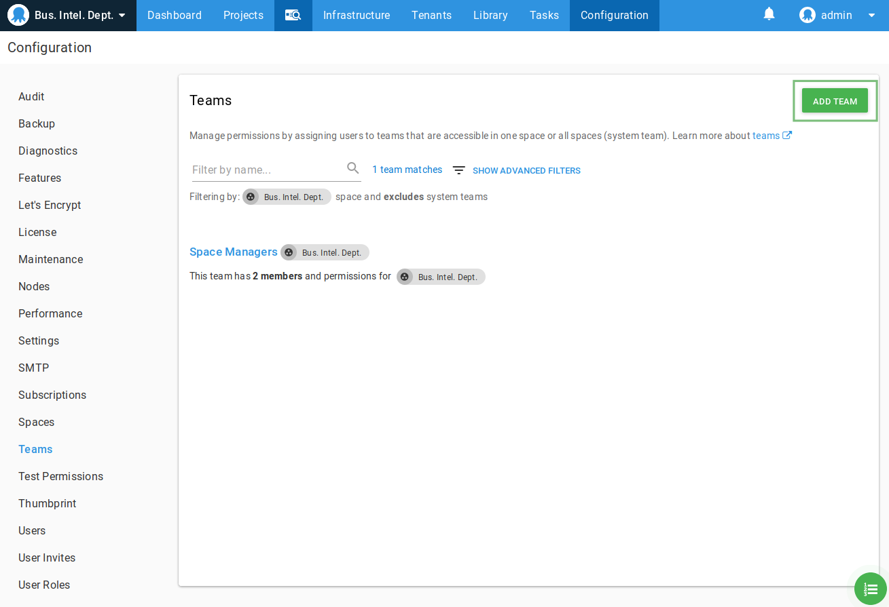
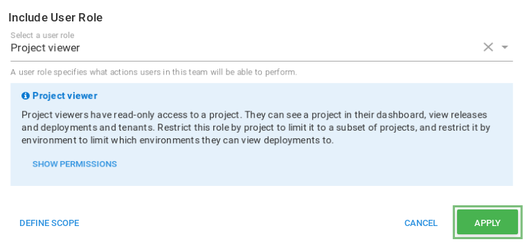
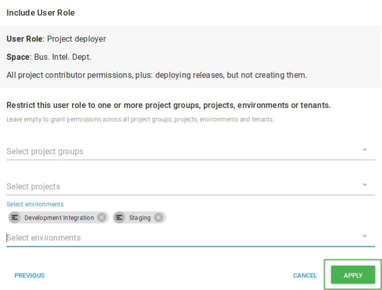
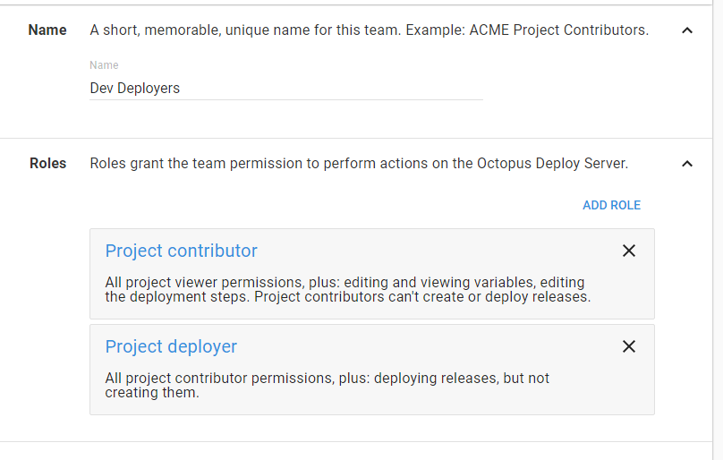
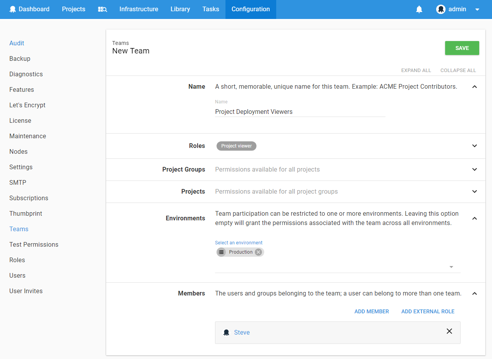

A common scenario some users may face, is the desire to provide full access to one environment, but only read access to the next stage. For example, the developers might be able to fully manage deployments to the development and staging environments, but only view the production deployments.

The way this is achieved changed with the release of **Octopus 2019.1** and the [Spaces functionality](/docs/administration/spaces/index.md), if you are using **Octopus 2018.10-LTS** or any other version of Octopus prior to **Octopus 2019.1**, use the instructions for 2018.12 and earlier.

- [Creating teams with mixed Environment Privileges in **Octopus 2019.1** and later](#Creatingteamsforauserwithmixedenvironmentprivileges2019-1).
- [Creating teams with mixed Environment Privileges in **Octopus 2018.12** and earlier](#Creatingteamsforauserwithmixedenvironmentprivileges2018-12).

## Creating teams for users with mixed environment privileges in 2019.1 and later {#Creatingteamsforauserwithmixedenvironmentprivileges2019-1}

### Creating the "Developers" Team {#Creatingteamsforauserwithmixedenvironmentprivileges-Creatingthe&quot;Developers&quot;Team}

Start by clicking the **Teams** tab under **Configuration** in the Octopus Deploy web portal.  Then click **Add team**.

When you create the team, it is possible to change the visibility of the team to either:

 - Visible only within the space we are in.
 - Visible to all spaces.

For this example, we'll choose this team to only be visible in the space we are currently in.

Give the team an appropriate name like *Developers* and click **Save**.

### Add the Project Viewer Role for All Environments

We can now add the **Project viewer** role to all environments by clicking **Include user role** from the **User Roles** tab. This role provides read only access to deployment processes and releases. Because we will not provide any scoping for this role - this role will form the baseline permissions
for this team in any scope.

### Adding Additional Roles for a Subset of Environments

Since our goal is to give members of the Developers team the ability to create and deploy releases _in the Development and Staging environments only_, we can click **Include user role** again, this time adding the **Project lead** role. This role provides all the permissions of the **Project viewer** role as well as allowing a team member to create and deploy releases. This time, we will click on **Define Scope** and choose the environments that we would like to scope the role to, before hitting the **Apply** button.

We can repeat this process as many times as necessary to configure the team to your needs. The resulting team configuration screen should now display all of the different roles and their scopes so that you can review them.

When you are happy with these changes hit **Save** to make them effective.

## Creating teams for users with mixed environment privileges in 2018.12 and earlier {#Creatingteamsforauserwithmixedenvironmentprivileges2018-12}

Given that a set of roles can be combined in a team and tied to a specific environment, this scenario indicates that we will need two different teams. One with the full deployment access but scoped to dev and staging, and another with just read roles scoped to production.

### Creating the "*Dev Deployers*" Team {#Creatingteamsforauserwithmixedenvironmentprivileges-Creatingthe&quot;DevDeployers&quot;Team}

Start by clicking the **Teams** tab under **Configuration** in the Octopus Deploy web portal.  Then click the **Add team**.

Give the team an appropriate name like *Dev Deployers* and add the **Project deployer** role. This role provides all the permissions of the **Project contributor** role, but also allows the user to deploy a release. In our case because we will limit the users to the development environment, we will allow them to also create releases and to do so they will need the **Project lead** role. Again this role provides all the permissions of the **Project contributor** role but without the deployment permissions that come with the **Project deployer** role.

Now that we have the roles configured for this team, we want to ensure that they are only able to be effective on specific environments. Our developers should not be able to perform *UAT* or *Production* deployments and are only allowed to deploy to the *Development* and *Staging* environments. Set the **Environments** field on the team page to the environments that the team should have its selected roles effective for. If this field is blank it is assumed to apply to **All environments** so ensure that it is correctly filled out if it should exclude others. If you want the permissions to also/instead be scoped to specific projects, then add the required projects to the **Projects** field for the same behavior.

With the permission rules configured add the users that you want them to apply to. Remember that if the user is a member of another team that has the same roles but for the production environment, then the permissions will be effective for both teams. The team permissions are all additive.

When you are happy with these changes hit **Save** to make them effective.

### Creating the "*Prod Deployment Viewers*" Team {#Creatingteamsforauserwithmixedenvironmentprivileges-CreatingThe&quot;ProdDeploymentViewers&quot;Team}

The previous rule was all well and good, but what about if we now want to allow the developer to see what has been deployed to production while still preventing them from pushing releases out to that stage. We can't go and modify the *Dev Deployers* team because that contains rules scoped to specific environments. Instead we will create a new team that is scoped to production, but only contains view permissions.

Once again go back to the **Teams** tab and click **Add team**. Lets give it a name that describes its purpose, *Prod Deployment Viewers*, and this time add just the **Project viewer** role. This allows the user to see details of a project, but not actually make any modifications.

This time we will set the **Environments** field to just be *Production* since these role are effectively already available to the users in the other environments by virtue of the **Project viewer** role being a subset of the already assigned **Project contributor** role.

Once again after adding all the users that should be a member of this team, in this case the same as those who can deploy to development, hit **Save**. The next time the user refreshes the page or performs an operation then these new rules will be in effect.

## Summary {#Creatingteamsforauserwithmixedenvironmentprivileges-Summary}

The permissions system in Octopus Deploy provides a very flexible way of defining broad access to system functionality, while still allowing it to be constrained to very specific environments or projects. In this guide we have seen how a developer can have their permissions configured so they can have full access to the first few stages of the deployment lifecycle, while restricting access to the business critical production areas.
