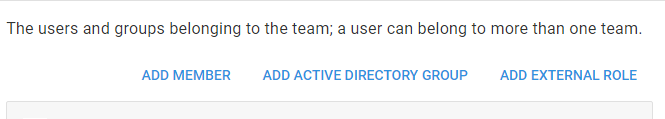

Some of the authentication providers allow external groups or roles to be added as Members of Teams in Octopus.  This section outlines how to add external groups/roles to Teams.

Adding external groups or roles to Octopus Teams can be helpful in controlling the permissions of users. In the case of Active Directory, when a user logs in to Octopus, we check the user's groups. If the user is in one of the groups assigned to an Octopus Team, they are considered part of that Team and will have the permissions set for that Team.

Depending on which authentication providers you have enabled, the following buttons may appear on the Team page.

## Add Active Directory group {#ExternalGroupsandRoles-AddActiveDirectorygroup}

This button appears if you have the Active Directory authentication provider enabled, and when activated you will see the following dialog

The search on this dialog will locate any groups in the domain that start with the text you provide.

### Trusted Domains {#ExternalGroupsandRoles-TrustedDomainsTrustedDomains}

If your environment has trusted domains, you can search for groups in the trusted domain by prefixing the search text with "**domain**" (where domain is the name of the Trusted Domain).

:::hint
Domain trust is the only constraint when Active Directory users authenticate with Octopus. If the user does not exist in Octopus, but is able to authenticate with Active Directory, a new Octopus user will automatically be created for the user. This new user will be placed in the Everyone Team, which by default has limited permissions, so they won't be able to do anything until they are moved to a Team with additional permissions assigned to it.
:::

## Add External Role {#ExternalGroupsandRoles-AddExternalRole}

This button appears if you have an external authentication provider enabled (e.g. Azure AD), and when activated you will see the following dialog

The Role Id corresponds to the role id from the external provider (learn more about [roles for Azure AD](/docs/administration/authentication-providers/azure-ad-authentication.md)), Display Name is purely for display in the Team page.
