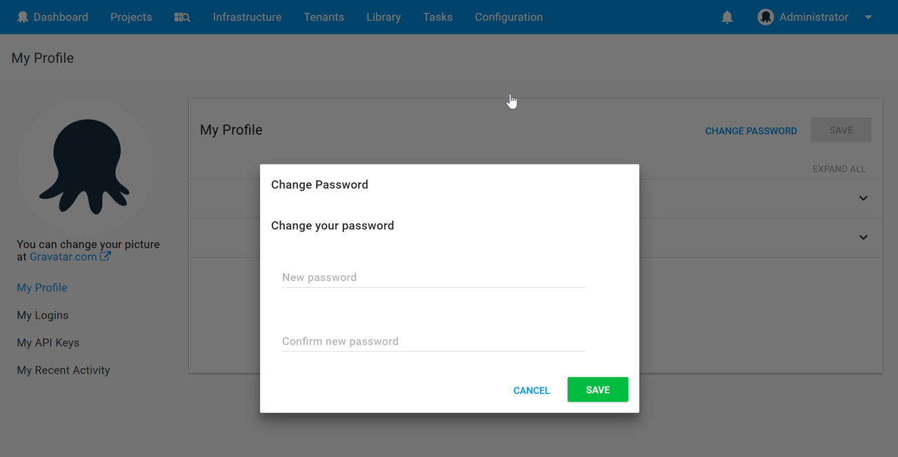

## Resetting Your Own Password {#Resettingpasswords-Resettingyourownpassword}

In the Octopus Web UI, click your username in the top right corner of the screen. Select **Profile** to go to your profile page.

To change your password, select **Change password**:


Enter and confirm your new password, then click **Save**:



## Resetting User Passwords {#Resettingpasswords-Resettinguserpasswords}

Octopus Server administrators can reset the passwords of other users from the Octopus Web Portal at {{Configuration,Users}}.

Select the user whose password you want to change:


Click **Change password**:


Enter and confirm the new password, then click **Save**:


## Resetting Administrator Passwords {#Resettingpasswords-Resettingadministratorpasswords}

Users can be made administrators, and new administrator accounts created using the command line on the Octopus Server machine.

To reset the password of an administrator, or to make a user into an administrator, open an administrative command prompt on the Octopus Server and run the following commands.

### For Username/Password Authentication {#Resettingpasswords-ForUsername/Passwordauthentication}

```powershell
Octopus.Server.exe service --stop
Octopus.Server.exe admin --username=YOURUSERNAME --password=YOURPASSWORD
Octopus.Server.exe service --start
```

Replace `YOURUSERNAME` with the simple login name of the administrator account, and provide the **new password**.

### For Active Directory Authentication {#Resettingpasswords-ForActiveDirectoryauthentication}

When Active Directory authentication is in use, the `--password` argument is not required:

```powershell
Octopus.Server.exe service --stop
Octopus.Server.exe admin --username=YOURUSERNAME
Octopus.Server.exe service --start
```

## Password Complexity {#Resettingpasswords-PasswordComplexity}

Passwords must satisfy password complexity rules.  A password must be at least 8 characters long and satisfy three or more of the criteria:

- length of at least 12 characters
- length of at least 16 characters
- contains a number
- contains whitespace
- contains an uppercase letter
- contains a lowercase letter
- contains punctuation
