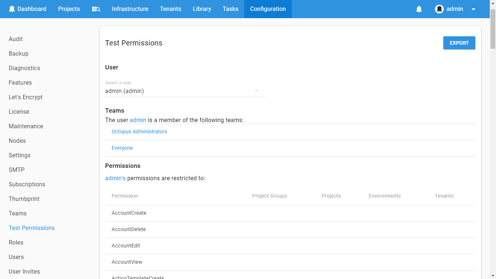

User roles and group permissions play a major part in the Octopus security model. These roles are assigned to Teams and they dictate what the members of those teams can do in Octopus.

## Built-in user roles {#UserRoles-Built-inUserRoles}

Octopus comes with a set of built-in user roles that are designed to work for most common scenarios:

| User role            | Description                              |
| -------------------- | ---------------------------------------- |
| Build Server         | Build servers can publish packages, and create releases, deployments, runbook snapshots and runbook runs. |
| Certificate Manager  | Certificate managers can edit certificates and export private-keys |
| Deployment Creator   | Deployment creators can create new deployments and runbook runs. |
| Environment Manager  | Environment managers can view and edit environments and their machines. |
| Environment Viewer   | Environment viewers can view environments and their machines, but not edit them. |
| Package Publisher    | Permits packages to be pushed to the Octopus Server's built-in NuGet feed. |
| Project Viewer       | Project viewers have read-only access to a project. They can see a project in their dashboard, view releases and deployments. Restrict this role by project to limit it to a subset of projects, and restrict it by environment to limit which environments they can view deployments to. |
| Project Contributor  | All project viewer permissions, plus: editing and viewing variables, editing the deployment steps. Project contributors can't create or deploy releases. |
| Project Initiator    | All project viewer permissions, plus: create new projects. |
| Project Deployer     | All project contributor permissions, plus: deploying releases, but not creating them. |
| Project Lead         | All project contributor permissions, plus: creating releases, but not deploying them. |
| Release Creator      | Release creators can create new releases and runbook snapshots. |
| Runbook Consumer     | Runbook consumers can view and execute runbooks. |
| Runbook Producer     | Runbook producers can edit and execute runbooks. |
| System Administrator | System administrators can do everything at the system level.  |
| System Manager       | System managers can do everything at the system level except certain system-level functions reserved for system administrators. |
| Tenant Manager       | Tenant managers can edit tenants and their tags |

The built-in user roles can be modified to contain more or less roles to suit specific needs. But instead of modifying the built-in ones, we recommend that you leave them as an example and instead create your own user roles.

### Additional user roles for spaces

In addition to the above users roles, **Octopus 2019.1** and above also comes with the following built-in user role.

| User Role            | Description                              |
| -------------------- | ---------------------------------------- |
| Space Manager        | Space managers can do everything within the context of the space they own. |

:::success
For more information regarding the 'system or space level', please see [system and space permissions](/docs/administration/managing-users-and-teams/system-and-space-permissions.md)  
:::

### Default permissions for built-in user roles {#UserRoles-Built-inUserRoles-Default-Permissions}

#### Build Server

| Space Permission            | Description                              |
| BuiltInFeedAdminister       | Create a release for a project (restrictable to Projects, ProjectsViaTenants) |    
| BuiltInFeedDownload         | Create runbook runs (restrictable to Environments, Projects, Tenants) |
| BuiltInFeedPush             | Create/update build information |
| DeploymentCreate            | Deploy releases to target environments (restrictable to Environments, Projects, Tenants) |
| DeploymentView              | Edit runbooks (restrictable to Projects, ProjectsViaTenants) |
| EnvironmentView             | Push new packages to the built-in package repository (restrictable to Projects) |
| FeedView                    | Replace or delete build information |
| LibraryVariableSetView      | Replace or delete packages in the built-in package repository (restrictable to Projects) |
| LifecycleView               | Retrieve the contents of packages in the built-in package repository (restrictable to Projects) |
| BuildInformationPush        | View a release of a project (restrictable to Projects, ProjectsViaTenants) |       
| BuildInformationAdminister  | View deployments (restrictable to Environments, Projects, Tenants) |
| ProcessView                 | View environments (restrictable to Environments) |
| ProjectView                 | View library variable sets (restrictable to Environments, Tenants) |
| ReleaseCreate               | View lifecycles |
| ReleaseView                 | View package feeds and the packages in them |
| TaskView                    | View runbook runs (restrictable to Environments, Projects, Tenants) |
| TenantView                  | View runbooks (restrictable to Projects, ProjectsViaTenants) |
| RunbookView                 | View summary-level information associated with a task (space) (restrictable to Environments, Projects, Tenants) |
| RunbookEdit                 | View tenants (restrictable to Tenants) |
| RunbookRunView              | View the deployment process and channels associated with a project (restrictable to Projects, ProjectsViaTenants) |
| RunbookRunCreate            | View the details of projects (restrictable to Projects, ProjectsViaTenants) |

#### Certificate Manager

| Space Permission            | Description                              |
| CertificateView             | Create certificates (restrictable to Environments, Tenants) |
| CertificateCreate           | Delete certificates (restrictable to Environments, Tenants) |
| CertificateEdit             | Edit certificates (restrictable to Environments, Tenants) |
| CertificateDelete           | Export certificate private-keys (restrictable to Environments, Tenants) |
| CertificateExportPrivateKey | View certificates (restrictable to Environments, Tenants) |
| EnvironmentView             | View environments (restrictable to Environments) |
| TenantView                  | View tenants (restrictable to Tenants) |

#### Deployment Creator

| Space Permission            | Description                              |
| DeploymentCreate            | Create runbook runs (restrictable to Environments, Projects, Tenants) |
| DeploymentView              | Deploy releases to target environments (restrictable to Environments, Projects, Tenants) |
| EnvironmentView             | View a release of a project (restrictable to Projects, ProjectsViaTenants) |
| LifecycleView               | View deployments (restrictable to Environments, Projects, Tenants) |
| ProcessView                 | View environments (restrictable to Environments) |
| ProjectView                 | View library variable sets (restrictable to Environments, Tenants) |
| ReleaseView                 | View lifecycles |
| TaskView                    | View runbook runs (restrictable to Environments, Projects, Tenants) |
| TenantView                  | View runbooks (restrictable to Projects, ProjectsViaTenants) |
| LibraryVariableSetView      | View summary-level information associated with a task (space) (restrictable to Environments, Projects, Tenants) |
| RunbookView                 | View tenants (restrictable to Tenants) |
| RunbookRunView              | View the deployment process and channels associated with a project (restrictable to Projects, ProjectsViaTenants) |
| RunbookRunCreate            | View the details of projects (restrictable to Projects, ProjectsViaTenants) |

#### Environment Manager

| System Permission           | Description                              |
| TeamView                    | View teams (system) |

| Space Permission            | Description                              |
| EnvironmentCreate           | Cancel server tasks (space) (restrictable to Environments, Projects, Tenants) |
| EnvironmentEdit             | Create accounts (restrictable to Environments, Tenants) |
| EnvironmentDelete           | Create environments |
| MachineCreate               | Create health check policies |
| MachineEdit                 | Create machines (restrictable to Environments, Tenants) |
| MachineDelete               | Create proxies |
| TaskCreate                  | Delete accounts (restrictable to Environments, Tenants) |
| TaskCancel                  | Delete environments (restrictable to Environments) |
| AccountCreate               | Delete health check policies |
| AccountEdit                 | Delete machines (restrictable to Environments, Tenants) |
| AccountDelete               | Delete proxies |
| ProxyCreate                 | Edit accounts (restrictable to Environments, Tenants) |
| ProxyEdit                   | Edit environments (restrictable to Environments) |
| ProxyDelete                 | Edit health check policies |
| MachinePolicyCreate         | Edit machines (restrictable to Environments, Tenants) |
| MachinePolicyEdit           | Edit proxies |
| MachinePolicyDelete         | Edit workers and worker pools |
| WorkerEdit                  | Explicitly create (run) server tasks (space) (restrictable to Environments, Projects, Tenants) |
| EnvironmentView             | View accounts (restrictable to Environments, Tenants) |
| MachineView                 | View certificates (restrictable to Environments, Tenants) |
| TaskView                    | View environments (restrictable to Environments) |
| TeamView                    | View health check policies |
| AccountView                 | View machines (restrictable to Environments, Tenants) |
| MachinePolicyView           | View proxies |
| CertificateView             | View summary-level information associated with a task (space) (restrictable to Environments, Projects, Tenants) |
| ProxyView                   | View teams (space) |
| WorkerView                  | View the workers in worker pools |

#### Environment Viewer

| System Permission           | Description                              |
| TeamView                    | View teams (system) |

| Space Permission            | Description                              |
| EnvironmentView             | View accounts (restrictable to Environments, Tenants) |
| MachineView                 | View certificates (restrictable to Environments, Tenants) |
| TaskView                    | View environments (restrictable to Environments) |
| TeamView                    | View health check policies |
| AccountView                 | View machines (restrictable to Environments, Tenants) |
| MachinePolicyView           | View proxies |
| CertificateView             | View summary-level information associated with a task (space) (restrictable to Environments, Projects, Tenants) |
| ProxyView                   | View teams (space) |
| WorkerView                  | View the workers in worker pools |

#### Package Publisher

| Space Permission            | Description                              |
| BuiltInFeedAdminister       | Create/update build information |
| BuiltInFeedDownload         | Push new packages to the built-in package repository (restrictable to Projects) |  
| BuiltInFeedPush             | Replace or delete build information |
| FeedView                    | Replace or delete packages in the built-in package repository (restrictable to Projects) |
| BuildInformationPush        | Retrieve the contents of packages in the built-in package repository (restrictable to Projects) |
| BuildInformationAdminister  | View package feeds and the packages in them |

#### Project Contributor

| System Permission           | Description                              |
| TeamView                    | View other user's roles |
| UserView                    | View teams (system) |
| UserRoleView                | View users |

| Space Permission            | Description                              |
| ArtifactCreate              | Block a release from progressing to the next lifecycle phase (restrictable to Projects) |
| ActionTemplateView          | Create library variable sets |
| ActionTemplateCreate        | Create step templates |
| ActionTemplateEdit          | Create triggers (restrictable to Projects) |
| ActionTemplateDelete        | Delete library variable sets |
| ProcessEdit                 | Delete step templates |
| ProjectEdit                 | Delete triggers (restrictable to Projects) |
| FeedView                    | Edit library variable sets (restrictable to Environments, Tenants) |
| LibraryVariableSetCreate    | Edit project details (restrictable to Projects, ProjectsViaTenants) |
| LibraryVariableSetEdit      | Edit runbooks (restrictable to Projects, ProjectsViaTenants) |
| LibraryVariableSetDelete    | Edit step templates |
| TaskCreate                  | Edit the deployment process and channels associated with a project (restrictable to Projects, ProjectsViaTenants) |
| InterruptionViewSubmitResponsible | Edit triggers (restrictable to Projects) |
| MachineView                 | Edit variables belonging to a project (restrictable to Environments, Projects, Tenants) |
| DefectReport                | Explicitly create (run) server tasks (space) (restrictable to Environments, Projects, Tenants) |
| DefectResolve               | Manually create artifacts (restrictable to Environments, Projects, Tenants) |      
| VariableView                | Take responsibility for and submit interruptions generated during deployments when the user is in a designated responsible team (restrictable to Environments, Projects, Tenants) |
| VariableEdit                | Unblock a release so it can progress to the next phase (restrictable to Projects) || TriggerCreate               | View a release of a project (restrictable to Projects, ProjectsViaTenants) |       
| TriggerDelete               | View certificates (restrictable to Environments, Tenants) |
| TriggerEdit                 | View deployments (restrictable to Environments, Projects, Tenants) |
| RunbookView                 | View environments (restrictable to Environments) |
| RunbookEdit                 | View Events, including access to the Audit screen (space) (restrictable to Environments, Projects, Tenants) |
| ReleaseView                 | View health check policies |
| ProjectView                 | View interruptions generated during deployments (restrictable to Environments, Projects, Tenants) |
| DeploymentView              | View library variable sets (restrictable to Environments, Tenants) |
| ProcessView                 | View lifecycles |
| EnvironmentView             | View machines (restrictable to Environments, Tenants) |
| ArtifactView                | View package feeds and the packages in them |
| EventView                   | View project groups (restrictable to ProjectGroups) |
| ProjectGroupView            | View runbook runs (restrictable to Environments, Projects, Tenants) |
| LibraryVariableSetView      | View runbooks (restrictable to Projects, ProjectsViaTenants) |
| TeamView                    | View step templates |
| TaskView                    | View summary-level information associated with a task (space) (restrictable to Environments, Projects, Tenants) |
| InterruptionView            | View teams (space) |
| LifecycleView               | View tenants (restrictable to Tenants) |
| MachinePolicyView           | View the artifacts created manually and during deployment (restrictable to Environments, Projects, Tenants) |
| TenantView                  | View the deployment process and channels associated with a project (restrictable to Projects, ProjectsViaTenants) |
| TriggerView                 | View the details of projects (restrictable to Projects, ProjectsViaTenants) |      
| CertificateView             | View triggers (restrictable to Projects) |
| RunbookRunView              | View variables belonging to a project or library variable set (restrictable to Environments, Projects, Tenants) |

#### Project Deployer

| System Permission           | Description                              |
| TeamView                    | View other user's roles |
| UserView                    | View teams (system) |
| UserRoleView                | View users |

| Space Permission            | Description                              |
| DeploymentCreate            | Block a release from progressing to the next lifecycle phase (restrictable to Projects) |
| InterruptionSubmit          | Cancel server tasks (space) (restrictable to Environments, Projects, Tenants) |    
| TaskCancel                  | Create library variable sets |
| RunbookRunCreate            | Create runbook runs (restrictable to Environments, Projects, Tenants) |
| ArtifactCreate              | Create step templates |
| ActionTemplateView          | Create triggers (restrictable to Projects) |
| ActionTemplateCreate        | Delete library variable sets |
| ActionTemplateEdit          | Delete step templates |
| ActionTemplateDelete        | Delete triggers (restrictable to Projects) |
| ProcessEdit                 | Deploy releases to target environments (restrictable to Environments, Projects, Tenants) |
| ProjectEdit                 | Edit library variable sets (restrictable to Environments, Tenants) |
| FeedView                    | Edit project details (restrictable to Projects, ProjectsViaTenants) |
| LibraryVariableSetCreate    | Edit runbooks (restrictable to Projects, ProjectsViaTenants) |
| LibraryVariableSetEdit      | Edit step templates |
| LibraryVariableSetDelete    | Edit the deployment process and channels associated with a project (restrictable to Projects, ProjectsViaTenants) |
| TaskCreate                  | Edit triggers (restrictable to Projects) |
| InterruptionViewSubmitResponsible | Edit variables belonging to a project (restrictable to Environments, Projects, Tenants) |
| MachineView                 | Explicitly create (run) server tasks (space) (restrictable to Environments, Projects, Tenants) |
| DefectReport                | Manually create artifacts (restrictable to Environments, Projects, Tenants) |
| DefectResolve               | Take responsibility for and submit interruptions generated during deployments (restrictable to Environments, Projects, Tenants) |
| VariableView                | Take responsibility for and submit interruptions generated during deployments when the user is in a designated responsible team (restrictable to Environments, Projects, Tenants) |
| VariableEdit                | Unblock a release so it can progress to the next phase (restrictable to Projects) || TriggerCreate               | View a release of a project (restrictable to Projects, ProjectsViaTenants) |
| TriggerDelete               | View certificates (restrictable to Environments, Tenants) |
| TriggerEdit                 | View deployments (restrictable to Environments, Projects, Tenants) |
| RunbookView                 | View environments (restrictable to Environments) |
| RunbookEdit                 | View Events, including access to the Audit screen (space) (restrictable to Environments, Projects, Tenants) |
| ReleaseView                 | View health check policies |
| ProjectView                 | View interruptions generated during deployments (restrictable to Environments, Projects, Tenants) |
| DeploymentView              | View library variable sets (restrictable to Environments, Tenants) |
| ProcessView                 | View lifecycles |
| EnvironmentView             | View machines (restrictable to Environments, Tenants) |
| ArtifactView                | View package feeds and the packages in them |
| EventView                   | View project groups (restrictable to ProjectGroups) |
| ProjectGroupView            | View runbook runs (restrictable to Environments, Projects, Tenants) |
| LibraryVariableSetView      | View runbooks (restrictable to Projects, ProjectsViaTenants) |
| TeamView                    | View step templates |
| TaskView                    | View summary-level information associated with a task (space) (restrictable to Environments, Projects, Tenants) |
| InterruptionView            | View teams (space) |
| LifecycleView               | View tenants (restrictable to Tenants) |
| MachinePolicyView           | View the artifacts created manually and during deployment (restrictable to Environments, Projects, Tenants) |
| TenantView                  | View the deployment process and channels associated with a project (restrictable to Projects, ProjectsViaTenants) |
| TriggerView                 | View the details of projects (restrictable to Projects, ProjectsViaTenants) |
| CertificateView             | View triggers (restrictable to Projects) |
| RunbookRunView              | View variables belonging to a project or library variable set (restrictable to Environments, Projects, Tenants) |

#### Project Initiator

| System Permission           | Description                              |
| TeamView                    | View other user's roles |
| UserView                    | View teams (system) |
| UserRoleView                | View users |

| Space Permission            | Description                              |
| ProjectCreate               | Block a release from progressing to the next lifecycle phase (restrictable to Projects) |
| ProjectEdit                 | Create projects (restrictable to ProjectGroups) |
| ProjectDelete               | Delete projects (restrictable to Projects, ProjectsViaTenants) |
| DefectReport                | Edit project details (restrictable to Projects, ProjectsViaTenants) |
| DefectResolve               | Unblock a release so it can progress to the next phase (restrictable to Projects) || ReleaseView                 | View a release of a project (restrictable to Projects, ProjectsViaTenants) |
| ProjectView                 | View certificates (restrictable to Environments, Tenants) |
| DeploymentView              | View deployments (restrictable to Environments, Projects, Tenants) |
| ProcessView                 | View environments (restrictable to Environments) |
| EnvironmentView             | View Events, including access to the Audit screen (space) (restrictable to Environments, Projects, Tenants) |
| ArtifactView                | View health check policies |
| EventView                   | View interruptions generated during deployments (restrictable to Environments, Projects, Tenants) |
| ProjectGroupView            | View library variable sets (restrictable to Environments, Tenants) |
| LibraryVariableSetView      | View lifecycles |
| TeamView                    | View project groups (restrictable to ProjectGroups) |
| TaskView                    | View runbook runs (restrictable to Environments, Projects, Tenants) |
| InterruptionView            | View runbooks (restrictable to Projects, ProjectsViaTenants) |
| LifecycleView               | View summary-level information associated with a task (space) (restrictable to Environments, Projects, Tenants) |
| MachinePolicyView           | View teams (space) |
| TenantView                  | View tenants (restrictable to Tenants) |
| TriggerView                 | View the artifacts created manually and during deployment (restrictable to Environments, Projects, Tenants) |
| CertificateView             | View the deployment process and channels associated with a project (restrictable to Projects, ProjectsViaTenants) |
| RunbookView                 | View the details of projects (restrictable to Projects, ProjectsViaTenants) |      
| RunbookRunView              | View triggers (restrictable to Projects) |

#### Project Lead

| System Permission           | Description                              |
| TeamView                    | View other user's roles |
| UserView                    | View teams (system) |
| UserRoleView                | View users |

| Space Permission            | Description                              |
| ReleaseCreate               | Block a release from progressing to the next lifecycle phase (restrictable to Projects) |
| ReleaseEdit                 | Create a release for a project (restrictable to Projects, ProjectsViaTenants) |    
| ReleaseDelete               | Create library variable sets |
| ArtifactEdit                | Create step templates |
| ArtifactDelete              | Create triggers (restrictable to Projects) |
| ArtifactCreate              | Delete a release of a project (restrictable to Projects, ProjectsViaTenants) |
| ActionTemplateView          | Delete artifacts (restrictable to Environments, Projects, Tenants) |
| ActionTemplateCreate        | Delete library variable sets |
| ActionTemplateEdit          | Delete step templates |
| ActionTemplateDelete        | Delete triggers (restrictable to Projects) |
| ProcessEdit                 | Edit a release of a project (restrictable to Projects, ProjectsViaTenants) |       
| ProjectEdit                 | Edit library variable sets (restrictable to Environments, Tenants) |
| FeedView                    | Edit project details (restrictable to Projects, ProjectsViaTenants) |
| LibraryVariableSetCreate    | Edit runbooks (restrictable to Projects, ProjectsViaTenants) |
| LibraryVariableSetEdit      | Edit step templates |
| LibraryVariableSetDelete    | Edit the deployment process and channels associated with a project (restrictable to Projects, ProjectsViaTenants) |
| TaskCreate                  | Edit the details describing artifacts (restrictable to Environments, Projects, Tenants) |
| InterruptionViewSubmitResponsible | Edit triggers (restrictable to Projects) |
| MachineView                 | Edit variables belonging to a project (restrictable to Environments, Projects, Tenants) |
| DefectReport                | Explicitly create (run) server tasks (space) (restrictable to Environments, Projects, Tenants) |
| DefectResolve               | Manually create artifacts (restrictable to Environments, Projects, Tenants) |      
| VariableView                | Take responsibility for and submit interruptions generated during deployments when the user is in a designated responsible team (restrictable to Environments, Projects, Tenants) |
| VariableEdit                | Unblock a release so it can progress to the next phase (restrictable to Projects) || TriggerCreate               | View a release of a project (restrictable to Projects, ProjectsViaTenants) |       
| TriggerDelete               | View certificates (restrictable to Environments, Tenants) |
| TriggerEdit                 | View deployments (restrictable to Environments, Projects, Tenants) |
| RunbookView                 | View environments (restrictable to Environments) |
| RunbookEdit                 | View Events, including access to the Audit screen (space) (restrictable to Environments, Projects, Tenants) |
| ReleaseView                 | View health check policies |
| ProjectView                 | View interruptions generated during deployments (restrictable to Environments, Projects, Tenants) |
| DeploymentView              | View library variable sets (restrictable to Environments, Tenants) |
| ProcessView                 | View lifecycles |
| EnvironmentView             | View machines (restrictable to Environments, Tenants) |
| ArtifactView                | View package feeds and the packages in them |
| EventView                   | View project groups (restrictable to ProjectGroups) |
| ProjectGroupView            | View runbook runs (restrictable to Environments, Projects, Tenants) |
| LibraryVariableSetView      | View runbooks (restrictable to Projects, ProjectsViaTenants) |
| TeamView                    | View step templates |
| TaskView                    | View summary-level information associated with a task (space) (restrictable to Environments, Projects, Tenants) |
| InterruptionView            | View teams (space) |
| LifecycleView               | View tenants (restrictable to Tenants) |
| MachinePolicyView           | View the artifacts created manually and during deployment (restrictable to Environments, Projects, Tenants) |
| TenantView                  | View the deployment process and channels associated with a project (restrictable to Projects, ProjectsViaTenants) |
| TriggerView                 | View the details of projects (restrictable to Projects, ProjectsViaTenants) |      
| CertificateView             | View triggers (restrictable to Projects) |
| RunbookRunView              | View variables belonging to a project or library variable set (restrictable to Environments, Projects, Tenants) |

#### Project Viewer

| System Permission           | Description                              |
| TeamView                    | View other user's roles |
| UserView                    | View teams (system) |
| UserRoleView                | View users |

| Space Permission            | Description                              |
| ReleaseView                 | View a release of a project (restrictable to Projects, ProjectsViaTenants) |
| ProjectView                 | View certificates (restrictable to Environments, Tenants) |
| DeploymentView              | View deployments (restrictable to Environments, Projects, Tenants) |
| ProcessView                 | View environments (restrictable to Environments) |
| EnvironmentView             | View Events, including access to the Audit screen (space) (restrictable to Environments, Projects, Tenants) |
| ArtifactView                | View health check policies |
| EventView                   | View interruptions generated during deployments (restrictable to Environments, Projects, Tenants) |
| ProjectGroupView            | View library variable sets (restrictable to Environments, Tenants) |
| LibraryVariableSetView      | View lifecycles |
| TeamView                    | View project groups (restrictable to ProjectGroups) |
| TaskView                    | View runbook runs (restrictable to Environments, Projects, Tenants) |
| InterruptionView            | View runbooks (restrictable to Projects, ProjectsViaTenants) |
| LifecycleView               | View summary-level information associated with a task (space) (restrictable to Environments, Projects, Tenants) |
| MachinePolicyView           | View teams (space) |
| TenantView                  | View tenants (restrictable to Tenants) |
| TriggerView                 | View the artifacts created manually and during deployment (restrictable to Environments, Projects, Tenants) |
| CertificateView             | View the deployment process and channels associated with a project (restrictable to Projects, ProjectsViaTenants) |
| RunbookView                 | View the details of projects (restrictable to Projects, ProjectsViaTenants) |
| RunbookRunView              | View triggers (restrictable to Projects) |

#### Release Creator

| Space Permission            | Description                              |
| EnvironmentView             | Create a release for a project (restrictable to Projects, ProjectsViaTenants) |    
| FeedView                    | Edit runbooks (restrictable to Projects, ProjectsViaTenants) |
| ProcessView                 | View a release of a project (restrictable to Projects, ProjectsViaTenants) |
| ProjectView                 | View environments (restrictable to Environments) |
| ReleaseCreate               | View package feeds and the packages in them |
| ReleaseView                 | View runbooks (restrictable to Projects, ProjectsViaTenants) |
| RunbookView                 | View the deployment process and channels associated with a project (restrictable to Projects, ProjectsViaTenants) |
| RunbookEdit                 | View the details of projects (restrictable to Projects, ProjectsViaTenants) |      

#### Runbook Consumer

| Space Permission            | Description                              |
| ProjectView                 | Create runbook runs (restrictable to Environments, Projects, Tenants) |
| EnvironmentView             | View certificates (restrictable to Environments, Tenants) |
| ArtifactView                | View environments (restrictable to Environments) |
| EventView                   | View Events, including access to the Audit screen (space) (restrictable to Environments, Projects, Tenants) |
| ProjectGroupView            | View health check policies |
| LibraryVariableSetView      | View interruptions generated during deployments (restrictable to Environments, Projects, Tenants) |
| TeamView                    | View library variable sets (restrictable to Environments, Tenants) |
| FeedView                    | View machines (restrictable to Environments, Tenants) |
| TaskView                    | View package feeds and the packages in them |
| InterruptionView            | View project groups (restrictable to ProjectGroups) |
| MachinePolicyView           | View runbook runs (restrictable to Environments, Projects, Tenants) |
| TenantView                  | View runbooks (restrictable to Projects, ProjectsViaTenants) |
| TriggerView                 | View summary-level information associated with a task (space) (restrictable to Environments, Projects, Tenants) |
| CertificateView             | View teams (space) |
| MachineView                 | View tenants (restrictable to Tenants) |
| RunbookView                 | View the artifacts created manually and during deployment (restrictable to Environments, Projects, Tenants) |
| RunbookRunView              | View the details of projects (restrictable to Projects, ProjectsViaTenants) |      
| RunbookRunCreate            | View triggers (restrictable to Projects) |

#### Runbook Producer

| Space Permission            | Description                              |
| ProjectCreate               | Cancel server tasks (space) (restrictable to Environments, Projects, Tenants) |    
| ProjectEdit                 | Create library variable sets |
| ProjectDelete               | Create projects (restrictable to ProjectGroups) |
| LifecycleView               | Create runbook runs (restrictable to Environments, Projects, Tenants) |
| ActionTemplateView          | Create step templates |
| ActionTemplateCreate        | Create triggers (restrictable to Projects) |
| ActionTemplateEdit          | Delete artifacts (restrictable to Environments, Projects, Tenants) |
| ActionTemplateDelete        | Delete library variable sets |
| LibraryVariableSetCreate    | Delete projects (restrictable to Projects, ProjectsViaTenants) |
| LibraryVariableSetEdit      | Delete runbook runs (restrictable to Environments, Projects, Tenants) |
| LibraryVariableSetDelete    | Delete step templates |
| TaskCreate                  | Delete triggers (restrictable to Projects) |
| TaskCancel                  | Edit library variable sets (restrictable to Environments, Tenants) |
| InterruptionViewSubmitResponsible | Edit project details (restrictable to Projects, ProjectsViaTenants) |
| VariableView                | Edit runbooks (restrictable to Projects, ProjectsViaTenants) |
| VariableEdit                | Edit step templates |
| TriggerCreate               | Edit the details describing artifacts (restrictable to Environments, Projects, Tenants) |
| TriggerDelete               | Edit triggers (restrictable to Projects) |
| TriggerEdit                 | Edit variables belonging to a project (restrictable to Environments, Projects, Tenants) |
| RunbookEdit                 | Explicitly create (run) server tasks (space) (restrictable to Environments, Projects, Tenants) |
| RunbookRunDelete            | Manually create artifacts (restrictable to Environments, Projects, Tenants) |      
| ArtifactCreate              | Take responsibility for and submit interruptions generated during deployments (restrictable to Environments, Projects, Tenants) |
| ArtifactEdit                | Take responsibility for and submit interruptions generated during deployments when the user is in a designated responsible team (restrictable to Environments, Projects, Tenants) |
| ArtifactDelete              | View certificates (restrictable to Environments, Tenants) |
| InterruptionSubmit          | View environments (restrictable to Environments) |
| ProjectView                 | View Events, including access to the Audit screen (space) (restrictable to Environments, Projects, Tenants) |
| EnvironmentView             | View health check policies |
| ArtifactView                | View interruptions generated during deployments (restrictable to Environments, Projects, Tenants) |
| EventView                   | View library variable sets (restrictable to Environments, Tenants) |
| ProjectGroupView            | View lifecycles |
| LibraryVariableSetView      | View machines (restrictable to Environments, Tenants) |
| TeamView                    | View package feeds and the packages in them |
| FeedView                    | View project groups (restrictable to ProjectGroups) |
| TaskView                    | View runbook runs (restrictable to Environments, Projects, Tenants) |
| InterruptionView            | View runbooks (restrictable to Projects, ProjectsViaTenants) |
| MachinePolicyView           | View step templates |
| TenantView                  | View summary-level information associated with a task (space) (restrictable to Environments, Projects, Tenants) |
| TriggerView                 | View teams (space) |
| CertificateView             | View tenants (restrictable to Tenants) |
| MachineView                 | View the artifacts created manually and during deployment (restrictable to Environments, Projects, Tenants) |
| RunbookView                 | View the details of projects (restrictable to Projects, ProjectsViaTenants) |      
| RunbookRunView              | View triggers (restrictable to Projects) |
| RunbookRunCreate            | View variables belonging to a project or library variable set (restrictable to Environments, Projects, Tenants) |

#### Space Manager

| System Permission           | Description                              |
| TeamView                    | View other user's roles |
| UserView                    | View teams (system) |
| UserRoleView                | View users |

| Space Permission            | Description                              |
| ProjectEdit                 | Block a release from progressing to the next lifecycle phase (restrictable to Projects) |
| ProjectView                 | Cancel server tasks (space) (restrictable to Environments, Projects, Tenants) |
| ProjectCreate               | Create a release for a project (restrictable to Projects, ProjectsViaTenants) |    
| ProjectDelete               | Create accounts (restrictable to Environments, Tenants) |
| ProcessView                 | Create certificates (restrictable to Environments, Tenants) |
| ProcessEdit                 | Create environments |
| VariableEdit                | Create health check policies |
| VariableEditUnscoped        | Create library variable sets |
| VariableView                | Create lifecycles |
| VariableViewUnscoped        | Create machines (restrictable to Environments, Tenants) |
| ReleaseCreate               | Create project groups |
| ReleaseView                 | Create projects (restrictable to ProjectGroups) |
| ReleaseEdit                 | Create proxies |
| ReleaseDelete               | Create runbook runs (restrictable to Environments, Projects, Tenants) |
| DefectReport                | Create step templates |
| DefectResolve               | Create subscriptions |
| DeploymentCreate            | Create tag sets |
| DeploymentDelete            | Create teams (space) |
| DeploymentView              | Create tenants |
| EnvironmentView             | Create triggers (restrictable to Projects) |
| EnvironmentCreate           | Create/update build information |
| EnvironmentEdit             | Delete a release of a project (restrictable to Projects, ProjectsViaTenants) |
| EnvironmentDelete           | Delete accounts (restrictable to Environments, Tenants) |
| MachineCreate               | Delete artifacts (restrictable to Environments, Projects, Tenants) |
| MachineEdit                 | Delete certificates (restrictable to Environments, Tenants) |
| MachineView                 | Delete deployments (restrictable to Environments, Projects, Tenants) |
| MachineDelete               | Delete environments (restrictable to Environments) |
| ArtifactView                | Delete health check policies |
| ArtifactCreate              | Delete library variable sets |
| ArtifactEdit                | Delete lifecycles |
| ArtifactDelete              | Delete machines (restrictable to Environments, Tenants) |
| FeedView                    | Delete project groups (restrictable to ProjectGroups) |
| EventView                   | Delete projects (restrictable to Projects, ProjectsViaTenants) |
| LibraryVariableSetView      | Delete proxies |
| LibraryVariableSetCreate    | Delete runbook runs (restrictable to Environments, Projects, Tenants) |
| LibraryVariableSetEdit      | Delete step templates |
| LibraryVariableSetDelete    | Delete subscriptions |
| ProjectGroupView            | Delete tag sets |
| ProjectGroupCreate          | Delete teams (space) |
| ProjectGroupEdit            | Delete tenants (restrictable to Tenants) |
| ProjectGroupDelete          | Delete triggers (restrictable to Projects) |
| TeamCreate                  | Deploy releases to target environments (restrictable to Environments, Projects, Tenants) |
| TeamView                    | Edit a release of a project (restrictable to Projects, ProjectsViaTenants) |       
| TeamEdit                    | Edit accounts (restrictable to Environments, Tenants) |
| TeamDelete                  | Edit certificates (restrictable to Environments, Tenants) |
| TaskView                    | Edit environments (restrictable to Environments) |
| TaskCreate                  | Edit feeds |
| TaskCancel                  | Edit health check policies |
| TaskEdit                    | Edit library variable sets (restrictable to Environments, Tenants) |
| InterruptionView            | Edit lifecycles |
| InterruptionSubmit          | Edit machines (restrictable to Environments, Tenants) |
| InterruptionViewSubmitResponsible | Edit non-environment scoped variables belonging to a project or library variable set (restrictable to Projects) |
| BuiltInFeedPush             | Edit project details (restrictable to Projects, ProjectsViaTenants) |
| BuiltInFeedAdminister       | Edit project groups (restrictable to ProjectGroups) |
| BuiltInFeedDownload         | Edit proxies |
| ActionTemplateView          | Edit runbooks (restrictable to Projects, ProjectsViaTenants) |
| ActionTemplateCreate        | Edit server tasks (space) (restrictable to Environments, Projects, Tenants) |
| ActionTemplateEdit          | Edit step templates |
| ActionTemplateDelete        | Edit subscriptions |
| LifecycleCreate             | Edit tag sets |
| LifecycleView               | Edit teams (space) |
| LifecycleEdit               | Edit tenants (restrictable to Tenants) |
| LifecycleDelete             | Edit the deployment process and channels associated with a project (restrictable to Projects, ProjectsViaTenants) |
| AccountView                 | Edit the details describing artifacts (restrictable to Environments, Projects, Tenants) |
| AccountEdit                 | Edit triggers (restrictable to Projects) |
| AccountCreate               | Edit variables belonging to a project (restrictable to Environments, Projects, Tenants) |
| AccountDelete               | Edit workers and worker pools |
| TenantCreate                | Explicitly create (run) server tasks (space) (restrictable to Environments, Projects, Tenants) |
| TenantEdit                  | Export certificate private-keys (restrictable to Environments, Tenants) |
| TenantView                  | Manually create artifacts (restrictable to Environments, Projects, Tenants) |
| TenantDelete                | Push new packages to the built-in package repository (restrictable to Projects) |  
| TagSetCreate                | Replace or delete build information |
| TagSetEdit                  | Replace or delete packages in the built-in package repository (restrictable to Projects) |
| TagSetDelete                | Retrieve the contents of packages in the built-in package repository (restrictable to Projects) |
| MachinePolicyCreate         | Take responsibility for and submit interruptions generated during deployments (restrictable to Environments, Projects, Tenants) |
| MachinePolicyView           | Take responsibility for and submit interruptions generated during deployments when the user is in a designated responsible team (restrictable to Environments, Projects, Tenants) |
| MachinePolicyEdit           | Unblock a release so it can progress to the next phase (restrictable to Projects) || MachinePolicyDelete         | View a release of a project (restrictable to Projects, ProjectsViaTenants) |
| ProxyCreate                 | View accounts (restrictable to Environments, Tenants) |
| ProxyView                   | View certificates (restrictable to Environments, Tenants) |
| ProxyEdit                   | View deployments (restrictable to Environments, Projects, Tenants) |
| ProxyDelete                 | View environments (restrictable to Environments) |
| SubscriptionCreate          | View Events, including access to the Audit screen (space) (restrictable to Environments, Projects, Tenants) |
| SubscriptionView            | View health check policies |
| SubscriptionEdit            | View interruptions generated during deployments (restrictable to Environments, Projects, Tenants) |
| SubscriptionDelete          | View library variable sets (restrictable to Environments, Tenants) |
| TriggerCreate               | View lifecycles |
| TriggerView                 | View machines (restrictable to Environments, Tenants) |
| TriggerEdit                 | View non-environment scoped variables belonging to a project or library variable set (restrictable to Projects) |
| TriggerDelete               | View package feeds and the packages in them |
| CertificateView             | View project groups (restrictable to ProjectGroups) |
| CertificateCreate           | View proxies |
| CertificateEdit             | View runbook runs (restrictable to Environments, Projects, Tenants) |
| CertificateDelete           | View runbooks (restrictable to Projects, ProjectsViaTenants) |
| CertificateExportPrivateKey | View step templates |
| FeedEdit                    | View subscriptions |
| WorkerView                  | View summary-level information associated with a task (space) (restrictable to Environments, Projects, Tenants) |
| WorkerEdit                  | View teams (space) |
| BuildInformationPush        | View tenants (restrictable to Tenants) |
| BuildInformationAdminister  | View the artifacts created manually and during deployment (restrictable to Environments, Projects, Tenants) |
| RunbookView                 | View the deployment process and channels associated with a project (restrictable to Projects, ProjectsViaTenants) |
| RunbookEdit                 | View the details of projects (restrictable to Projects, ProjectsViaTenants) |
| RunbookRunView              | View the workers in worker pools |
| RunbookRunDelete            | View triggers (restrictable to Projects) |
| RunbookRunCreate            | View variables belonging to a project or library variable set (restrictable to Environments, Projects, Tenants) |

#### System Administrator

| System Permission           | Description                              |
| AdministerSystem            | Cancel server tasks (system) |
| ConfigureServer             | Configure server settings like Authentication, SMTP, and HTTP Security Headers |
| EventView                   | Create spaces |
| TeamCreate                  | Create teams (system) |
| TeamView                    | Delete spaces |
| TeamEdit                    | Delete teams (system) |
| TeamDelete                  | Edit server tasks (system) |
| TaskView                    | Edit spaces |
| TaskCreate                  | Edit teams (system) |
| TaskCancel                  | Edit user role definitions |
| TaskEdit                    | Edit users |
| SpaceView                   | Explicitly create (run) server tasks (system) |
| SpaceEdit                   | Invite users to register accounts |
| SpaceCreate                 | Perform system-level functions like configuring HTTP web hosting, the public URL, server nodes, maintenance mode, and server diagnostics |
| SpaceDelete                 | View Events, including access to the Audit screen (system) |
| UserView                    | View other user's roles |
| UserInvite                  | View spaces |
| UserRoleView                | View summary-level information associated with a task (system) |
| UserRoleEdit                | View teams (system) |
| UserEdit                    | View users |

#### System Manager

| System Permission           | Description                              |
| ConfigureServer             | Cancel server tasks (system) |
| EventView                   | Configure server settings like Authentication, SMTP, and HTTP Security Headers |   
| TeamCreate                  | Create spaces |
| TeamView                    | Create teams (system) |
| TeamEdit                    | Delete spaces |
| TeamDelete                  | Delete teams (system) |
| TaskView                    | Edit server tasks (system) |
| TaskCreate                  | Edit spaces |
| TaskCancel                  | Edit teams (system) |
| TaskEdit                    | Edit user role definitions |
| SpaceView                   | Edit users |
| SpaceEdit                   | Explicitly create (run) server tasks (system) |
| SpaceCreate                 | Invite users to register accounts |
| SpaceDelete                 | View Events, including access to the Audit screen (system) |
| UserView                    | View other user's roles |
| UserInvite                  | View spaces |
| UserRoleView                | View summary-level information associated with a task (system) |
| UserRoleEdit                | View teams (system) |
| UserEdit                    | View users |

#### Tenant Manager

| Space Permission            | Description                              |
| TenantCreate                | Create tenants |
| TenantEdit                  | Delete tenants (restrictable to Tenants) |
| TenantDelete                | Edit tenants (restrictable to Tenants) |
| TenantView                  | View tenants (restrictable to Tenants) |

## Creating user roles (LTS) {#UserRoles-CreatingUserRolesLTS}

If you are using a version prior to **Octopus 2019.1** (including **2018.10-LTS**), a custom User Role can be created with any combination of permissions. To create a custom user role:

1. Under the **Configuration** page, click **Roles**.

   

2. Click **Add custom role**.

3. Select the set of permissions you'd like this new User Role to contain, and give the role a name and description.

   

Once the custom role is saved, the new role will be available to be assigned to any team on Octopus.

## Creating user roles with spaces {#UserRoles-CreatingUserRoles}

If you are using **Octopus 2019.1** or later, a custom User Role can be created with any combination of permissions. To create a custom user role:

1. Under the **Configuration** page, click **Roles**.

   

2. Click **Add custom role**.

3. Select the set of permissions you'd like this new User Role to contain, and give the role a name and description. These can be system or space level permissions.

   

Once the custom role is saved, the new role will be available to be assigned to teams in Octopus. [Some rules apply](/docs/administration/managing-users-and-teams/system-and-space-permissions.md#SystemAndSpacePermissions-RulesOfTheRoad), depending on the mix of system or space level permissions you chose.

When applying roles to a team, you are able to optionally specify a scope for each role applied. This enables some complex scenarios, like granting a team [different levels of access](/docs/administration/managing-users-and-teams/creating-teams-for-a-user-with-mixed-environment-privileges.md) based on the environment they are authorized for.   

## Troubleshooting permissions {#UserRoles-TroubleshootingPermissions}

If for some reason a user has more/fewer permissions than they should, you can use the **Test Permissions** feature to get an easy to read list of all the permissions that a specific user has on the Octopus instance.

To test the permissions go to **{{Configuration,Test Permissions}}** and select a user from the drop-down.

The results will show:

- The teams of which the user is a member of.
- A chart detailing each role and on which Environment/Project this permission can be executed. The chart can be exported to a CSV file by clicking the Export button. Once the file is downloaded it can viewed in browser using [Online CSV Editor and Viewer](http://www.convertcsv.com/csv-viewer-editor.htm).

If a user tries to perform an action without having enough permissions to do it, an error message will pop up showing which permissions the user is lacking, and which teams actually have these permissions.

:::warning
As further versions of Octopus are released, we might create new roles to improve our security model. These new roles will not be automatically included in any of the built-in user roles, to avoid giving users permissions they are not supposed to have. These new roles will have to be added manually to a User Role by an administrator.
:::
