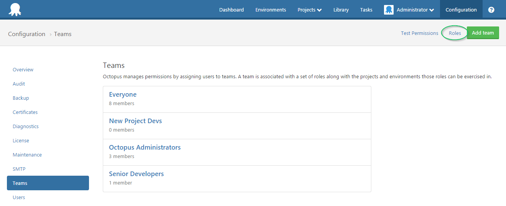
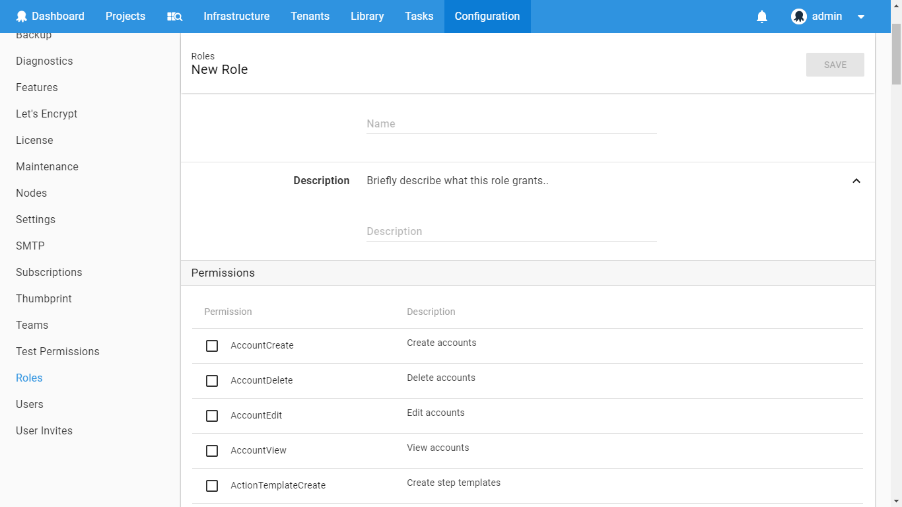

A custom User Role can be created with any combination of permissions. To create a custom user role:

1. Under the **Configuration** page, click **Roles**.

   

2. Click **Add custom role**

3. Select the set of permissions you'd like this new User Role to contain, and give the role a name and description

   

Once the custom role is saved, the new role will be available to be assigned to any team on Octopus.

