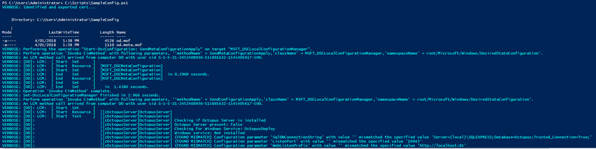

## Automate Octopus Server installation and configuration via OctopusDSC.
Before you use this guide, you will need to confirm that you have [installed the OctopusDSC PowerShell module](/docs/administration/octopus-dsc/Index.md).

Once you have installed the OctopusDSC module you are ready to automate the installation and configuration of Octopus Server. Below is a basic example for installing the Octopus Server Manager and configuring your new instance. You can use this to test and see the results.

Below is an example script to give you an idea. First, ensure the OctopusDSC module is on your `$env:PSModulePath`. Then you can create and apply configuration like this.

```PowerShell
Configuration SampleConfig
{
    Import-DscResource -Module OctopusDSC

    Node "localhost"
    {
        cOctopusServer OctopusServer
        {
            Ensure = "Present"
            State = "Started"

            # Server instance name. Leave it as 'OctopusServer' unless you have more
            # than one instance
            Name = "OctopusServer"

            # The url that Octopus will listen on
            WebListenPrefix = "http://localhost:81"

            SqlDbConnectionString = "Server=(local)\SQLEXPRESS;Database=Octopus;Trusted_Connection=True;"

            # The admin user to create
            OctopusAdminCredential = $PSCredentialObject

            # optional parameters
            AllowUpgradeCheck = $true
            AllowCollectionOfAnonymousUsageStatistics = $true
            ForceSSL = $false
            ListenPort = 10943
            DownloadUrl = "https://octopus.com/downloads/latest/WindowsX64/OctopusServer"

            # for pre 3.5, valid values are "UsernamePassword"
            # for 3.5 and above, only "Ignore" is valid (this is the default value)
            LegacyWebAuthenticationMode = "UsernamePassword"

            HomeDirectory = "C:\Octopus"

            # if not supplied, Octopus will use a free license
            LicenseKey = "base64encodedlicense"
        }
    }
}

SampleConfig

Start-DscConfiguration .\SampleConfig -Verbose -wait

Test-DscConfiguration
```

:::hint
For more OctopusDSC server scripts and examples, please see our GitHub repository [examples page](https://github.com/OctopusDeploy/OctopusDSC/tree/master/OctopusDSC/Examples).:::
:::hint
You are able to define a custom `DownloadUrl` in your script which can point to internal drives or directories. When doing so, you must ensure that you are pointing directly to the .MSI installer and not the directory.
Example: `DownloadUrl = "\\192.168.10.100\installers\Octopus\Server\Latest\Octopus.3.17.11-x64.msi"`
:::

### What happens here?

The above script is a basic example of the configuration. In order to run the server installation, you will need a certificate to encrypt your desired Octopus administrator login information. The is can be done by referencing the following [Microsoft documentation](https://docs.microsoft.com/en-us/powershell/dsc/secureMOF).

OctopusDSC will download the latest version of the Octopus Server manager from our website. It will then install the msi and create an instance with any configuration settings you pass through to it in the above configuration script.

OctopusDSC can also be used to create and register new server instances on servers which already have a server instance. To do this simply change the value of `Name = "OctopusServer"` to the instance name you desire.

:::hint
Ensure you have replaced the values from the above script which require specific values, such as `SqlDbConnectionString`, `OctopusAdminUsername` and `OctopusAdminPassword` etc.
:::

Successfully running the script should return something along the lines of the following:


That's it! OctopusDSC has installed, configured, and registered your new server instance. This can be used to remotely manage your infrastructure. Or it can be packaged with your OS images and used on initial server configuration.

## Settings
Your OctopusDSC script can be configured to match most use cases we see. Below we have information on what you can customize in your script and the format you should present it.

When `Ensure` is set to `Present`, the resource will:

1. Download the Octopus Server MSI from the internet
2. Install the MSI
3. Create the database
4. Set the admin username and password
5. Configure with a free license
6. Start the service

When `Ensure` is set to `Absent`, the resource will:

1. Delete the Octopus Server windows service
2. Uninstall using the MSI if there are no other instances installed on this machine

When `State` is `Started`, the resource will ensure that the Octopus Server windows service is running. When `Stopped`, it will ensure the service is stopped.

### Properties
Below are the properties that you can define in your cOctopusServerDSC script.

| Property                                     | Type                                                | Default Value                                                   | Description |
| -------------------------------------------- | --------------------------------------------------- | ----------------------------------------------------------------| ------------|
| `Ensure`                                     | `string` - `Present` or `Absent`                    | `Present`                                                       | The desired state of the Octopus Server - effectively whether to install or uninstall. |
| `Name`                                       | `string`                                            |                                                                 | The name of the Octopus Server instance. Use `OctopusServer` by convention unless you have more than one instance. |
| `State`                                      | `string` - `Started` or `Stopped`                   | `Started`                                                       | The desired state of the Octopus Server service. |
| `DownloadUrl`                                | `string`                                            | `https://octopus.com/downloads/latest/WindowsX64/OctopusServer` | The url to use to download the msi. |
| `SqlDbConnectionString`                      | `string`                                            |                                                                 | The connection string to use to connect to the SQL Server database. |
| `WebListenPrefix`                            | `string`                                            |                                                                 | A semi-colon (`;`) delimited list of urls on which the server should listen. eg `https://octopus.example.com:81`. |
| `OctopusAdminCredential`                     | `PSCredential`                                      | `[PSCredential]::Empty`                                         | The name/password of the administrative user to create on first install. |
| `AllowUpgradeCheck`                          | `boolean`                                           | `$true`                                                         | Whether the server should check for updates periodically. |
| `AllowCollectionOfAnonymousUsageStatistics`  | `boolean`                                           | `$true`                                                         | Allow anonymous reporting of usage statistics. |
| `LegacyWebAuthenticationMode`                | `string` - `UsernamePassword`, `Domain` or `Ignore` | `Ignore`                                                        | For Octopus version older than 3.5, allows you to configure how users login. For 3.5 and above, this must be set to `ignore`.  |
| `ForceSSL`                                   | `boolean`                                           | `$false`                                                        | Whether SSL should be required (HTTP requests get redirected to HTTPS) |
| `ListenPort`                                 | `int`                                               | `10943`                                                         | The port on which the Server should listen for communication from `Polling` Tentacles. |
| `AutoLoginEnabled`                           | `boolean`                                           | `$false`                                                        | If an authentication provider is enabled that supports pass through authentcation (eg Active Directory), allow the user to automatically sign in. Only supported from Octopus 3.5. |
| `OctopusServiceCredential`                   | `PSCredential`                                      | `[PSCredential]::Empty`                                         | Credentials of the account used to run the Octopus Service |
| `HomeDirectory`                              | `string`                                            | `C:\Octopus`                                                    | Home directory for Octopus logs and config (where supported) |
| `LicenseKey`                                 | `string`                                            |                                                                 | The Base64 (UTF8) encoded license key. If not supplied, uses a free license. Drift detection is only supported from Octopus 4.1.3. |
| `GrantDatabasePermissions`                   | `boolean`                                           | `$true`                                                         | Whether to grant `db_owner` permissions to the service account user (`$OctopusServiceCredential` user if supplied, or `NT AUTHORITY\System`)  |
| `OctopusMasterKey`                           | `PSCredential`                                      | `[PSCredential]::Empty`                                         | The master key for the existing database. |
| `OctopusRunOnServerCredential`               | `PSCredential`                                      | `[PSCredential]::Empty`                                         | The user account to use to execute run-on-server scripts. If not supplied, executes scripts under the service account used for `Octopus.Server.exe` |

## Authentication automation with OctopusDSC
We also currently have the following resources for automating the configuration of various authentication methods/providers. See the below list for links to our script repository:

### Active Directory
[OctopusServerActiveDirectoryAuthentication](https://github.com/OctopusDeploy/OctopusDSC/tree/master/OctopusDSC/DSCResources/cOctopusServerActiveDirectoryAuthentication)
```Powershell
Configuration SampleConfig
{
    Import-DscResource -Module OctopusDSC

    Node "localhost"
    {
        cOctopusServerActiveDirectoryAuthentication "Enable AD authentication"
        {
            InstanceName = "OctopusServer"
            Enabled = $true
            AllowFormsAuthenticationForDomainUsers = $false
            ActiveDirectoryContainer = "CN=Users,DC=GPN,DC=COM"
        }
    }
}

SampleConfig

Start-DscConfiguration .\SampleConfig -Verbose -wait

Test-DscConfiguration
```
#### Active Directory Authentication Properties

| Property                                  | Type         | Default Value    | Description |
| ------------------------------------------| ------------ | -----------------| ------------|
| `InstanceName`                            | `string`     |                  | The name of the Octopus Server instance. Use `OctopusServer` by convention unless you have more than one instance. |
| `Enabled`                                 | `boolean`    | `$false`         | Whether to enable Active Directory authentication. |
| `AllowFormsAuthenticationForDomainUsers`  | `boolean`    | `$false`         | Whether to allow users to manually enter a username and password. |
| `ActiveDirectoryContainer`                | `string`     |                  | The active directory container (if user objects are stored in a non-standard location).  |
#### Azure Active Directory
[OctopusServerAzureADAuthentication](https://github.com/OctopusDeploy/OctopusDSC/tree/master/OctopusDSC/DSCResources/cOctopusServerAzureADAuthentication)
```powershell
Configuration SampleConfig
{
    Import-DscResource -Module OctopusDSC

    Node "localhost"
    {
        cOctopusServerAzureADAuthentication "Enable AzureAD authentication"
        {
            InstanceName = "OctopusServer"
            Enabled = $true
            Issuer = "https://login.microsoftonline.com/b91ebf6a-84be-4c6f-97f3-32a1d0a11c8a"
            ClientId = "0272262a-b31d-4acf-8891-56e96d302018"
        }
    }
}

SampleConfig

Start-DscConfiguration .\SampleConfig -Verbose -wait

Test-DscConfiguration
```
#### Properties

| Property            | Type         | Default Value    | Description |
| --------------------| ------------ | -----------------| ------------|
| `InstanceName`      | `string`     |                  | The name of the Octopus Server instance. Use `OctopusServer` by convention unless you have more than one instance. |
| `Enabled`           | `boolean`    | `$false`         | Whether to enable AzureAD authentication. |
| `Issuer`            | `string`     |                  | The `OAuth 2.0 Authorization Endpoint` from the Azure Portal, with the trailing `/oauth2/authorize` removed. |
| `ClientId`          | `string`     |                  | The `Application ID` from the Azure Portal. |
#### GoogleApps
[OctopusServerGoogleAppsAuthentication](https://github.com/OctopusDeploy/OctopusDSC/tree/master/OctopusDSC/DSCResources/cOctopusServerGoogleAppsAuthentication)
```powershell
Configuration SampleConfig
{
    Import-DscResource -Module OctopusDSC

    Node "localhost"
    {
        cOctopusServerGoogleAppsAuthentication "Enable Google Apps authentication"
        {
            InstanceName = "OctopusServer"
            Enabled = $true
            ClientID = "5743519123-1232358520259-3634528"
            HostedDomain = "https://octopus.example.com"
        }
    }
}

SampleConfig

Start-DscConfiguration .\SampleConfig -Verbose -wait

Test-DscConfiguration
```

#### Properties

| Property            | Type         | Default Value    | Description |
| --------------------| ------------ | -----------------| ------------|
| `InstanceName`      | `string`     |                  | The name of the Octopus Server instance. Use `OctopusServer` by convention unless you have more than one instance. |
| `Enabled`           | `boolean`    | `$false`         | Whether to enable GoogleApps authentication. |
| `ClientId`          | `string`     |                  | The `Client ID` from the Google Developer console. |
| `HostedDomain`      | `string`     |                  | The url of your octopus server. |
#### Guest Login
[OctopusServerGuestAuthentication](https://github.com/OctopusDeploy/OctopusDSC/tree/master/OctopusDSC/DSCResources/cOctopusServerGuestAuthentication)
```powershell
Configuration SampleConfig
{
    Import-DscResource -Module OctopusDSC

    Node "localhost"
    {
        cOctopusServerGuestAuthentication "Enable guest account login"
        {
            InstanceName = "OctopusServer"
            Enabled = $true
        }
    }
}

SampleConfig

Start-DscConfiguration .\SampleConfig -Verbose -wait

Test-DscConfiguration
```

#### Properties

| Property            | Type         | Default Value    | Description |
| --------------------| ------------ | -----------------| ------------|
| `InstanceName`      | `string`     |                  | The name of the Octopus Server instance. Use `OctopusServer` by convention unless you have more than one instance. |
| `Enabled`           | `boolean`    | `$false`         | Whether to enable the read-only guest account. |
#### OKTA
[OctopusServerOktaAuthentiaction](https://github.com/OctopusDeploy/OctopusDSC/tree/master/OctopusDSC/DSCResources/cOctopusServerOktaAuthentication)
```powershell
Configuration SampleConfig
{
    Import-DscResource -Module OctopusDSC

    Node "localhost"
    {
        cOctopusServerOktaAuthentication "Enable Okta authentication"
        {
            InstanceName = "OctopusServer"
            Enabled = $true
            Issuer = "https://dev-258251.oktapreview.com"
            ClientId = "752nx5basdskrsbqansE"
        }
    }
}

SampleConfig

Start-DscConfiguration .\SampleConfig -Verbose -wait

Test-DscConfiguration
```
#### Properties

| Property            | Type         | Default Value    | Description |
| --------------------| ------------ | -----------------| ------------|
| `InstanceName`      | `string`     |                  | The name of the Octopus Server instance. Use `OctopusServer` by convention unless you have more than one instance. |
| `Enabled`           | `boolean`    | `$false`         | Whether to enable Okta authentication. |
| `Issuer`            | `string`     |                  | The 'Issuer' from the Application settings in the Okta portal. |
| `ClientId`          | `string`     |                  | The 'Audience' from the Application settings in the Okta portal. |

#### Username and Password
[OctopusServerUsernamePasswordAuthentication](https://github.com/OctopusDeploy/OctopusDSC/tree/master/OctopusDSC/DSCResources/cOctopusServerUsernamePasswordAuthentication)
```powershell
Configuration SampleConfig
{
    Import-DscResource -Module OctopusDSC

    Node "localhost"
    {
        cOctopusServerUsernamePasswordAuthentication "Enable Username/Password Auth"
        {
            InstanceName = "OctopusServer"
            Enabled = $true
        }
    }
}

SampleConfig

Start-DscConfiguration .\SampleConfig -Verbose -wait

Test-DscConfiguration
```
#### Properties

| Property            | Type         | Default Value    | Description |
| --------------------| ------------ | -----------------| ------------|
| `InstanceName`      | `string`     |                  | The name of the Octopus Server instance. Use `OctopusServer` by convention unless you have more than one instance. |
| `Enabled`           | `boolean`    | `$false`         | Whether to enable internal username/password authentication. |
#### Watchdog where put this?
[OctopusServerServerWatchdog](https://github.com/OctopusDeploy/OctopusDSC/tree/master/OctopusDSC/DSCResources/cOctopusServerWatchdog)

## Drift

Currently the resource does not consider `SqlDbConnectionString`, `OctopusAdminUsername` or `OctopusAdminPassword` when testing for drift.

This means that the server will be automatically reconfigured if you change any properties except the ones listed above.

If the DownloadUrl property changes, it will detect the configuration drift and upgrade the Server as appropriate. However, if you leave it as default (ie 'install latest'), it will not upgrade when a new version is released - it only actions on change of the property.

However, if you need to change any of the `SqlDbConnectionString`, `OctopusAdminUsername` or `OctopusAdminPassword`properties, you will need to uninstall then reinstall the server (by changing `Ensure` to `Absent` and then back to `Present`).

## Links
If you would like to contribute to the OctopusDSC open source repository, please follow the instructions on this documentations parent page.

[Automating Infrastructure with DSC](/docs/administration/octopus-dsc/Index.md)
[Installing Octopus Tentacle Agent via DSC](/docs/administration/octopus-dsc/Tentacle-Agent.md)
