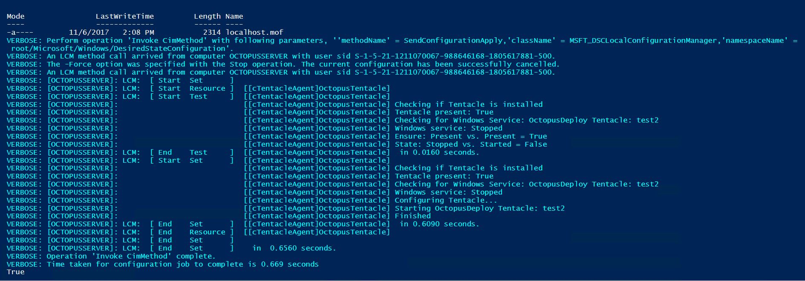

## Deploy and configure Octopus Tentacle Agent with OctopusDSC

Before you use this guide, you will need to confirm that you have [installed the OctopusDSC PowerShell module](link to index).

Once you have installed the OctopusDSC module you are ready to automate the deployment and configuration of Tentacle Agent. Below is a basic example for installing Tentacle agent, configuring the instance and registering it with your Octopus server. You can use this to test and see the results.

:::hint
First, ensure the OctopusDSC module is on your `$env:PSModulePath`. Then you can create and apply configuration like this.
:::


Create a powershell script from the following code which can on our open source GitHub repository for [OctopusDSC]().


```powershell
Configuration SampleConfig
{
    param ($ApiKey, $OctopusServerUrl, $Environments, $Roles, $ListenPort)

    Import-DscResource -Module OctopusDSC

    Node "localhost"
    {
        cTentacleAgent OctopusTentacle
        {
            Ensure = "Present"
            State = "Started"

            # Tentacle instance name. Leave it as 'Tentacle' unless you have more
            # than one instance
            Name = "Tentacle"

            # Defaults to <MachineName>_<InstanceName> unless overridden
            DisplayName = "My Tentacle"

            # Required parameters. See full properties list below
            ApiKey = $ApiKey
            OctopusServerUrl = $OctopusServerUrl
            Environments = $Environments
            Roles = $Roles
        }
    }
}

SampleConfig -ApiKey "API-ABCDEF12345678910" -OctopusServerUrl "https://demo.octopusdeploy.com/" -Environments @("Development") -Roles @("web-server", "app-server") -ListenPort 10933

Start-DscConfiguration .\SampleConfig -Verbose -wait

Test-DscConfiguration
```

##### What happens here?
OctopusDSC will download the latest version of the Octopus Tentacle agent from our website. It will then install the msi and create an instance with any configuration settings you pass through to it in the script. (The above is a barebones script)
Once the Tentacle is installed and configured, it will register on the Octopus server you have defined under `SampleConfig`. The script will set the Tentacle name, connection information, Environment, and Roles.

OctopusDSC can also be used to create and register new Tentacle instances on servers with pre-existing tentacle installations. To do this simply change the value of `Name = "Tentalce"` to the Tentacle Agent instance name you desire.

:::hint
Ensure you have replaced the values under `SampleConfig` with valid connection information and an `API-Key` for an Octopus user who has permissions to register new Tentacles with the Octopus server.:::

Successfully running the script should return the following:



That's it! OctopusDSC has installed, configured, and registered your Tentacle agent. This can be used to remotely manage large or dynamic infrastructures remotely with ease. Or it can be packaged with your OS images and used on initial server configuration.


## Configure your OctopusDSC script

:::hint
If you would like to see some examples of different OctopusDSC Tentacle agent scripts, please see our Open Source GitHub repository.
:::
Your OctopusDSC script can be configured to match most use cases we see. Below we have information on what you can customise in your script and the format you should present it.

When `Ensure` is set to `Present`, the resource will:

 1. Download the Tentacle MSI from the internet
 2. Install the MSI
 3. Configure Tentacle either in listening mode or polling mode
 4. Add a Windows firewall exception for the listening port (if in listening mode)
 5. Register the Tentacle with your Octopus server, using the registration settings

When `Ensure` is set to `Absent`, the resource will:

 1. De-register the Tentacle from your Octopus server, using the registration settings
 2. Delete the Tentacle windows service
 3. Uninstall using the MSI if there are no other Tentacles installed on this machine

When `State` is `Started`, the resource will ensure that the Tentacle windows service is running. When `Stopped`, it will ensure the service is stopped.

### Properties

Below is the list of properties that you can be used to customise your script.

| Property                      | Type                                                       | Default Value                                                 | Description |
| ----------------------------- | ---------------------------------------------------------- | ------------------------------------------------------------- | ------------|
| `ApiKey`                      | `string`                                                   |                                                               | The [Api Key](http://docs.octopusdeploy.com/display/OD/How+to+create+an+API+key) to use to register the Tentacle with the Server. |
| `CommunicationMode`           | `string` - `Listen` or `Poll`                              | `Listen`                                                      | The type of Tentacle - whether the Tentacle [listens](http://docs.octopusdeploy.com/display/OD/Listening+Tentacles) for requests from server, or [actively polls](http://docs.octopusdeploy.com/display/OD/Polling+Tentacles) the server for requests. **Note:** to change the `CommunicationMode`, you need to uninstall and reinstall the Tentacle. |
| `CustomPublicHostName`        | `string`                                                   |                                                               | The `PublicHostName` to use when registering the Tentacle when `PublicHostNameConfiguration` is set to `Custom`. |
| `DefaultApplicationDirectory` | `string`                                                   |                                                               | The default location where to install applications. |
| `DisplayName`                 | `string`                                                   | `<Name>_<MachineName>`                                        | The display name of the Tentacle that is used in the Octopus UI. |
| `Ensure`                      | `string` - `Present` or `Absent`                           | `Present`                                                     | The desired state of the Tentacle - effectively whether to install or uninstall. |
| `Environments`                | `string[]`                                                 |                                                               | An array of [Environments](http://docs.octopusdeploy.com/display/OD/Environments) to which to assign the Tentacle. Required if `RegisterWithServer` is `$true`.|
| `ListenPort`                  | `int`                                                      | `10933`                                                       | The port on which the Tentacle should listen, when `CommunicationMode` is set to `Listen`. |
| `TentacleCommsPort`           | `int`                                                      | `ListenPort`                                                  | The comms port that the Octopus server is instructed to call back on to reach this machine; defaults to the configured listening port. Only needs to be specified if the call back port is different from the listen port. e.g the tentacle is behind a loadbalancer. |
| `Name`                        | `string`                                                   |                                                               | The name of the Tentacle instance. Use `Tentacle` by convention unless you have more than one instance. |
| `OctopusServerThumbprint`     | `string`                                                   |                                                               | The certificate thumbprint of the Octopus Server to trust. Useful (combined with `RegisterWithServer` = `$false`) if the Tentacle cannot reach the Server, but the Server can reach the Tentacle. |
| `OctopusServerUrl`            | `string`                                                   |                                                               | The Url of the Octopus server with which to register the Tentacle. |
| `Policy`                      | `string`                                                   |                                                               | The machine policy to assign to the Tentacle. If not set, uses the default machine policy. |
| `PublicHostNameConfiguration` | `string` - `PublicIp`, `FQDN`, `ComputerName` or `Custom`  | `PublicIp`                                                    | The method used to specify the `PublicHostName` of the Tentacle. If `PublicIp`, it uses [api.ipify.org](api.ipify.org) to get the machines public IP address. If `FQDN`, it uses WMI to detemine the DNS host name and the domain. If `ComputerName`, it uses the local computers host name. If `Custom`, it uses the value specified by `CustomPublicHostName`. |
| `RegisterWithServer`          | `boolean`                                                  | `$true`                                                       | Whether to register with the Octopus Server automatically |
| `Roles`                       | `string[]`                                                 |                                                               | An array of [Roles](http://docs.octopusdeploy.com/display/OD/Machine+Roles) to assign to the Tentacle. Required if `RegisterWithServer` is `$true`. |
| `ServerPort`                  | `int`                                                      | `10943`                                                       | The port on which to communicate with the server, when `CommunicationMode` is set to `Poll`. |
| `State`                       | `string` - `Started` or `Stopped`                          | `Started`                                                     | The desired state of the Tentacle service. |
| `Tenants`                     | `string[]`                                                 |                                                               | The Tenants to assign to this Tentacle. Multi-tenancy must be enabled on the Octopus Server. |
| `TenantTags`                  | `string[]`                                                 |                                                               | The TenantTags to assign to this Tentacle, in the format `CustomerType/VIP`. Multi-tenancy must be enabled on the Octopus Server. |
| `TentacleDownloadUrl64`       | `string`                                                   | `http://octopusdeploy.com/downloads/latest/OctopusTentacle64` | The url to use to download the Tentacle, when run on an `x64` architecture. |
| `TentacleDownloadUrl`         | `string`                                                   | `http://octopusdeploy.com/downloads/latest/OctopusTentacle`   | The url to use to download the Tentacle, when run on an `x86` architecture. |
| `TentacleHomeDirectory`       | `string`                                                   | `$($env:SystemDrive)\Octopus`                                 | The location where Octopus should store its working files, logs, packages etc. |

## Drift

Currently the resource only considers the `Ensure`, `State` and `TentacleDownloadUrl`/`TentacleDownloadUrl64` properties when testing for drift.

This means that if you set `Ensure` to `Present` to install Tentacle, then later set it to `Absent`, testing the configuration will return `$false`. Likewise if you set the `State` to `Stopped` and the service is running.

If the tentacleDownloadUrl / tentacleDownloadUrl64 properties change, it will detect the configuration drift and upgrade/downgrade the Tentacle as appropriate. However, if you leave it as default (ie 'install latest'), it will not upgrade when a new version is released - it only actions on change of the property.

However, if you were to set the `ListenPort` to a new port, the drift detection isn't smart enough to check the old configuration, nor update the registered machine. You'll need to uninstall and reinstall for these other settings to take effect.

## Links
If you would like to contribute to the OctopusDSC open source repository, please follow the instructions on this documentations parent page.

[Automating Infrastructure with DSC](/docs/administration/octopus-dsc/Index.md)
[Installing Octopus Server Manager via DSC](/docs/administration/octopus-dsc/octopus-server.md)
