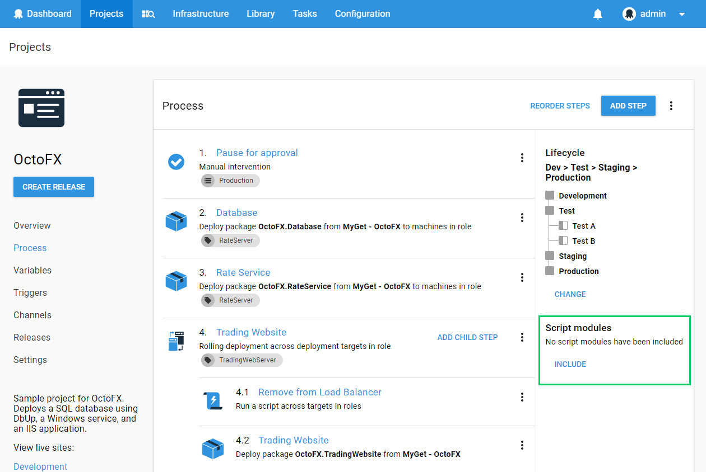

Once you have created a Script Module, you can start using the functions contained on it on your deployment processes.

1.  Go to your **[Deployment Process](/docs/deploying-applications/index.md)** and click on Include **Script Modules.**



A new window will pop up up, prompting you to select you script module. Select the module you just created (make sure the checkbox is checked) and hit **Apply**.


You should now be able to see your module loaded on your Deployment Process


2.  Add a **[Standalone Powershell Script step](/docs/deploying-applications/custom-scripts/index.md)** and call the *Say-Hello* function from it.

```powershell
Say-Hello -name George
```


Once you're done, hit **Save.**

:::success
Make sure to select a **Role**, an **Environment** and to put a **Step Name**
:::

3.  Create and Deploy a release.

4.  Check the Release task log and expand all the steps. You should be able to see the output of the *Say-Hello* function in there.


