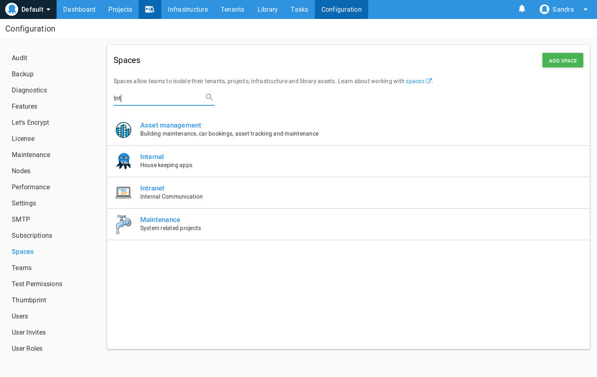
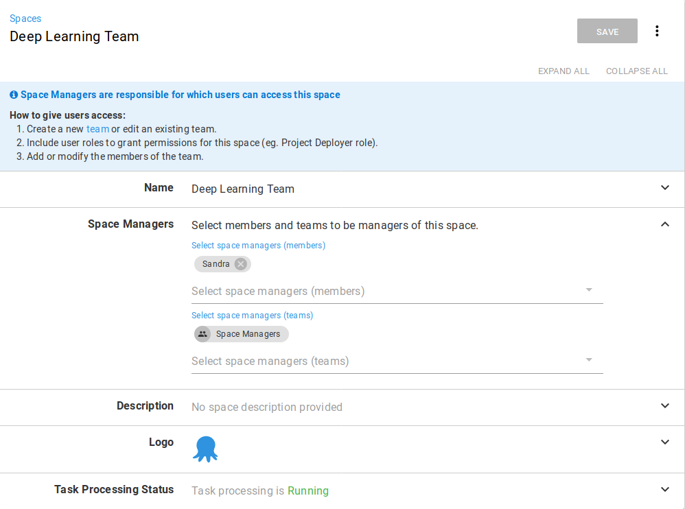

Spaces let you partition your Octopus server so that different teams can only access the projects, environments, and infrastructure they work with from the spaces they are members of.

Using spaces keeps the different projects and infrastructure your teams work with completely separate, which means something configured in **Space-A**, is not available to projects in **Space-B**. This makes it easier for large organizations with multiple teams using Octopus because each team member will only see the projects, environments, and infrastructure that is available in their space.

By default, every instance of Octopus server since **Octopus 2019.1** comes with a default space. However, if your organization is not planning to use multiple spaces, this default space can be safely ignored and doesn't require configuration or management.

## Managing Spaces

Spaces are managed by navigating to {{Configuration,Spaces}}.

An Octopus administrator, or a team member with sufficient permission, can create, remove or modify spaces from this screen. It is also possible to [nominate a default space](#change-the-default-space), or [disable the default space entirely](#disable-the-default-space). Each space has a logo, which is also shown in the [space switcher](#switching-between-spaces) to make it easy to identify which space is currently focused upon by the UI. There is also a search filter to quickly find the spaces that you are interested in managing.

### The Space Manager

Each space has a **space manager**. The space manager is the administrator for that space and is responsible for managing users and teams within the space and assigning permissions to them.

When creating a new space, you are required to nominate a team member (or a team) to the role of space manager. This space manager is then responsible for [managing teams and permissions](/docs/administration/managing-users-and-teams/index.md) within that space.

The user who creates a space doesn't necessarily need to be the space manager of the space. This enables a 'hands off' administrative approach suited to larger organizations or those who prefer to separate the duties of Octopus Server Administration, from the duties of Team Administration.

Behind the scenes, a **space managers** team is created, and any users that are nominated to be a space manager, are put in that team. This team cannot be created or deleted, and serves no other purpose than applying the correct space manager permissions.

### Create a Space {#create-a-space}

New spaces are added from the configuration section of the portal.

1. To create a new space navigate to {{Configuration,Spaces}} and select **ADD SPACE**.
2. Give the space a name.
3. Give the space a manager. This can be individual users or teams. Either can be selected from the drop-down menu. Click **SAVE**.
4. Provide a description for the space.
5. Optionally, upload a logo for the space.
6. Click **SAVE**.

### Modify a Space

You can rename spaces, change their description, give them new logos, change the space managers, or stop the spaces task queue from processing.

1. Navigate to {{Configuration,Spaces}} and select the space you want to modify.
1. Expand the field you would like to change.
1. Make your changes and click **SAVE**.

### Delete a Space

You can delete spaces when you are the **space manager**. Deleting a space cannot be undone, and the space and all of its contents, including projects, environments, releases, and deployment history will be deleted.

1. Navigate to {{Configuration,Spaces}} and select the space you want to delete.
1. Expand the **Task Queue Status** section and select the *Stop task queue* checkbox, and click **SAVE**.
1. Click the overflow button and select **Delete**.
1. Enter the name of the space and click **DELETE**.

## Default Space

The **Default space** is provided to existing installations as a mechanism to ensure that the instance operates in much the same way as it did prior to upgrading to a version of Octopus that supports spaces. Enabled by default, its primary function is to provide an initial space for any existing resources. This also effectively hides the existence of spaces until you're ready to start using them.

We create the default space when you install or upgrade your Octopus Deploy server. In the case of an upgrade, we put all of the space scoped resources (like Projects, Environment, etc) into this space. For new installations, anything you create will be added to the default space.

If you don't want to think about spaces, just leave everything in the Default space!

### Change or Disable the Default Space {#change-the-default-space}

You can change the default space:

:::warning
The following carries some minor downtime for any automation that relies on the default space being available.
:::

1. Navigate to {{Configuration,Spaces}} and [disable the default space](#disable-the-default-space).
2. Return to {{Configuration,Spaces}} and select the space that you wish to nominate as the default space.
3. Click the overflow button and select **Enable the default space**.

For organizations that are new to Octopus, especially those that make heavy use of spaces, a default space is not required, and you can remove the default space entirely. However, this comes with some considerations that should be weighed carefully against the needs of your organization.

In addition to providing a home for existing resources, the default space allows any existing API calls that do not explicitly set a `Space Identifier` in the route to be routed to the default space. For example, in the case where the default space ID is `Spaces-1` then the route `/api/projects/my-project` is equivalent to `/api/Spaces-1/projects/my-project`.

:::warning
With a default space enabled, any REST API calls that do not specify a space in the URL will be assumed to be directed to the default space. **By turning off the default space**, this will no longer be the case. If you have a lot of bespoke automation relying on raw REST API calls, **you will need to make changes to ensure these scripts explicitly specify the space ID in the route**. Otherwise they will break with the default space turned off.
:::

This means that by disabling the default space - **you are opting into a non-backwards compatible scenario**, so be prepared! Things to check include:

 - Versions of Tentacle on target environments need to be upgraded to the latest version otherwise they will not connect.
 - Scripts you've written that directly call the API.
 - Integrations with Octopus Server are updated to their latest versions (like TFS, ADO, and Team City plugins)
 - Community library templates that use the API are updated (you can [refer to this PR](https://github.com/OctopusDeploy/Library/pull/750) as a guide).

To disable the default space:

1. Navigate to {{Configuration,Spaces}} and select the default space.
2. Expand the **Task Queue Status** section and select the **Stop task queue** checkbox, and click **SAVE**.
3. Click the overflow button and select **Disable the default space**.
4. Enter the name of the space and click **YES I'M SURE**.

## Switching Between Spaces {#switching-between-spaces}

When you log into the Octopus Web Portal, the first item on the navigation menu is the spaces menu. Click this icon to access the spaces you are a member of and select the space you need.

## System Scoped or Space Scoped {#system-scope-space-scoped}

There is a hard barrier between spaces, so, for instance, a deployment target configured for Space-A isn't available to projects in Space-B. However, there are some things that aren't scoped to a space, and are available system wide.

The following table shows what is space-scoped, system-scoped, or scoped to both.

| Resource              | Space-Scoped                | System-Scoped |
| --------------------- | --------------------------- | ------------- |
| Environments          | &#x2714;                    |               |
| Lifecycles            | &#x2714;                    |               |
| Projects              | &#x2714;                    |               |
| Variable Sets         | &#x2714;                    |               |
| Deployment Targets    | &#x2714;                    |               |
| Tenants               | &#x2714;                    |               |
| Octopus Server Nodes  |                             | &#x2714;      |
| Authentication        |                             | &#x2714;      |
| Users                 |                             | &#x2714;      |
| License               |                             | &#x2714;      |
| Events                | &#x2714;                    | &#x2714;      |
| Teams                 | &#x2714;                    | &#x2714;      |
| Tasks                 | &#x2714;                    | &#x2714;      |

## Automation Changes to be Aware of {#automation-changes}

As always, using our client libraries offer the best chance of a successful upgrade for your existing automation, and our latest release of Octopus Client has all the changes required to inter-operate with any version of Octopus, as do most of our plugins for other build systems. However, due to the depth and breadth of the changes required to make spaces a reality, we weren't able to maintain backwards compatibility for the REST API in all cases.

Please refer to [the release notes](<!-- todo -->) for a complete list of breaking changes.

## When should I use Spaces?

Spaces is extremely useful for organizations that have any number of the following characteristics:

- Many groups of engineers across many projects
- Requires separation of duties
- Completely autonomous teams of engineers, each responsible for their entire process
- Large number of projects or environments have created a cluttered dashboard and you just want to tidy them up

### When shouldn't I use Spaces?

If you need to keep resources available to multiple teams on a system-wide basis, spaces would prevent you from sharing those resources. If this is the case, the default space is likely the best solution for you and your teams.
