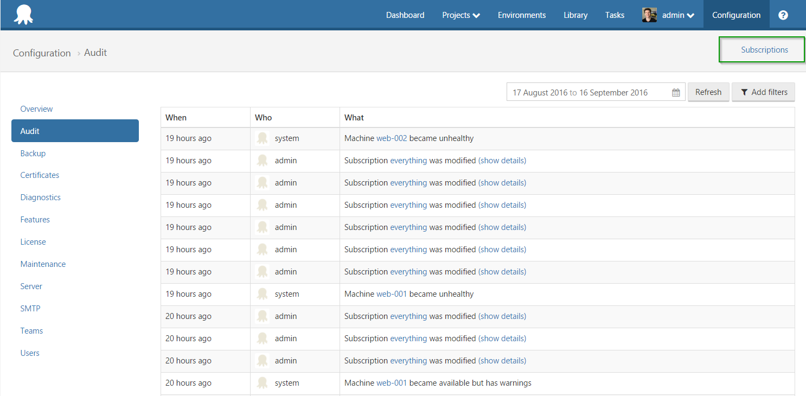

:::hint
Subscriptions are available in Octopus Deploy 3.5 and later
:::

Subscriptions allow you to subscribe to events that are happening within Octopus, so you can be notified when events have occurred and react accordingly. Both **email** and **webhook** notifications are currently supported.

Subscriptions can be accessed from the `Audit` screen from of the `Configuration` menu.

