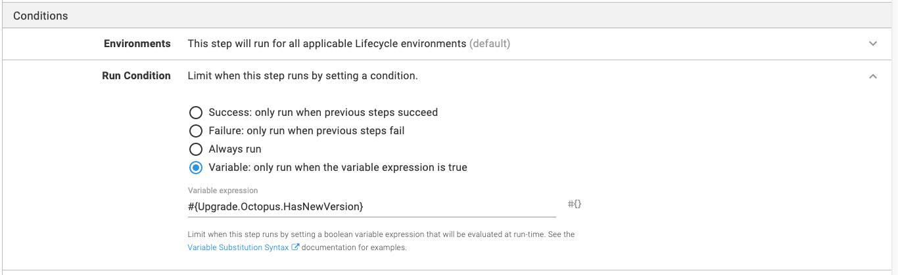

Automating the Octopus Deploy upgrade ensures all essential steps are executed during an upgrade.  This guide provides the steps necessary to automate the upgrade process.  Automating the upgrade process will reduce the outage window to be around 5-10 minutes.  

## Overview

This guide was written for upgrading Octopus Deploy on Windows. 

## Prep Work

Before going down the automation path, it is critical to back up the master key and license key.  If anything goes wrong, you might need these keys to do a restore.  It is better to have the backup and not need it than need the backup and not have it.  The master key doesn't change, while your license key changes, at most, once a year.  Back them up once to a secure location and move on to the standard upgrade process.

1. Backup the Master Key.
1. Backup the License Key.

!include <upgrade-octopus-backup-master-key>

## Upgrading Single Node Octopus Deploy instances

A single node Octopus Deploy instance is not configured for high availability.  The instance is running on a single Windows Server, and as such, you can run this script to:

1. Check for a new version (exit if the current version is the newest version).
1. Enable [maintenance mode](/docs/administration/managing-infrastructure/maintenance-mode.md).
1. Stop the instance.
1. Backup the database.
1. Download and install the MSI.
1. Upgrade the database.
1. Start the instance back up.

Depending on the duration of the upgrade, your Octopus Server may still be starting up when the script completes. It will still be in maintenance mode, giving you a chance to log in to the Octopus web portal and verify things are working as expected.

```PowerShell
$url = 'https://samples.octopus.app'
$apiKey = "API-YOURKEY"
$octopusDeployDatabaseName = "OctopusDeploy"
$sqlbackupFolderLocation = "\\ServerStorage\Share\Databasebackup"
$downloadDirectory = "${env:Temp}"

# This is the default install location, but yours could be different
$installPath = "${env:ProgramFiles}\Octopus Deploy\Octopus"
$serverExe = "$installPath\Octopus.Server.Exe"

# Get the latest minor/patch version
$currentVersion = (Invoke-RestMethod "$Url/api").Version
$currentMajorVersion = $currentVersion.Split('.')
$versions = Invoke-RestMethod "https://octopus.com/download/upgrade/v3" `
    | Where-Object { $_.Version.StartsWith($currentMajorVersion + '.') }
$upgradeVersion = $versions[-1].Version

if ($upgradeVersion -eq $currentVersion) {
    Write-Host "No new versions found. Quitting..."
    exit
}

# Download the installer
$msiFilename = "Octopus.$upgradeVersion-x64.msi"
Write-Host "Downloading $msiFilename"
Start-Bitstransfer -source "https://download.octopusdeploy.com/octopus/$msiFilename" -Destination "$downloadDirectory\$msiFilename"

# Place Octopus into maintenance mode
if (-not (Invoke-RestMethod -Uri "$url/api/maintenanceconfiguration" -Headers @{'X-Octopus-ApiKey' = $apiKey}).IsInMaintenanceMode) {
    Invoke-RestMethod `
        -Method Put `
        -Uri "$url/api/maintenanceconfiguration" `
        -Headers @{'X-Octopus-ApiKey' = $apiKey} `
        -Body (@{ Id = "maintenance"; IsInMaintenanceMode = $true } | ConvertTo-Json)
}

# Finish any remaining tasks and stop the service
& $serverExe node --instance="OctopusServer" --drain=true --wait=0
& $serverExe service --instance="OctopusServer" --stop

# Backup database
$backupFileName = "$octopusDeployDatabaseName_" + (Get-Date -Format FileDateTime) + '.bak'
$backupFileFullPath = "$sqlbackupFolderLocation\$backupFileName"

$instanceConfig = (& $serverExe show-configuration --instance="OctopusServer" --format="JSON") | Out-String | ConvertFrom-Json
   
$sqlConnection = New-Object System.Data.SqlClient.SqlConnection
$sqlConnection.ConnectionString = $instanceConfig.'Octopus.Storage.ExternalDatabaseConnectionString'

$command = $sqlConnection.CreateCommand()
$command.CommandType = [System.Data.CommandType]'Text'
$command.CommandTimeout = 0

Write-Host "Opening the connection"
$sqlConnection.Open()

$command.CommandText = "BACKUP DATABASE [$octopusDeployDatabaseName]
  TO DISK = '$backupFileFullPath'
      WITH FORMAT"
$command.ExecuteNonQuery()

Write-Host "Successfully backed up the database $octopusDeployDatabaseName"
Write-Host "Closing the connection"
$sqlConnection.Close()

# Running the installer
$msiToInstall = "$downloadDirectory\$msiFilename"
Write-Host "Installing $msiToInstall"
$msiExitCode = (Start-Process -FilePath "msiexec.exe" -ArgumentList "/i $msiToInstall /quiet" -Wait -Passthru).ExitCode 
Write-Output "Server MSI installer returned exit code $msiExitCode" 

# Upgrade database and restart service
& $serverExe database --instance="OctopusServer" --upgrade
& $serverExe service --instance="OctopusServer" --start
& $serverExe node --instance="OctopusServer" --drain=false

Remove-Item "$downloadDirectory\$msiFilename"
```

## Upgrading High Availability Octopus Deploy instances

Automating the upgrade of a Highly Available Octopus Deploy instance requires more than a single script.  A degree of coordination is required to update all the nodes.  In addition, specific actions, backing up the database, upgrading the database, enabling / disabling maintenance mode should only happen once.   

The recommendation is to use an Octopus Deploy runbook on another instance to upgrade the High Availability instance.  You can get a free license to do this with an [Octopus Cloud instance](https://octopus.com/start).


Each node will need a Tentacle installed on it.  You will need two roles for this to work.

- HAServer: All Tentacles will be assigned to this.
- HAServer-Primary: This is the server which does the majority of the work (checking for new versions, upgrading the database, etc).

The same sample script from above will be used, but pieces will be broken up into steps.


### Variables

As this is a runbook, you'll want to create variables to share across the various steps.

- `Upgrade.Octopus.Url` - the URL of your instance, for example `https://samples.octopus.app`.
- `Upgrade.Octopus.ApiKey` - the API key of a service account with permissions to turn on and off maintenance mode.  Please be sure to make this a sensitive variable!
- `Upgrade.Download.Folder` - The network location of the shared folder to download the MSI to, for example `\\YOURNAS\ShareName`
- `Upgrade.Database.Backup.Folder` -  The network location of the shared folder to backup the database to, for example `\\YOURNAS\DatabaseBackupShare\`
- `Upgrade.Database.Name` - The name of your Octopus Deploy database.  This is used for the backup script.
- `Upgrade.Octopus.HasNewVersion` - Output variable set in the first step.  All other steps will use this variable as a run condition.  Example value: `#{unless Octopus.Deployment.Error}#{Octopus.Action[Check for new Octopus Version to Download].Output.UpgradeFound}#{/unless}`

### Process

The upgrade process itself very similar to upgrading a single node instance.  The key difference is the script is broken up into multiple steps.

:::hint
Aside from step 1, all steps should set run condition to look at the variable `Upgrade.Octopus.HasNewVersion`


:::

#### 1. Check for a new version (HAServer-Primary).

```PowerShell
# Get the latest minor/patch version
$url = $OctopusParameters["Upgrade.Octopus.Url"]
$downloadFolder = $OctopusParameters["Upgrade.Download.Folder"]

$upgradeMsiList = Get-ChildItem -Path "$downloadFolder\*" -Include *.msi
if ($upgradeMsiList.Count -gt 0)
{
	Set-OctopusVariable -Name "UpgradeFound" -Value $true
    Write-Host "MSIs already exist in the download directory, exiting so they can be installed"
    exit
}

$currentVersion = (Invoke-RestMethod "$Url/api").Version
$currentMajorVersion = $currentVersion.Split('.')
$versions = Invoke-RestMethod "https://octopus.com/download/upgrade/v3" `
    | Where-Object { $_.Version.StartsWith($currentMajorVersion + '.') }
$upgradeVersion = $versions[-1].Version

if ($upgradeVersion -eq $currentVersion) {
	Set-OctopusVariable -Name "UpgradeFound" -Value $false
    Write-Host "No new versions found. Quitting..."
    exit
}

# Download the installer
$msiFilename = "Octopus.$upgradeVersion-x64.msi"
$outfile = "$downloadFolder\$msiFilename"

if (Test-Path $outfile)
{
	Set-OctopusVariable -Name "UpgradeFound" -Value $true
    Write-Host "The latest version has already been download and is waiting to be installed"
    exit
}

Write-Host "Downloading $msiFilename"
Start-BitsTransfer -source "https://download.octopusdeploy.com/octopus/$msiFilename" -destination $outfile
Set-OctopusVariable -Name "UpgradeFound" -Value $true
```

#### 2. Put the server into maintenance mode (HAServer-Primary).

```PowerShell
$url = $OctopusParameters["Upgrade.Octopus.Url"]
$apiKey = $OctopusParameters["Upgrade.Octopus.ApiKey"]

# This is the default install location, but yours could be different
$installPath = "${env:ProgramFiles}\Octopus Deploy\Octopus"

# Check to see if this is a re-run, if all the nodes are stopped then this will fail
try
{
	$octopusApi = Invoke-RestMethod -uri "$url/api"
}
catch
{
	Write-Host "Error calling api endpoint for $url, exiting"
    exit
}

# Place Octopus into maintenance mode
if (-not (Invoke-RestMethod -Uri "$url/api/maintenanceconfiguration" -Headers @{'X-Octopus-ApiKey' = $apiKey}).IsInMaintenanceMode) {
    Invoke-RestMethod `
        -Method Put `
        -Uri "$url/api/maintenanceconfiguration" `
        -Headers @{'X-Octopus-ApiKey' = $apiKey} `
        -Body (@{ Id = "maintenance"; IsInMaintenanceMode = $true } | ConvertTo-Json)
}
```

#### 3. Stop all nodes (HAServer).

```PowerShell
# Upgrading the MSI on a single server updates all instances, shut them all down first
$installPath = "${env:ProgramFiles}\Octopus Deploy\Octopus"
$serverExe = "$installPath\Octopus.Server.exe"

$instanceList = (& $serverExe list-instances --format="JSON") | Out-String | ConvertFrom-Json
Write-Host "Found $($instanceList.length) Octopus instances"

foreach ($instance in $instanceList)
{
    Write-Host "Stopping $($instance.InstanceName)"
    # Finish any remaining tasks and stop the service
    & $serverExe node --instance="$($instance.InstanceName)" --drain=true --wait=0
    & $serverExe service --instance="$($instance.InstanceName)" --stop
}
```

#### 4. Backup Database (HAServer-Primary)
```PowerShell
$BackupFolderLocation = $OctopusParameters["Upgrade.Database.Backup.Folder"]
$OctopusDatabaseName = $OctopusParameters["Upgrade.Database.Name"]

$installPath = "${env:ProgramFiles}\Octopus Deploy\Octopus"
$serverExe = "$installPath\Octopus.Server.exe"
$backupFileName = "$OctopusDatabaseName_" + (Get-Date -Format FileDateTime) + '.bak'
$backupFileFullPath = "$backupFolderLocation\$backupFileName"

$instanceConfig = (& $serverExe show-configuration --instance="OctopusServer" --format="JSON") | Out-String | ConvertFrom-Json
   
$sqlConnection = New-Object System.Data.SqlClient.SqlConnection
$sqlConnection.ConnectionString = $instanceConfig.'Octopus.Storage.ExternalDatabaseConnectionString'

$command = $sqlConnection.CreateCommand()
$command.CommandType = [System.Data.CommandType]'Text'
$command.CommandTimeout = 0

Write-Host "Opening the connection"
$sqlConnection.Open()

Write-Host "Backing up the database"
$command.CommandText = "BACKUP DATABASE [$OctopusDatabaseName]
  TO DISK = '$backupFileFullPath'
      WITH FORMAT"
$command.ExecuteNonQuery()

Write-Host "Successfully backed up the database $octopusDatabaseName"
Write-Host "Closing the connection"
$sqlConnection.Close()

```

#### 5. Install the MSI (HAServer).

```PowerShell
$OctopusParameters["Upgrade.Download.Folder"]
$upgradeMsiList = Get-ChildItem -Path "$downloadFolder\*" -Include *.msi
if ($upgradeMsiList.Count -le 0)
{
    Write-Host "No MSIs found, exiting step"
    exit
}

$msiToInstall = $upgradeMsiList[0]
# Running the installer
Write-Host "Installing $msiToInstall"
$msiExitCode = (Start-Process -FilePath "msiexec.exe" -ArgumentList "/i $msiToInstall /quiet" -Wait -Passthru).ExitCode 
Write-Output "Server MSI installer returned exit code $msiExitCode" 
```

#### 6. Upgrade the database (HAServer-Primary).
```PowerShell
$installPath = "${env:ProgramFiles}\Octopus Deploy\Octopus"
$serverExe = "$installPath\Octopus.Server.exe"

& $serverExe database --instance="OctopusServer" --upgrade
```

#### 7. Restart all nodes (HAServer).
```PowerShell
# A server could have multiple instances, as we shut them down all earlier, start them all back up
$installPath = "${env:ProgramFiles}\Octopus Deploy\Octopus"
$serverExe = "$installPath\Octopus.Server.exe"

$instanceList = (& $serverExe list-instances --format="JSON") | Out-String | ConvertFrom-Json
Write-Host "Found $($instanceList.length) Octopus instances"

foreach ($instance in $instanceList)
{
    Write-Host "Starting $($instance.InstanceName)"
    # Finish any remaining tasks and stop the service
    & $serverExe service --instance="$($instance.InstanceName)" --start
    & $serverExe node --instance="$($instance.InstanceName)" --drain=false
}
```

### Triggers and notifications

Now that the upgrae process is in a runbook, you can create a trigger to check once a day or week.  In addition, you can set up notifications to notify you when a new version is found and you need to disable maintenance mode.  How you use the runbook is up to you.
