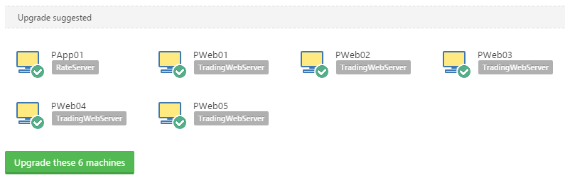

The following guide provides an overview of how the various components of a modern Octopus installation (3.x or newer) can be updated to the latest release.

## Before you begin

Before you start your upgrade, you should take time to:

- Test your [backup and restore process](/docs/administration/data/backup-and-restore.md).
- Learn about [maintenance mode](/docs/administration/managing-infrastructure/maintenance-mode.md).
- [Plan your upgrade](/docs/administration/upgrading/legacy/index.md#upgrade-path).

### Release notes

For every Major and Minor release we will provide release notes highlighting new features and calling out breaking changes. For example, you can see the features and highlights for the latest feature release on our [downloads page](https://octopus.com/downloads). We also talk about [interesting releases on our blog](https://octopus.com/blog/tag/Product).

You can also use our release comparison tool to see **all of the changes** introduced between any two versions of Octopus Deploy. For example: [https://octopus.com/downloads/compare?from=3.2.15&to=3.5.2](https://octopus.com/downloads/compare?from=3.2.15&amp;to=3.5.2).

## Downgrading or rolling back an upgrade {#Upgrading-DowngradingorRollingBackanUpgrade}

The process for successfully downgrading depends on the upgrade you have performed. The kind of upgrade you perform depends on the difference between versions:

- **Patch upgrade** = If you install a patch of Octopus Deploy and run into any problems, you can reinstall the version of Octopus Deploy that was installed prior to the upgrade straight over-the-top without any problems.
  - For example: **Octopus 2018.1.2** to **Octopus 2018.1.4** (same Major.Minor but different Patch). If you need to downgrade for any reason you can reinstall **Octopus 2018.1.2** straight over the top, and get back to normal operation.
  - On that note, you can move freely between any patch in the same Minor release. For example, **Octopus 3.4.2** or **Octopus 3.4.10** or **Octopus 3.4.12**.
- **Minor upgrade** = If you perform a Minor upgrade and run into any problems, you will need to restore a recent SQL Database backup and reinstall the version of Octopus Deploy that was installed prior to the upgrade.
  - For example: **Octopus 2018.1.4** to **Octopus 2018.2.1** would be a Minor upgrade. Make sure to test a [backup and restore](/docs/administration/data/backup-and-restore.md) before upgrading. If you need to downgrade for any reason, you should restore the backup, and then reinstall **Octopus 2018.1.4**.
- **Major upgrade** = We will provide a detailed upgrade guide for any Major upgrades.
  - For example: **Octopus 3.6.5** to **Octopus 2018.1.4** would be a Major upgrade. You should take care when performing a major upgrade and follow our upgrade guide carefully.

## Update available notification {#UpgradingfromOctopus3.x-UpdateAvailableNotification}

When an update is available, a bullhorn icon will appear in the top status bar with details and a link to the downloads page.

:::warning
**What is included in the release?**
You can find the differences between your current version and the newest version using our [Compare versions](https://octopus.com/downloads/compare) page. Please note that this will also list the release notes for major and minor version changes which may include **breaking changes** or **dependencies** that you may need to also update. It is important to know what might be affected by your upgrade.
:::

## Scheduling maintenance

Upgrading Octopus Server is normally quite fast, however you should allow yourself time to perform a good [backup and restore process](/docs/administration/data/backup-and-restore.md).

You should also consider how long the actual upgrade may take:

- [Patch](/docs/administration/upgrading/index.md##Upgrading-HowweversionOctopusDeploy) upgrades are usually very fast - only the executable binaries are upgraded.
- [Minor](/docs/administration/upgrading/index.md##Upgrading-HowweversionOctopusDeploy) upgrades are usually quite fast, however these releases typically require database changes.
- [Major](/docs/administration/upgrading/index.md##Upgrading-HowweversionOctopusDeploy) upgrades usually require detailed planning.

## Upgrading Octopus Server {#UpgradingfromOctopus3.x-UpgradingOctopusServerUpgradingOctopusServer}

Upgrading the Octopus Server is easy, you will just need to follow these steps:

1. Schedule a maintenance window: Octopus Server will be unavailable during the upgrade (unless you are [upgrading Octopus HA](#upgrading-octopus-ha)).
1. Switch your server to [Maintenance Mode](/docs/administration/managing-infrastructure/maintenance-mode.md) and wait until all current tasks and deployments have completed. This ensures that no further changes will be made that may potentially become lost if the upgrade fails and you need to rollback.

    

1. [Backup your database and Master Key](/docs/administration/data/backup-and-restore.md) so that it can be restored in case anything goes wrong.

    

1. Download the latest [Octopus Deploy MSI installer](https://octopus.com/downloads).

:::success
**No Internet connection required for install**
Once you have downloaded the required version of the Octopus Server MSI no further Internet connectivity is required. This allows for installation on servers and systems that have no Internet connectivity.
:::

1. Run the installer and follow the prompts.
1. Turn [Maintenance Mode](/docs/administration/managing-infrastructure/maintenance-mode.md) `OFF`.

    

1. Calamari will then be automatically updated if required with the next health check or deployment that takes place.

:::success
**No need to upgrade the Tentacle**
All **Tentacle 3.x** versions are compatible with all modern Octopus Server versions from **3.x** onwards. Given that the deployment code is now embedded within Calamari, and this gets pushed out automatically as needed by the Octopus Server, you no longer need be concerned about ensuring the version number between Tentacle and Server remain in lockstep. We hope splitting the Tentacle helps relieve some of the hassle and friction involved with upgrading Octopus and provides better communication about changes to Tentacle.
:::

## Upgrading Octopus HA {#upgrading-octopus-ha}

You should generally follow the same instructions as above but upgrade one node at a time. This will allow you to keep the cluster running and avoid interruption to your users. Read more about [Managing High Availability Nodes](/docs/administration/high-availability/managing-high-availability-nodes.md).

:::warning
It is important to upgrade all nodes in your cluster during the same maintenance window, especially if the database schema is changed. The database schema will be upgraded when you upgrade the first node. Any nodes running the old version can fail due to a database schema mismatch.
:::

### Upgrading Octopus HA nodes

Follow these steps to upgrade each node in your cluster:

1. Go to the **{{Configuration>Nodes}}** page.
1. Set Drain to `ON` for the node you want to upgrade.

    

1. Wait until all the running tasks complete.
1. Upgrade the Octopus Server instance on the node.
1. Set Drain to `OFF` so the node starts processing tasks again.

## Upgrading Calamari {#UpgradingfromOctopus3.x-UpgradingCalamariUpgradingCalamari}

Calamari will either self-update automatically during a deployment if they are out of date with the latest available on the server, or they can be manually updated to avoid interrupting the deployment.

### Auto update {#UpgradingfromOctopus3.x-AutoUpdate}

During a deployment process one of the first commands that's executed on the Tentacle is a check to confirm that the latest version of Calamari exists on the target machine. This is currently done by checking for the existence for an empty file in the folder location of`${env:TentacleHome}\Calamari\{{CalamariVersion}}\Success.txt` where the `CalamariVersion` variable is defined by the latest available on the Server.

When deploying to an environment with out of date Calamaris, they will be automatically upgraded. An info message on the deployment page will notify the user that this will happen.

**Manual update**

The environments page will make machines without latest Calamari yellow, and show a green Update button (per environment) - this will just run a script that ensures Calamari is there.

**Upgrading Octopus Tentacles**

The role of Tentacles has changed in modern versions of Octopus. Modern Tentacles are only responsible for the secure communication protocol, and then calling Calamari to actually perform deployments. This means Tentacle only needs to change when we change some part of the secure communication protocol (hopefully very infrequently).

:::hint
**Why have there been so many different versions of Tentacle 3.x?**
In early versions of 3.x we have been rebuilding Tentacle in lock-step with Octopus Server due to shared dependencies in their project structure even though there have not been any changes to Tentacle itself. We unlocked these with Tentacle 3.14.
:::

**Octopus 3.1** supports automatically updating Tentacles via the Environments page. You can upgrade all Tentacles which will systematically work through all Machines in all Environments in batches until all Tentacles are upgraded.

Alternatively you can upgrade Tentacles one Environment at a time.

:::success
**Optional and required Tentacle upgrades**
In most cases we will maintain backwards compatibility between versions of Octopus Server and Tentacle. In these cases the Environments page will **recommend** updating your Tentacles while still allowing deployments to continue as normal. In the rare occasion we need to break compatibility you will be **required** to upgrade any incompatible Tentacles before you can Deploy to those machines again from the upgraded Octopus Server.
:::

## Upgrading to Octopus 2019.x or greater

Prior to 2019.x, the list of instances was stored in the registry.  That list stores the name of the instance and the location of the configuration file.  The configuration file, typically stored in `C:\Octopus\`, stores the database connection string, along with a slew of other settings.  This configuration allows you to uninstall and reinstall Octopus Deploy on the same machine without losing any settings.

In 2019, Octopus Deploy was updated to .NET Core, with the intention of being able to run on Windows and Linux.  Linux doesn't have a registry.  For versions running 2019.x or higher, the list of instances is now stored in `C:\ProgramData\Octopus\OctopusServer\Instances` on Windows.

When you upgrade Octopus Deploy you just need to run the installer.  The installer will copy all the new .dlls and .exes into the install directory.  After the installer is finished, it will start the Octopus Manager.  The Octopus Manager will look at the list of instances, and for each instance, run the necessary upgrade scripts using the connection string from the configuration file.  

## How to downgrade to a previously installed instance of Octopus Server {#Howtodowngradetoapreviousinstalledinstanceofoctopusserver}

If for any reason you need to downgrade to a previous version of Octopus Server, follow the steps below:

1. Turn [Maintenance Mode](/docs/administration/managing-infrastructure/maintenance-mode.md) `ON`.

:::warning
Wait until all current tasks and deployments have completed.
:::

2. Navigate to the Octopus Manager and stop the Octopus service.

3. Restore the database, by using the database back up you completed prior to installing the new version you were upgrading to.

:::warning
Any data that has been created from between when the backup was taken to when it was restored will be lost. You should always use the most recent backup, or rolling forward may be a better solution if the backup is old.
:::

4. Download the previous version of the Octopus installer, from our [Previous releases page](https://octopus.com/downloads/previous).

5. Install the previous version you are rolling back to, over the top of the installation you are rolling back from.

:::warning
There is no need to uninstall the newer version you were trying to upgrade to.
:::

6. Turn [Maintenance Mode](/docs/administration/managing-infrastructure/maintenance-mode.md) `OFF`.

## Troubleshooting {#UpgradingfromOctopus3.x-Troubleshooting}

In a few cases a bug in a 3rd party component causes the installer displays a "Installation directory must be on a local hard drive" error. If this occurs, running the install again from an elevated command prompt using the following command (replacing Octopus.3.3.4-x64.msi with the name of the installer you are using):

`msiexec /i Octopus.3.3.4-x64.msi WIXUI_DONTVALIDATEPATH="1"`
