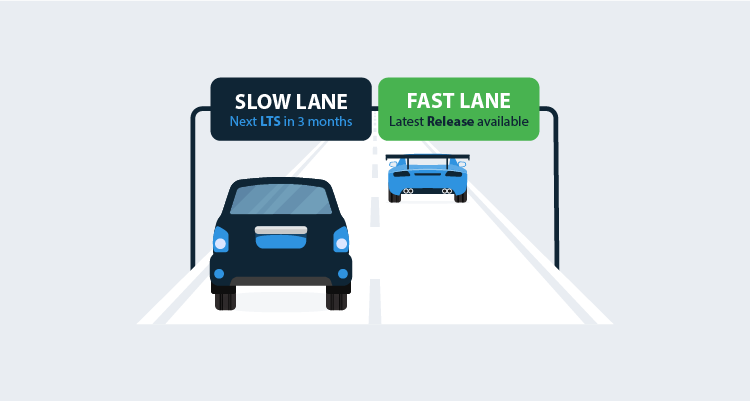

We ship a new release of Octopus with **six months of long-term support** on a **three month cadence**. This means there will be **two current LTS releases** at any point in time.

Each LTS release will roll up all the features and bug fixes we've stabilized during that three month period. A release of Octopus with long-term support will:

- Get critical bug fixes and security patches for up to six months.
- Not get new features, minor enhancements, or minor bug fixes; these will roll up into the next LTS release.

You can download the latest LTS from the [downloads page](https://octopus.com/downloads), or you can use the direct download links:

- [Octopus Server x64](https://octopus.com/downloads/slowlane/WindowsX64/OctopusServer)
- [Octopus Server 32-bit/x86](https://octopus.com/downloads/slowlane/WindowsX86/OctopusServer)

!toc

## Announcements

We announce each new LTS release of Octopus in a blog post with the [LTS tag](https://octopus.com/blog/tag/LTS), clearly stating which releases are still covered by long-term support, and releases where long-term support has expired.

Each release of Octopus clearly indicates if it is an LTS release on the [downloads page](https://octopus.com/downloads) and inside the product itself.

## Introducing the Fast and Slow Lanes {#fast-and-slow-lanes}

We realize not every customer is the same so we provide two release lanes, the **fast lane** and the **slow lane**. This way you can choose which releases are best for your situation.

- The **fast lane** is where we ship new features when they are ready, usually every 4-6 weeks, and where we ship bug fixes and minor enhancements into patches every few days. Octopus Cloud customers are always in the fast lane.
- The **slow lane** is where we stabilize and ship releases with long-term support, along with any patches containing critical bug fixes and security patches for up to six months.

Under the covers, we still work the same way we have since we started in 2011: shipping bug fixes and minor enhancements with a quick turnaround and working closely with our customers to design and test new features. What we have added is a special release cadence, where the release is based on the most stable version at that point in time with some additional quality assurance, complete with the offer of six months long-term support.

### Self-hosted: The Power to Choose

Self-hosted customers can decide for themselves which releases to install, and when to upgrade their installation.

Choose the **slow lane releases with long-term support** if this sounds like your scenario:

- "We prefer stability over having the latest features."
- "We upgrade Octopus about every three months."
- "We evaluate Octopus in a test environment before upgrading our production installation."

You should choose the **fast lane releases** if this sounds like your scenario:

- "We want the latest and greatest features and really fast turnaround on small enhancements and bug fixes."
- "We want to engage closely with the Octopus team, so we can help them build the best automation tooling in the world!"

## Patching LTS Releases

When it comes to deciding what to include or exclude from a patch for one of the current LTS releases we use this rule of thumb:

> Installing a patch should be safer than not installing that patch.

We will ship a patch for an LTS release when, for example:

- We discover a security vulnerability which will result in us raising a CVE report.
- We discover a show-stopping bug where there is no viable workaround.
- We discover an issue which is only present in a current LTS release.
- We discover something which just makes good business sense to patch.

We will not:

- Ship hundreds of LTS patches - we want stability and a high signal to noise ratio.
- Ship new features in LTS patches.
- Ship breaking changes in LTS patches.

## Switching lanes {#switching-lanes}

Sometimes it makes sense for you to switch lanes. You can switch lanes in a controlled fashion. "Accelerating" to a fast lane release will result in you running a higher version of Octopus - it's just a normal upgrade. If you would like to "decelerate" back to the slow lane releases with long-term support, just wait until the next LTS release is shipped and upgrade to that release.

## FAQ

Here are a handful of questions our customers have asked since we announced the long-term support program. If your question isn't answered here, please reach out to [our support team](https://octopus.com/support).

### When should I upgrade my Octopus installation?

Our preference, for your benefit and ours, is that you keep your Octopus up to date. You benefit with the highest quality, best performing, most secure Octopus, and we benefit by having a smaller distribution of Octopus versions to support. It's a win-win situation!

- If you are using Octopus Cloud, we take care of updates on your behalf, you're always in the fast lane with early access to the newest features.
- If you are using self-hosted Octopus, we recommend using releases with LTS.
  - When we ship a patch, like `2018.10.1 LTS`, you should patch your Octopus - it will be less risk to upgrade than to leave your Octopus unpatched.
  - When we ship a new LTS release, you can choose to stay on your current version as long as it is still covered by our LTS program, but we recommend keeping up with the current release where possible.
- If you are using self-hosted Octopus, but decide to stay in the fast lane, we highly recommend staying current just like Octopus Cloud. This gives us the best opportunity to support you. If you don't want to stay current, in line with Octopus Cloud, perhaps the releases with LTS are a better option for your scenario.

### When you ship a patch like 2018.10.1 LTS should I install it?

Absolutely, yes! We use this rule of thumb when deciding what to include in a patch for releases with LTS: **Installing a patch should be safer than not installing that patch.**

We generally ship LTS patches with fixes for critical security vulnerabilities or exploits, or show stopping bugs with no viable workarounds.

### Should I stay in the fast lane instead of installing an LTS release and moving to the slow lane?

By introducing the LTS program we are giving you the power to choose between upgrading in the fast lane or the slow lane. This is a decision you will have to make based on your scenario.

We generally recommend self-hosted customers choose releases with LTS.

### Will you still support me even if I don't upgrade?

Absolutely, yes! Staying current with Octopus releases is mutually beneficial, but we will support all Octopus customers to the best of our ability regardless of which release you are running. If we fix a bug on your behalf, you will need to upgrade to get the bug fix anyhow. Staying current is in everyone's best interests!

### Can We Move Between the Slow and Fast Lanes?

Yes, you can switch lanes in a controlled fashion. "Accelerating" to a fast lane release will result in you running a higher version of Octopus - it's just a normal upgrade. If you would like to "decelerate" back to the slow lane releases with long-term support, just wait until the next LTS release is shipped and upgrade to that release.

### Will You Maintain the Monthly Cadence for Fast Lane Releases?

Prior to starting the long-term support program we shipped releases on an approximate monthly cadence. We think a predictable cadence is more important for customers using the slow lane releases with long-term support - it will help them plan their upgrades.

- In the **slow lane** we aim to ship LTS releases on a strict three month cadence.
- In the **fast lane** we aim to ship new releases on a monthly cadence, however, sometimes we may decide to ship a fast lane release earlier, or take some extra time to harden a fast lane release before shipping it.

If you prefer a more predictable cadence choose the slow lane releases with long-term support.
