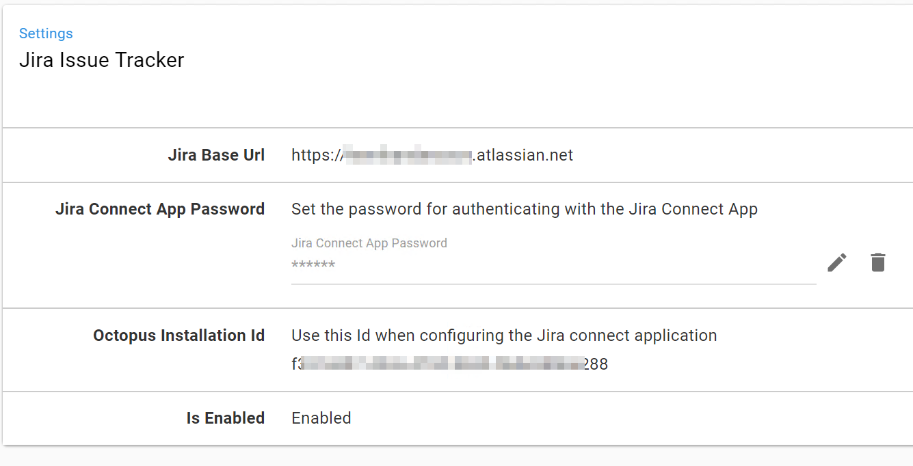

This section details how to configure the work item integration between Octopus and Jira.

## Packaging

Key to flowing information through the pipeline is having a method of transport. Octopus uses a custom metadata file embedded in the packages to transport work item information.

This has a number of advantages, but the key one is that the package is always the source of truth for the data. If you are creating releases interactively in Octopus (i.e. separate to the CI/CD pipeline) for any reason, or if you are using ARC for example, the package will always contain the work item metadata.

The metadata is only read when packages are uploaded to the Octopus built-in package feed, so you must use it in order to use the work item functionality. Support for reading the metadata in packages sourced from external feeds may be added in a future release.

To get the work item metadata file into the package use the Octopus _Pack Package_ step in your build server and configure the _Process commit messages_ setting.

The build plugins work on the assumption that the team are referencing the Jira work items in their commit messages, as they would for Bamboo build integration with Jira. Octopus notifies Jira about release and deployment progress and the information appears in Jira similar to the following.

As a note, _Development_ here refers to an environment type, not an environment name. The environment name in Octopus in this example was actually Azure-Dev.

## Octopus Connect App and the Jira Extension

In the previous section we saw how to configure the pack package step and then the final result of a deployment being displayed in Jira. There are a few things that need to be configured to get to that point, let's look at those now.

Something worth pointing out at this point is that the Jira functionality we're demonstrating here is only available in the SaaS version. There isn't a SaaS requirement on the Octopus side of the integration though, so you can use either an OnPrem or Cloud version of Octopus.

With that in mind, the first step in the integration is to add the Octopus Connect App in the Jira marketplace.

TODO: add a screenshot of the marketplace tile

To complete the installation of the app from the marketplace you must configure it. This requires aligning a couple of pieces of information from the page that appears in Jira

and from the **Configuration / Jira Issue Tracker** page in Octopus.

You'll probably want both of these open in separate browser windows/tabs to complete the configuration. On the Jira side you need to copy the _Octopus Installation Id_ from the Octopus page and on the Octopus side you'll need to copy your Jira instance's base Url and the client secret that appears on the Connect App configuration page.

## Project settings

Now Octopus and Jira are connected there are two other settings that you have to configure in Octopus. First you need to tell your Octopus project which packages in your deployment process contain the work items

In this example the project is using the primary package from the step named Deploy. You can specify multiple packages if required. An example of where you might use this is a deployment process that includes steps for a Web App and a SQL database schema migration. The packages for both of those form the complete product and either or both could be contributing work items.

On the project settings you can also control whether you want the work item links to be appended to the deployment release notes. The work item data will always be stored separately on the deployment as well, this setting allows you to have the links as part of the release note text if you want.

## Environment settings

The thing to configure relates back to our earlier note on environment types vs environment names. In Octopus you'll need to map the Jira environment types for the environments that you're going to be tracking work items for.

The fixed list of environment types are important for the tracking in Jira and this configuration allows you the flexibility of easily mapping any existing environments to a type.
