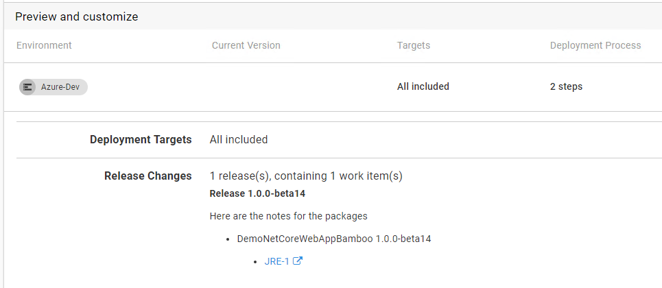

Octopus uses metadata that can tell you how a package was built and what went into the package. This metadata includes work items which represent the bugs and enhancements that go into new builds of your software.

As an example, consider the following


This diagram depicts multiple releases and deployments that have occurred over time, along with which work item details are included for each deployment. In this scenario, each release was immediately deployed to the Dev environment, which results in the simplest case because there was only a single release involved.

The deployments for `1.0.3` illustrate a more complex roll-up of work items. When `1.0.3` was deployed to the Staging environment, it included work items from releases `1.0.2` and `1.0.3`. Similarly, when it was deployed to the Prod environment, it also included the work items from `1.0.1`.

When configured, your build server passes metadata to Octopus and it is included in the release and deployment details. This section explains how to configure integration between your build server and Octopus to take advantage of these features.

## Building the Metadata

Octopus uses a custom metadata file as the method of transport for passing this information through the pipeline, pushing the file to the server separately from the package itself.

Keeping the file separate to the package means that packages stored in external feeds can still provide the custom metadata to Octopus. This means it also works for things like container images that are pushed to container repositories.

To create the metadata file and provide it to Octopus, use the Octopus _Metadata_ step in your build server (below is the TeamCity version of the step for illustration).


The **Commit processing** tells Octopus which format of work item references to look for in the commit messages.

The metadata will appear in the package feed details for any package in the internal feed that has had metadata pushed.


If you have configured an issue tracker extension (e.g. Jira), that matches the work items type, they will appear as a link to the issue tracking system. If not, they appear as plain text.

Note that you can actually have multiple "issue trackers" enabled at the same time. In the screenshot above, both the Jira and GitHub trackers are enabled. The reason being that the GitHub tracker knows how to render the links back to the commits. If you disabled it then the work items links would still appear to Jira, but the commit link would not display.

## Releases and Deployments

When a release is created for the project, the work items are collected from the selected package versions and displayed with the package details.


When this release is deployed the metadata from the release will be passed to the deployment. This metadata will be displayed in the deployment preview.


When expanded you will see the details of each release that has gone in to the deployment.



The Release Changes are also displayed on the task summary for the deployment.


In some scenarios this one-to-one between releases and deployments will be the norm. Teams using continuous deployment may see a rapid progression of versions through their environments and on to production.

Many teams don't operate like this though. It is common for a number of releases to be prepared and tested before being promoting to the next environment. For example, they may merge pull requests for several fixes/features and then deploy the final release to test. This can be repeated several times and eventually a final release progresses from test to production. In this situation the deployment to production isn't just the work items from that last release, it is _the accumulation of all of the work items in all of the releases since the last one that was deployed to production_.

Given that you can initiate deployments to multiple "scopes" at once in Octopus it is expected that you could see different work items lists for each scope.

For instance, if you have two tenants in the same environment, and **tenant A** is on an earlier version than **tenant B**, the resulting list for **tenant A** will be the list for **tenant B** plus the additional work items between the version it was on and the version **tenant B** was on.

As a second example, imagine you have two environments in a lifecycle, for instance, **staging** and **performance**, but you don't always deploy to one of the environments. Maybe you periodically deploy to the **performance** environment to check for regressions but not every time you deploy to **staging**. The work items for the **performance** environment will be the same as **staging** plus the additional work items for the releases in between.

## Deploy a Release Step

The Octopus [deploy release step](https://g.octopushq.com/DeployReleaseStep) adds an interesting dimension to metadata accumulation. When you use this step Octopus treats each "child project" like it is a package. It also treats the child project's release as a potential source for metadata.

When creating the releases in the "parent project" Octopus accumulates the release notes and metadata from the child projects just as it would for packages.

## Release Notes Templates {#Release-Notes-Templates}

To help take advantage of all of this metadata knowledge in the packages, Octopus supports using release notes with variables substitution. A release notes template can also be specified in the project settings, to make consistency across releases easy.

During release creation the template will be evaluated and you will see the resulting markdown displayed in the portal. The template has access to all unscoped project variables and the variables relating to the release:

``` csharp
public class Packages
{
  public string PackageId { get; set; }
  public string Version { get; set; }
  public WorkItemLink[] WorkItems { get; set; }
}

public class WorkItemLink
{
    public string Id { get; set; }
    public string LinkUrl { get; set; }
    public string LinkText { get; set; }
}
```

The variables are setup so you can iterate over the list or you can directly index via the PackageID. E.g.

```
#{each package in Octopus.Release.Package}
## #{package.PackageId} #{package.Version}
#{/each}
```

or

```
#{Octopus.Release.Package[MyAwesomePackageId].Version}
```

The following example illustrates some sample text followed by the packages, with the packages rendered as a bullet point list.

```Here are the notes for the packages
Here are the notes for the packages
#{each package in Octopus.Release.Package}
- #{package.PackageId} #{package.Version}
#{each workItem in package.WorkItems}
    - [#{workItem.Description}](#{workItem.LinkUrl})
#{/each}
#{/each}
```

If you don't include the work item details yourself, Octopus will automatically add them as a simple list of external links in the UI for the release, deployment preview, and deployment task. Providing them, like in this example, gives you exact control over the rendering in the portal and in the email step, as you'll see in the next section.

## Deployment Variables and the Email Step {#Deployment-Variables}

During a deployment there are variables available for both the release notes values and the work items.

The release changes variable is `Octopus.Deployment.Changes` and contains the release notes and work items in JSON format. The structure is a JSON array of `ReleaseChange` objects matching the following C# class:

```csharp
public class ReleaseChanges
{
  public string Version { get; set; }
  public string ReleaseNotes { get; set; }
  public WorkItemLink[] WorkItems { get; set; }
}

public class WorkItemLink
{
    public string Id { get; set; }
    public string LinkUrl { get; set; }
    public string LinkText { get; set; }
}
```

There is an entry per release and it includes the release notes (**in markdown format**) and the metadata for each of the packages in that release.

The following example uses these variables to generate the HTML body for the Octopus email step:

```html
<p>Here are the notes customized for email</p>
#{each change in Octopus.Deployment.Changes}
<strong><a href="(#{Octopus.Web.ServerUri}#{Octopus.Web.ReleaseLink}">#{change.Version}</a></strong></br>
#{change.ReleaseNotes | MarkdownToHtml}</br>
#{/each}
```

Also note, in this example we are providing a link back to the release in Octopus as part of the email.

## Issue Trackers

If you are using an issue tracker like Jira, Octopus can also be integrated with it to provide information about the progress of work items. For more details see:

- [Jira Issue Tracker](jira.md)
- [GitHub Issue Tracker](github.md)
