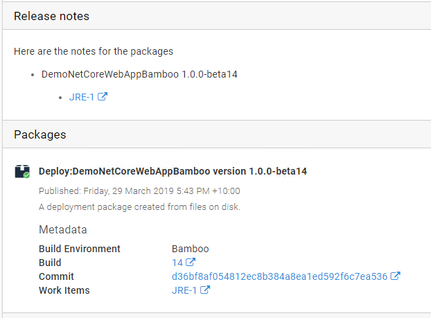
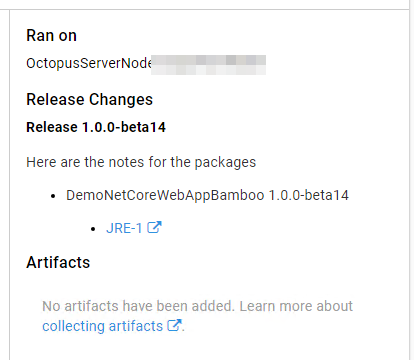

This section details how to configure the custom metadata integration in Octopus. The metadata includes information about how a package was built and what it includes, including work item details.

The overall premise of how the work item functionality works is, the build server parses Commit messages looking for references to work items. Information about the work items is then passed through the CI/CD pipeline and included in the release and deployment details.

## Building the metadata

Key to flowing information through the pipeline is having a method of transport. Octopus uses a custom metadata file, which is pushed to the server separately to the package itself.

The reason the file is separate is to allow for packages that are destined for external feeds, Octopus can still be given the custom metadata relating to those packages. This also includes things like container images that are being pushed to container repositories.

To create the metadata file and get it to Octopus, use the Octopus _Metadata_ step in your build server (below is the TeamCity step for illustration).


The build server plugins work on the assumption that the team are referencing the work items in their commit messages, for example as they would for Bamboo build integration with Jira or integration with GitHub issues.

The metadata will appear in the package feed details for any package in the internal feed that has had metadata pushed for it.


If there is a specific issue tracker extension, e.g. Jira, enabled and configured that matches the work items type the work items will appear as a links to the issue tracking system. If not the work items will appears as plain text.

## Project settings

The next step is to tell your Octopus project which packages in its deployment process contain metadata that you want included in the releases and deployments.


In this example the project is using the primary package from the step named Deploy. You can specify multiple packages if required. An example of where you might use this is a deployment process that includes steps for a Web App and a SQL database schema migration. The packages for both of those form the complete product and either or both could be contributing work items.

## Releases and Deployments

When a release is created for the project, the selected package versions are used to collect the work item list and it is shown with the release details.



When this release is deployed the metadata will be contributed to the deployment. They will appear in the preview


and again on the task summary for the deployment.



In some scenarios this one to one between releases and deployments will be the norm. Teams using continuous deployment may see a rapid progression of versions through their environments and on to production.

Many teams won't be operating like this though, many will accumulate a number of releases before promoting to the next environment. For example, they may merge pull requests for several fixes/features and then deploy the final release to test. This could even go through a couple of revolutions and then eventually a final release progresses from test to production. In this situation the deployment to production isn't just the work items from that last release, it is the accumulation of all of the work items in all of the releases since the last one that was deployed to production.

This accumulation logic is how Octopus always determines the metadata list, it's always the accumulation since the last deployment to the given "scope". A scope in this context is the combination of deployment environment and tenant (if multi-tenancy is in play).

Given that you can initiate deployments to multiple "scopes" at once in Octopus it is quite conceivable, and expected, that you could see different work items lists for each scope. Let's consider a couple of examples, first 2 tenants in the same environment. In this case if tenant A is on an earlier version than tenant B the the result list for tenant A would the list for tenant B plus the additional work items between the version it was on and the version tenant B was on.

As a second example, imagine you have 2 environments in a lifecycle but you don't always deploy to 1 of them. Let's use staging and a performance test environment as an example. Maybe you periodically deploy to the performance environment to check for regressions but not every time you deploy to staging. The work items for the performance environment would be the same as staging plus the additional work items for the releases in between.

## Deploy a Release step

The Octopus [deploy release step](https://g.octopushq.com/DeployReleaseStep) adds an interesting dimension to metadata accumulation. When you are using this step Octopus treats each "child project" as though it was a package. Following from this reasoning, it also treats the child project's release as a potential source for metadata.

On the project settings you can select a deploy release step and use it the same as any other package from the internal feed. When creating the releases in the "parent project" Octopus accumulates the release notes and metadata from the child projects just as it would for packages.

## Deployment Variables and the Email step

During a deployment there are variables available for both the new release notes values and the work items.

The release notes variable is `Octopus.Deployment.Notes` and contains the release notes and work items in json format. The structure is a Json array of `ReleaseChange` objects matching the following C# class

```csharp
public class ReleaseChanges
{
    public string Version { get; set; }
    public string ReleaseNotes { get; set; }
    public OctopusPackageVersionMetadata[] VersionMetadata { get; set; }
}

public class OctopusPackageVersionMetadata : IPackageVersionMetadata
{
  public string PackageId { get; set; }
  public string Version { get; set; }
  public OctopusPackageMetadata OctopusPackageMetadata { get; set; }
}

public class OctopusPackageMetadata
{
  public string BuildEnvironment { get; set; }
  public string IssueTrackerId { get; set; }
  public string BuildNumber { get; set; }
  public string BuildLink { get; set; }
  public string VcsRoot { get; set; }
  public string VcsCommitNumber { get; set; }
  public WorkItem[] WorkItems { get; set; }
}

public class WorkItem 
{
    public string Id { get; set; }
    public string IssueTrackerId { get; set; }
    public string LinkUrl { get; set; }
    public string LinkText { get; set; }
}
```

To describe that structure in words, there is an entry per release and it includes the release notes and the metadata for each of the packages in that release.

The following example uses these variables to generate the Html body for the Octopus email step.

```html
Here are the notes:<br/>
#{each change in Octopus.Deployment.Changes}
<h2>#{change.Version}</h2>
#{change.ReleaseNotes}</br>
#{each versionMetadata in change.VersionMetadata}
<h3>#{versionMetadata.PackageId}</h3>
#{each workItem in versionMetadata.OctopusPackageMetadata.WorkItems}
      <a href="#{workItem.LinkUrl}">#{workItem.LinkText}</a>
#{/each} 
#{/each} 
#{/each} 
```

## Issue Trackers

If you are using an issue tracker like Jira, Octopus can also be integrated with it to provide information about the progress of work items. For more details see [Jira Issue Tracker](jira.md).