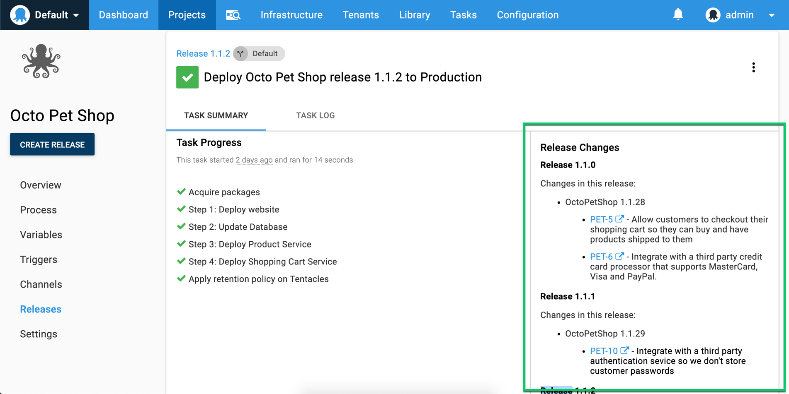
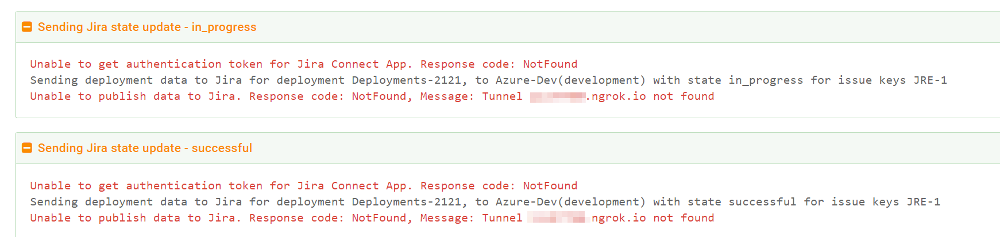

**Octopus 2019.4** introduced support to integrate Octopus with Jira Cloud and Jira Server. The integration adds links to Jira issues in release details of your deployments, and adds release notes to Octopus from Jira to help automate the release note process. If you're using Jira Cloud, you can also view release and deployment details from Octopus directly in Jira issues, making it possible to see if the issue has been included in any deployments. This feature builds upon the functionality to [track metadata and work item](/docs/api-and-integration/metadata/index.md) information through your CI/CD pipeline.

This page described how to configure this functionality for Octopus and Jira.

* Learn about [Connecting Jira Server and Octopus Deploy](#connecting-jira-server-and-octopus-deploy)
* Learn about [Connecting Jira Cloud and Octopus Deploy](#connecting-jira-cloud-and-octopus-deploy)

---

## Connecting Jira Server and Octopus Deploy

This section describes how to configure Octopus Deploy to connect to Jira Server. When configured, this integration, connections are always made to Jira (either from Octopus server itself or via links in the browser). There are no cases where Jira connects to Octopus.

This means you can configure any Octopus instance, whether self-hosted or cloud, to use the Jira integration. The only network connectivity requirements are that your Octopus server and your browser can connect to the Jira Base URL discussed below.

If you are using Jira Server, see [Connecting Jira Cloud and Octopus Deploy](#connecting-jira-cloud-and-octopus-deploy).

<!-- I've left this blank so we can review/agree upon the Jira Cloud copy first and then strip it appropriately to suit the Jira Server copy. -->

## Connecting Jira Cloud and Octopus Deploy

This section describes how to configure Octopus Deploy to connect to Jira Cloud. In all cases for this integration, connections are always made to Jira (either from Octopus server itself or via links in the browser). There are no cases where Jira connects to Octopus.

This means you can configure any Octopus instance, whether self-hosted or cloud, to use the Jira integration. The only network connectivity requirements are that your Octopus server and your browser can connect to the Jira Base URL discussed below.

If you are using Jira Cloud, you can use the Octopus Deploy plugin for Jira that's available from the [Atlassian Marketplace](https://marketplace.atlassian.com/apps/1220376/octopus-deploy-for-jira) to enable teams to view release and deployment details from Octopus directly in Jira issues. This section and the following steps describe how to configure this.

If you are using Jira Server, see [Connecting Jira Server and Octopus Deploy](#connecting-jira-server-and-octopus-deploy).

1. Install the Octopus Deploy plugin in your Jira Cloud instance.

    From the Atlassian Marketplace, add the [Octopus Deploy for Jira](https://marketplace.atlassian.com/apps/1220376/octopus-deploy-for-jira) app and click 'Get Started' to configure it. Alternately, the app is also available in Jira by navigation to **{{Jira Settings,Find new apps}}**.

    Note: Keep this configuration page open while you complete the next steps as you need to copy values between Octopus and Jira.

2. Configure the Jira extension in Octopus Deploy.

    In the Octopus web portal, navigate to **{{Configuration,Settings,Jira Issue Tracker}}** and copy the following values from the Jira App configuration page:

    - **Jira Base URL**. This tells Octopus where your Jira instance is located and enables Octopus to render the links back to Jira issues. i.e., https://your-jira-instance.atlassian.net.
    - **Jira Connect App Password**.

    Ensure the **Is Enabled** property is set as well.

3. In Octopus Deploy Configure the Release Note Options (optional).

    - **Jira username/password**: Set these values to allow Octopus to connect to Jira and retrieve Jira issue (work item) details when viewing packages or creating releases. If these are not provided, just the raw work item references will be used as the work item link descriptions. If they are provided the work item's title will be used as the work item link's description.

    <!-- Lee: I noted work item in brackets above to make the connection between the two terms. Is that sufficent? I've used Jira issue primarily on this page as it's what the audience understands but work item is our term. Need advice on this. -->

    The password should be an API Token, rather than an actual password. You can create an API token from an Atlassian account in the 'Security' area.
    
    - **Release Note Prefix**: If specified, Octopus will look for a comment that starts with the given prefix text and use whatever text appears after the prefix as the release note, which will come through to the release notes templates etc as the work item link's description. If not comment is found with the prefix then Octopus will default back to using the title for that work item.

    For example, a prefix of `Release note:` can be used to identify a customer friendly issue title vs a technical feature or bug fix title.

1. Ensure the Octopus Server URL in set in Octopus Deploy.

    Navigate to the **{{Configuration,Nodes}}** page and ensure you have set the Server URI field to your Octopus Server's base URL. i.e., https://my-company.octopus.app/ or https://my-company-internal-name/
    Note: Octopus passes this value to Jira so it can build hyperlinks back to the deployments from its UI. It never actually tries to connect to this Url itself.

1. Configure the Octopus plugin in Jira.

    Navigate to the **{{Configuration,Settings,Jira Issue Tracker}}** page in Octopus, copy the **Octopus InstallationID**, and add it to Jira App configuration.

1. Update your environment settings in Octopus Deploy.

    Navigate to **{{Infrastructure,Environments}}** to map your Octopus environments to Jira environment types. This is required so Jira can understand Octopus environments and track issue progress.

    Note: Jira environment types are a fixed list that cannot be edited.

When configured, this integration will provide Jira with updates about the progress of Jira issues (work items) through the pipeline.

## Octopus Deployment Task Log

When the Jira issue tracker is enabled and configured, you will see blocks similar to the following appear in the log during your deployments. These show the state updates Octopus is sending through to Jira, and if you expand them the details include information about the Jira issues for traceability.

The following illustrates where Octopus tried to send an _in_progress_, and then a _successful_, state change to Jira but was unable to.

Note: **This does not impact the Octopus deployment itself, it will still be considered a successful deployment.**

When Octopus successfully sends state changes to Jira, the blocks will appear with green text just like the other blocks in the log.
