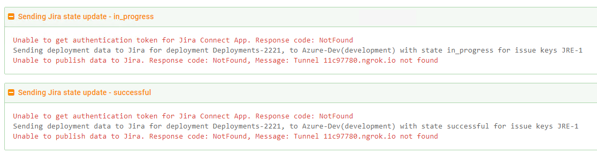

In addition to being able to [track metadata and work-item](index.md) information through your CI/CD pipeline, Octopus can also integrate with Jira to provide progress information related to the work-items during deployments.

The integration to Jira is additional to the work-item tracking built in to Octopus. The configuration described below assumes you already have work-item tracking enabled in your pipeline and packages.

## Levels of integration

There are several levels of integration available for Jira. The first allows Octopus to parse the commits looking for Jira work item references, this is available as soon as the Jira Issue Tracker extension is enabled.

The second level of integration is providing links to Jira for the work items that are found. This occurs once the BaseUrl is set on the extension.

These first two levels of integration work whether your Jira instance is OnPrem or SaaS. The third level of integration allows Octopus to update Jira when deployments occur, and **is only available with the SaaS version of Jira**. It becomes enabled once the Connect App is configured (see below) and the Octopus server's Uri is set in {{Configuration,Nodes}}.

## Octopus Connect App and the Jira Extension

The first step to configure the integration is adding the Octopus Connect App in the Jira marketplace.

***TODO: add a screenshot of the marketplace tile***

To complete the installation of the app from the marketplace, you must add the following values from Jira App configuration page to Octopus by navigating to **{{Configuration,Settings,Jira Issue Tracker}}** in  Octopus:

- Jira Base URL, i.e., https://your-jira-instance.atlassian.net.
- Octopus Secret (enter the Octopus Secret into the **Jira Connect App Password** field.)

And from the **{{Configuration,Settings,Jira Issue Tracker}}** page in Octopus, you need to copy the **Octopus InstallationID** and add it to Jira App configuration.

## Environment Settings

The next thing to configure relates back to the earlier note on environment types and environment names. In Octopus you need to map the Jira environment types for the environments that you're going to be tracking work-items.

The fixed list of environment types are important for the tracking in Jira, and this configuration gives you the flexibility of easily mapping any existing environments to a type.

The environment name also gets passed through to Jira, as shown in the earlier example. Also note that multi-tenancy is fully supported and the deployment will show in Jira per tenant per environment name.

The following diagram illustrates an un-tenanted deployment to Dev and then a tenanted deployment to Dev of the same version (the text is truncated in the screenshot, the alt text for the link reads `Deploy work-items test release 0.0.5 to Dev for Tenant A`)

## Deployment Task Log

Once the Jira issue tracker is enabled and configured you will see blocks similar to the following appear in the log during your deployments. These show the state updates Octopus is sending through to Jira, and if you expand them the details include information on the work-item IDs etc for traceability.

The following illustrates where Octopus tried to send an _in_progress_, and then a _successful_, state change to Jira but was unable to. **This does not impact the Octopus deployment itself, it will still be considered a successful deployment.**

On success the blocks will appear with green text just like the other blocks in the log.

## Deployment Events

The end result of this integration is to provide Jira with updates on the progress of work-items through the pipeline. It will display information similar to the following when it receives these updates for the work-items:

Note that, as discussed above, **Testing**, and **Development** here refer to environment types and not an environment names.

:::warning
It is important to note the link in the above image will link to the deployment in Octopus. In order for Octopus to feed this URL to Jira you must have the Server URI configured on the {{Configuration,Nodes}} page.
:::