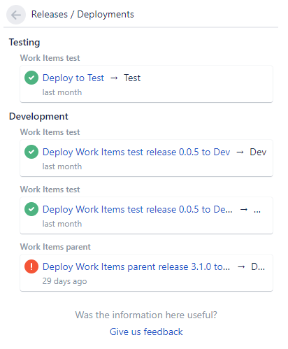

**Octopus 2019.4** introduced support to integrate with Jira Software to provide release and deployment details directly in Jira issues. This builds upon the functionality to [track metadata and work item](/docs/api-and-integration/metadata/index.md) information through your CI/CD pipeline.

This integration is using the [Octopus Deploy plugin for Jira](https://marketplace.atlassian.com/apps/1220376/octopus-deploy-for-jira) and this page describes how to connect and configure the two applications. 

:::hint
The Octopus Deploy plugin for Jira is only compatible with Jira Software Cloud as Jira Server (on-prem) does not support the APIs required to enable this functionality. There is limited support available as noted in our [Jira Server section](#jira-server-on-prem-support).
:::

## Connecting Jira and Octopus Deploy

1. Install the Octopus Deploy plugin in Jira

    Add the `Octopus Deploy for Jira` app from the [Atlassian Marketplace](https://marketplace.atlassian.com/apps/1220376/octopus-deploy-for-jira) and then click the 'Get Started' button to configure it.

    Note: Keep this configuration page open while you navigate to Octopus in the next step as you need to copy values from one page to the other.

1. Configure the Jira extension in Octopus Deploy

    Navigate to the **{{Configuration,Settings,Jira Issue Tracker}}** page in Octopus and copy the following values from the Jira App configuration page:

    - Jira Base URL, i.e., https://your-jira-instance.atlassian.net.
    - Jira Connect App Password 

    Set the 'Is Enabled' property as well.

1. Configure the Release Notes options in Octopus Deploy (optional)

    - Jira username/password - Octopus can retrieve Jira Issue descriptions if you specify your Atlassian Cloud username and an API token. You can create an API token from an Atlassian account in the 'Security' area.
    - Release Note Prefix - Specifying a release note prefix tells Octopus to look through your Jira issue descriptions for one that  for one that starts with that prefix. If it finds one it will use the text following the prefix as the `WorkItemLink.Description`. If you leave this field blank, or a comment starting with the prefix isn't found, the issue's title will be used for the `WorkItemLink.Description`.

1. Set the Octopus Server URL in Octopus Deploy

    Navigate to the {{Configuration,Nodes}} page and ensure you have set the Server URI field to your Octopus Server's base URL. i.e., https://my-company.octopus.app/ or https://my-company-internal-name/

1. Configure the Octopus Deploy plugin for Jira

    Navigate to the **{{Configuration,Settings,Jira Issue Tracker}}** page in Octopus and copy the **Octopus InstallationID** and add it to Jira App configuration.

1. Update your Octopus environment settings

    Navigate to **{{Infrastructure,Environments}}** to map your Octopus environments to Jira environment types. This is required so Jira is able to understand Octopus environments and track issue progress. 
    
    Note: Jira environment types are a fixed list that cannot be edited. 

The end result of this integration is to provide Jira with updates on the progress of Jira issues (work items) through the pipeline.

## Octopus Deployment Task Log

Once the Jira issue tracker is enabled and configured, you will see blocks similar to the following appear in the log during your deployments. These show the state updates Octopus is sending through to Jira, and if you expand them the details include information on the Jira issues for traceability.

The following illustrates where Octopus tried to send an _in_progress_, and then a _successful_, state change to Jira but was unable to. 

Note: **This does not impact the Octopus deployment itself, it will still be considered a successful deployment.**

On success the blocks will appear with green text just like the other blocks in the log.

## Jira Server (on-prem) Support

The `Octopus Deploy plugin for Jira` is only compatible with Jira Software Cloud however, there is some limited functionality available that works with Jira Server (on-prem). Octopus can display Jira issue names and descriptions in release and deployments if the following is configured. 

* Configure your build server to [push build and commit metadata](/docs/api-and-integration/metadata/index.md) to Octopus 
* Configure the Jira extension in Octopus Deploy as per above with your on-prem server details including the username and password/API token. 
