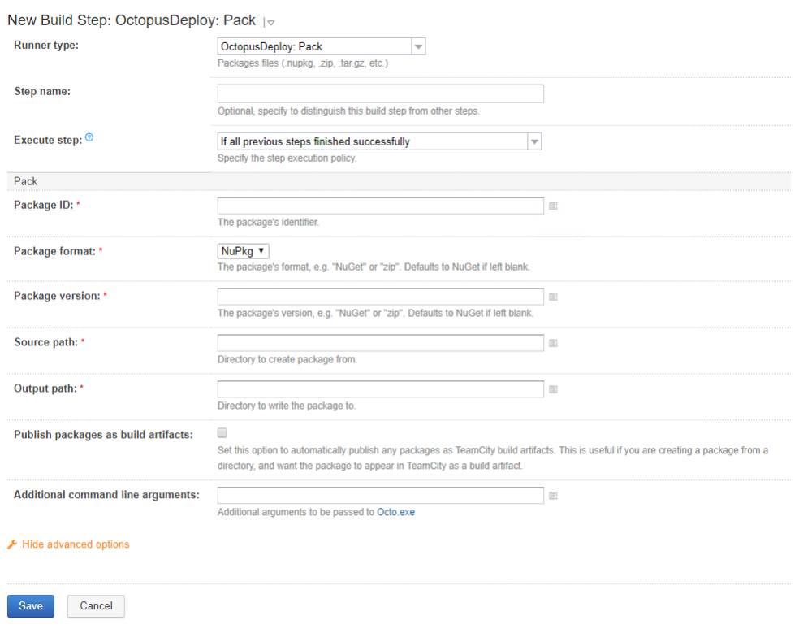

!include <teamcity-intro>

!include <teamcity-install>

!include <teamcity-pack>

## Installing the Octopus TeamCity Plugin

The Octopus Deploy TeamCity plugin is available in the following places:

- The [Jetbrains Plugin Repository](https://plugins.jetbrains.com/plugin/9038-octopus-deploy-integration).
- The [Octopus Downloads page](https://octopus.com/downloads).
- In TeamCity by navigating to **{{Administraton,Plugins List,Browse plugin respository}}** and searching for **Octopus Deploy Integration**.

The TeamCity documentation has instructions and options for [installing plugins](https://www.jetbrains.com/help/teamcity/installing-additional-plugins.html).

## Create Packages with TeamCity

Octopus supports multiple [package formats](/docs/packaging-applications/index.md#supported-formats) for deploying your software. TeamCity can be configured to monitor you source control and package your applications when changes are made.

You configure TeamCity to package your applications by creating a [build configuration](https://www.jetbrains.com/help/teamcity/build-configuration.html), and adding a step to the configuration of runner type, **Octopus Deploy: Pack**.

1. Give the step a name.
2. Enter the [package ID](/docs/packaging-applications/index.md#package-id).
3. Select the type of **package format** you want to create, NuGet(default) or Zip.
4. Enter the **package version**. The package version cannot be a single number (learn about [version numbers in Octopus](/docs/packaging-applications/index.md##version-numbers)). Make sure this evaluates to a multi-part number, for instance, **1.1.3.**. You may want to edit the General Settings for your project to ensure that the TeamCity build number uses multiple parts:

5. Enter the **source path**.
6. enter the **output path**.

With these options selected, your packages will automatically be created using the version number of the current build. OctoPack will ensure these packages appear in the artifacts tab of TeamCity:

## Using Octopus as a Package Repository {#TeamCity-PushpackagestoOctopusUsingOctopusasaPackageRepository}

Octopus can be used as a [NuGet package repository](/docs/packaging-applications/package-repositories/built-in-repository/index.md), or it can be configured to use an external feed (such as retrieving them from TeamCity).

To push packages to Octopus during the OctoPack phase, enter the NuGet endpoint URL into the **Publish packages to http** field, and [an API key](/docs/api-and-integration/api/how-to-create-an-api-key.md) in the **Publish API Key** field.  OctoPack will then push the packages when the solution is built.  You'll find the URL to your repository on the **{{Library,Packages}}** tab in Octopus.  Simply click the `Show examples` link to see options to upload packages including the repository URL.

## Consuming the TeamCity NuGet feed in Octopus {#TeamCity-ConsumeNuGetFeedInOctopusConsumingtheTeamCityNuGetfeedinOctopus}

!include <teamcity-feed>

## Creating and Pushing Packages From TeamCity to Octopus {#TeamCity-CreateAndPushPackageToOctopusCreatingandpushingpackagesfromTeamCitytoOctopus}

:::hint
In version 4.38.0 of the TeamCity Plugin we have added a new build runner that can be used to package your applications as either a NuGet or Zip formatted package.
:::

:::hint
In version 3.3.1 of the TeamCity Plugin we have added a new build runner that can be used to package and push your applications from TeamCity to Octopus.
:::

## Using the Plugin With Linux Build Agents {#TeamCity-LinuxAgentsUsingthepluginwithLinuxbuildagents}

Traditionally the Octopus TeamCity plugin required a Windows build agent to work. As of version 4.2.1 will run on Linux build agents if they meet either **one** of the following requirements:

1. Have [.NET Core](https://www.microsoft.com/net/core) installed on the build agent and in the PATH such that the `dotnet` command runs successfully. To install, follow the linked guide to install the .NET Core SDK for your distribution. Ensure that the `dotnet` command runs successfully. From version 4.15.10 of the plugin .NET Core v2 is required.
2. Have the Octo command line tool installed and in the PATH such that the `Octo` command runs successfully. To install, download the .tar.gz for you system from the [Octopus download page](https://octopus.com/downloads), extract somewhere appropriate and symlink `Octo` into your PATH. Again, ensure that `Octo` runs successfully. On Ubuntu you may need to install `libunwind8` using your package manager.
