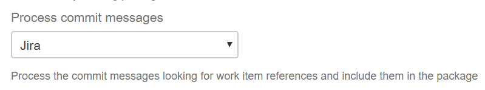
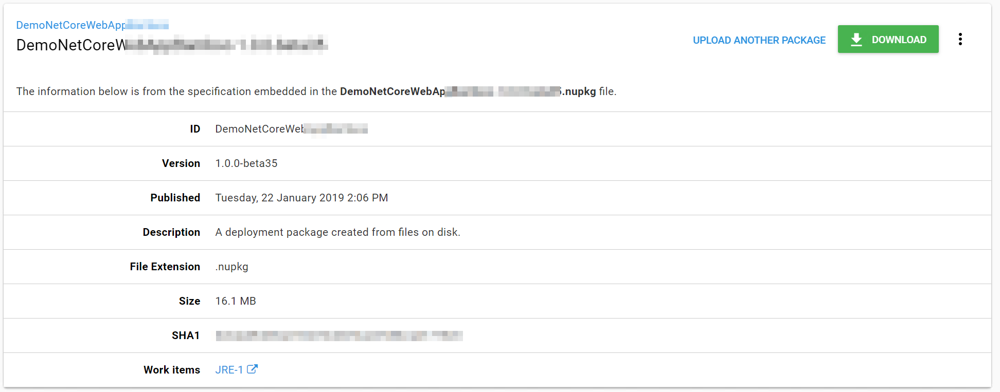
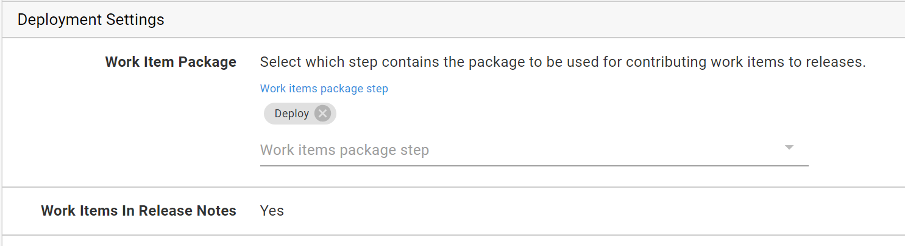
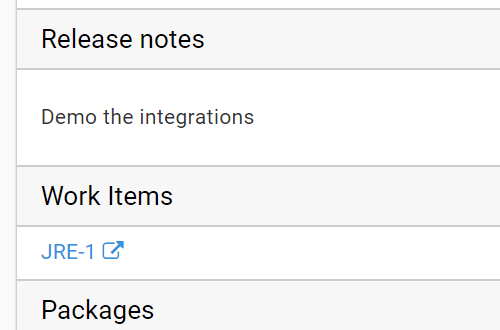
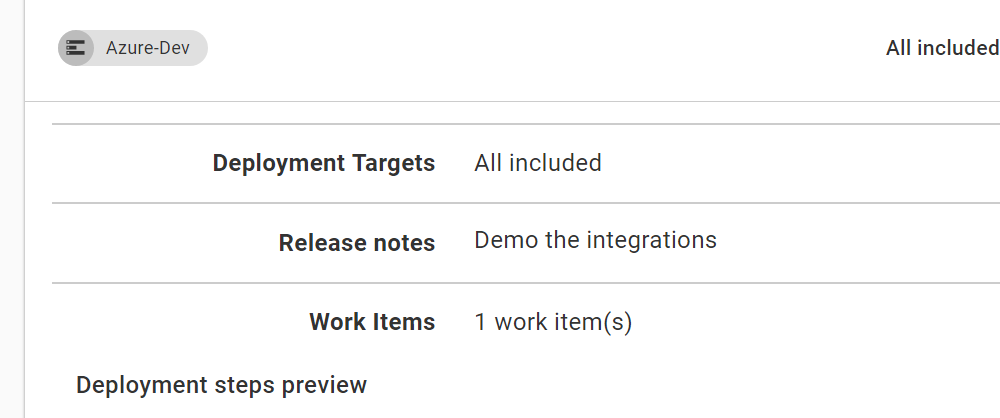
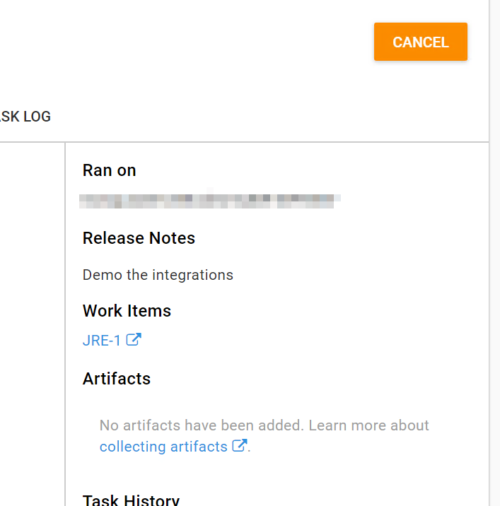

This section details how to configure the work item integration in Octopus. The overall premise of how this functionality works is, the build server parses Commit messages looking for references to work items. Information about the work items is then passed through the CI/CD pipeline and included in the release and deployment details.

## Packaging

Key to flowing information through the pipeline is having a method of transport. Octopus uses a custom metadata file embedded in the packages to transport work item information.

This has a number of advantages, but the key one is that the package is always the source of truth for the data. If you are creating releases interactively in Octopus (i.e. separate to the CI/CD pipeline) for any reason, or if you are using ARC for example, the package will always contain the related work item metadata.

The metadata is only read when packages are uploaded to the Octopus built-in package feed, so you must use it in order to use the work item functionality. Support for reading the metadata in packages sourced from external feeds may be added in a future release.

To get the work item metadata file into the package use the Octopus _Pack Package_ step in your build server and configure the _Process commit messages_ setting.



The build plugins work on the assumption that the team are referencing the work items in their commit messages, for example as they would for Bamboo build integration with Jira. 

The work items will appear in the package feed details for any package that contains the metadata.



If there is a specific issue tracker extension, e.g. Jira, enabled and configured that matches the work items type the work items will appear as a links to the issue tracking system. If not the work items will appears as plain text.

## Project settings

The next step is to tell your Octopus project which packages in its deployment process contain the work items



In this example the project is using the primary package from the step named Deploy. You can specify multiple packages if required. An example of where you might use this is a deployment process that includes steps for a Web App and a SQL database schema migration. The packages for both of those form the complete product and either or both could be contributing work items.

On the project settings you can also control whether you want the work item links to be appended to the deployment release notes. The work item data will always be stored separately on the deployment as well, this setting allows you to have the links as part of the release note text if you want. Note that when the work items are added to the release notes, they are always appended at the bottom and are in markdown format. *This may not suit your needs, but we'll talk a bit more about that below.*

## Releases and Deployments

When a release is created for the project, the selected package versions are used to collect the work item list and it is shown with the release details.



When this release is deployed the work items will be contributed to the deployment. They will appear in the preview



and again on the task summary for the deployment.



In some scenarios this one to one between releases and deployments will be the norm. Team using continuous deployment may see a rapid progression of versions through their environment and on to production.

Many teams won't be operating like this though, many will accumulate a number of releases before promoting to the next environment. For example, they may merge pull requests for several fixes/features and then deploy the final release to test. This could even go through a couple of revolutions and then eventually a final release progresses from test to production. In this situation the deployment to production isn't just the work items from that last release, it is the accumulation of all of the work items in all of the releases since the last one that was deployed to production.

This accumulation logic is how Octopus always determines the work item list, it's always the accumulation since the last deployment to the given "scope". A scope in this context is the combination of deployment environment and tenant (if multi-tenancy is in play).

Given that you can initiate deployments to multiple "scopes" at once in Octopus it is quite conceivable, and expected, that you could see different work items lists for each scope. Let's consider a couple of examples, first 2 tenants in the same environment. In this case if tenant A is on an earlier version than tenant B the the result list for tenant A would the list for tenant B plus the additional work items between the version it was on and the version tenant B was on.

As a second example, imagine you have 2 environments in a lifecycle but you don't always deploy to 1 of them. Let's use staging and a performance test environment as an example. Maybe you periodically deploy to the performance environment to check for regressions but not every time you deploy to staging. The work items for the performance environment would be the same as staging plus the additional work items for the releases in between.

## Deploy a Release step

The Octopus [deploy release step](https://g.octopushq.com/DeployReleaseStep) adds an interesting dimension to work item accumulation. When you are using this step Octopus treats each "child project" as though it was a package. Following from this reasoning, it also treats the child projects as a potential source for work items.

On the project settings you can select a deploy release step and use it the same as any other package from the internal feed. When creating the releases in the "parent project" Octopus accumulates the work items from the child projects just as it would for packages.

## Deployment Variables and the Email step

During a deployment there are variables available for both the new release notes values and the work items.

The release notes variable is `Octopus.Deployment.Notes` and contains the release notes in markdown format, the same as `Octopus.Release.Notes` (which is still available and still contains only the release notes for the specific release and not the accumulated notes for the deployment).

The work items variable is `Octopus.Deployment.WorkItems` and contains a Json array of objects matching the following C# class

```csharp
public class WorkItem 
{
    public string Id { get; set; }
    public string IssueTrackerId { get; set; }
    public string LinkUrl { get; set; }
    public string LinkText { get; set; }
}
```

The following example uses these variables in as Html body for the Octopus email step.

```html
Here are the notes:<br/>
#{Octopus.Deployment.Notes}
<br/>
And the work items:<br/>
#{each workItem in Octopus.Deployment.WorkItems}
      <a href="#{workItem.LinkUrl}">#{workItem.LinkText}</a>
#{/each}
```

It's worth re-iterating here that the Notes will be in markdown format, and if you use the project settings option mentioned earlier to include the work items in the release notes field itself they will be in markdown format, not as Html anchors like in this example. So if you intend to include the work item details in an email step we would recommend not using the setting to include them in the note field itself.

## Issue Trackers

If you are using an issue tracker like Jira, Octopus can also be integrated with it to provide information about the progress of work items. For more details see [Jira Issue Tracker](jira.md).