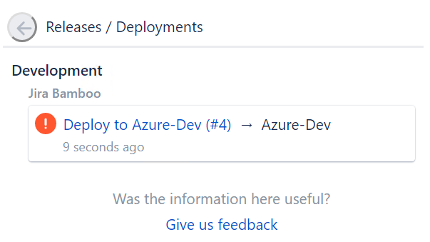
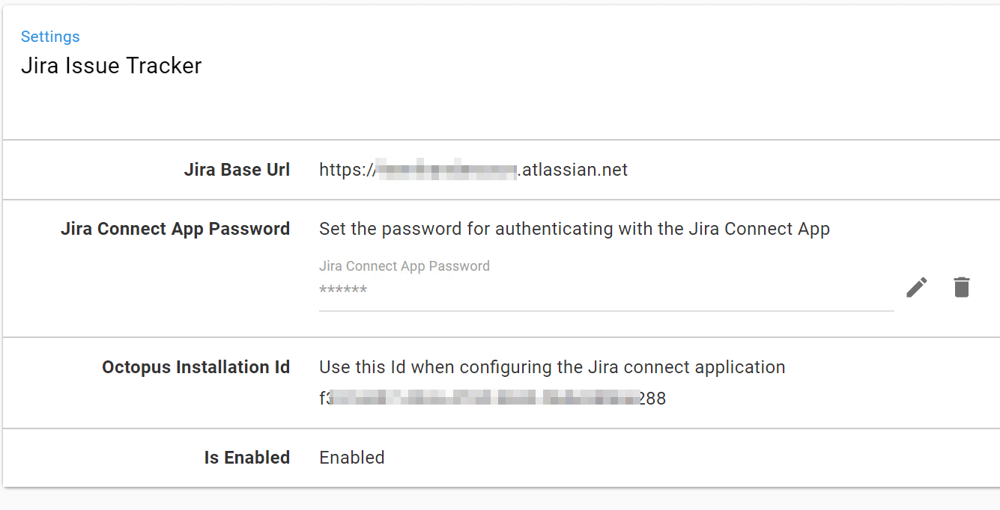
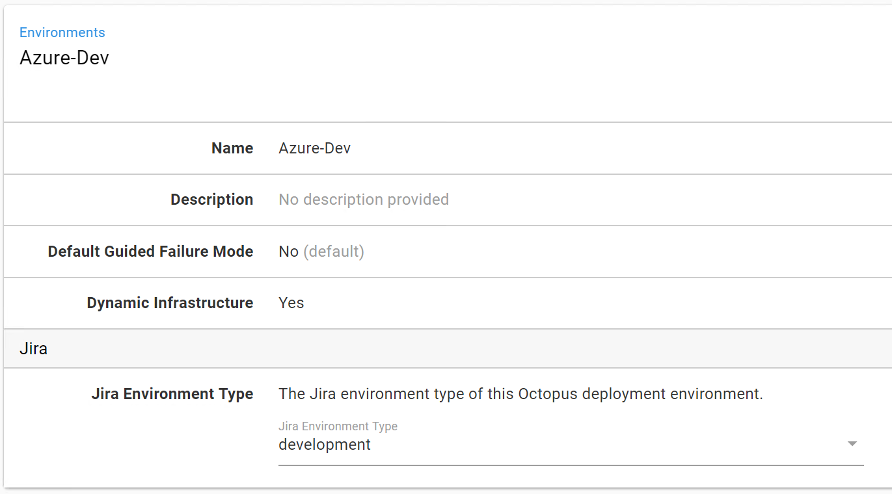
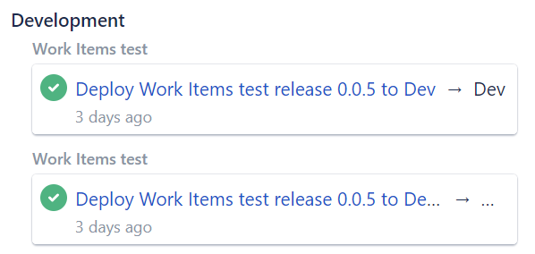

In addition to being able to [track work-item](/docs/api-and-integration/index.md) information through your CI/CD pipeline, Octopus can also integrate with Jira to provide progress information related to the work-items during deployments.

The integration to Jira is additional to the work-item tracking built in to Octopus. The configuration described below assumes you already have the work-item tracking enabled in your pipeline and packages.

## Deployment Events

To set the scene, the end goal of the integration is to provide Jira with updates on the progress of work-items through the pipeline. It will display information similar to the following when it receives these updates for the work-items:

As a note, **Development** here refers to an environment type, not an environment name. The environment name in Octopus in this example was actually Azure-Dev. See below for more detail on where this becomes important.

## Octopus Connect App and the Jira Extension

Something worth pointing out at this point is that the Jira functionality we're demonstrating here is only available in the SaaS version of Jira. There isn't a SaaS requirement on the Octopus side of the integration though, so you can use either a self-hosted or Cloud version of Octopus.

With that in mind, the first step in the integration is to add the Octopus Connect App in the Jira marketplace.

***TODO: add a screenshot of the marketplace tile***

To complete the installation of the app from the marketplace you must configure some security related values. This requires aligning a couple of pieces of information from the page that appears in Jira:

And from the **Configuration / Jira Issue Tracker** page in Octopus:

You'll probably want both of these open in separate browser windows/tabs to complete the configuration. On the Jira side you need to copy the _Octopus Installation Id_ from the Octopus page, and on the Octopus side you'll need to copy your Jira instance's *Base Url* and the *Octopus Secret* that appears on the Connect App configuration page to use as the *Jira Connect App Password*.

## Environment Settings

The next thing to configure relates back to our earlier note on environment types VS environment names. In Octopus you'll need to map the Jira environment types for the environments that you're going to be tracking work-items for:

The fixed list of environment types are important for the tracking in Jira and this configuration allows you the flexibility of easily mapping any existing environments to a type.

The environment name does get passed through to Jira, as shown in the earlier example, so the information is still available for you to see. Also note that if you are using multi-tenancy this is fully supported and what you will see in Jira is a per tenant per environment name. As an example, the following diagram illustrates an un-tenanted deployment to Dev and then a tenanted deployment to Dev of the same version (the text is truncated in the shot, the alt text for the link reads `Deploy work-items test release 0.0.5 to Dev for Tenant A`)

## Deployment Task Log

Once the Jira issue tracker is enabled and configured you will see blocks similar to the following appear in the log during your deployments. These show the state updates Octopus is sending through to Jira, and if you expand them the details include information on the work-item IDs etc for traceability.

As a final note, errors that occur while trying to send the information to Jira will appear as above in the task log but will not cause the deployment itself to fail (on success the blocks will appear with green text just like the other blocks in the log).
