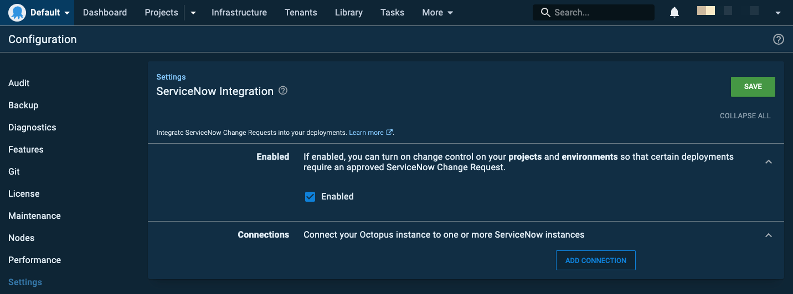
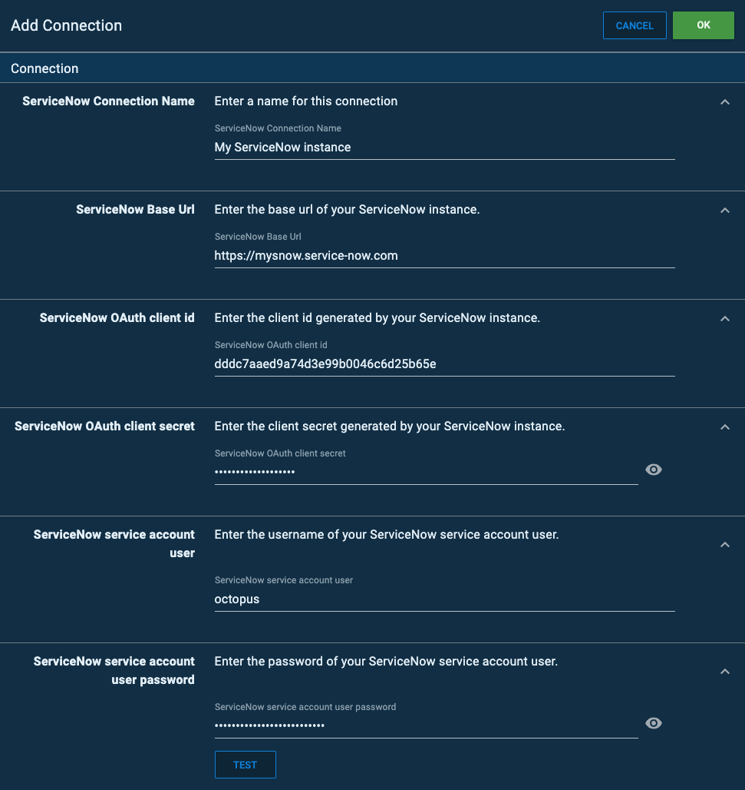
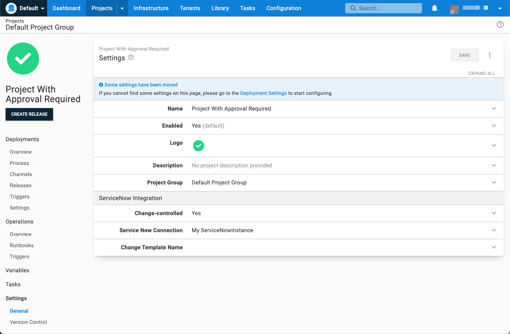
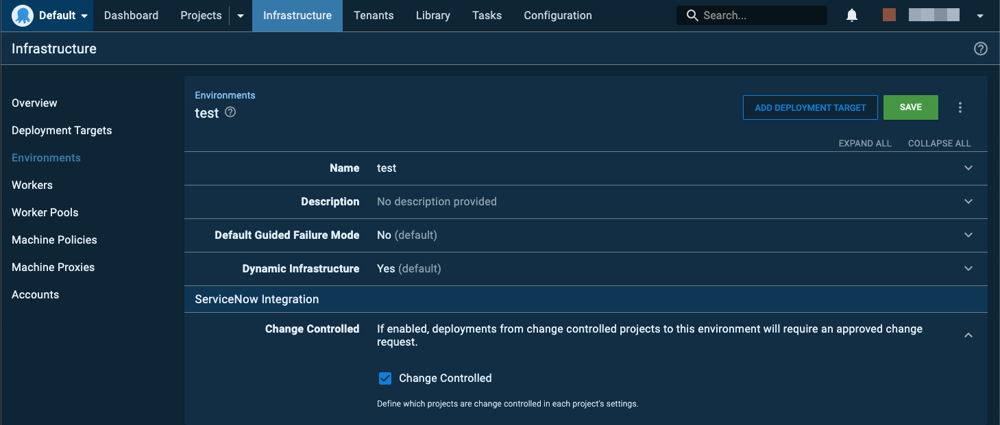
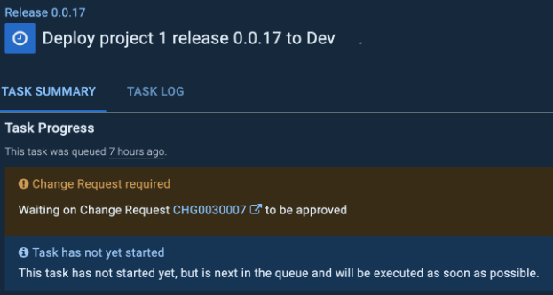

:::warning
The ServiceNow Integration feature is only available as an EAP for version 2022.2.5556 or later and it requires a feature license to be able to use it.
```

## Overview

The Octopus Deploy/ServiceNow integration allows users to block the execution of specifically configured deployments unless they have a corresponding approved ServiceNow **Change Request** (CR).

For configured project and environment combinations, Octopus Deploy will 

To enable this behavior, both systems must be configured before deployments can be managed.

| Project | Environment Change Controlled | Environment **Not** Change Controlled| 
| --------|--|-- |
| Change Controlled | _Approval Required_  | No Approval Required | 
| **Not** Change Controlled | No Approval Required | No Approval Required |

## Getting started

The Service Now integration requires Octopus 2022.2.5556 or later, and an Octopus license with the Service Now Integration feature enabled.

To get started:
1. Configure ServiceNow
1. Obtain a ServiceNow feature license for your Octopus instance 
1. Configure a connection from Octopus to ServiceNow
1. Configure which deployments require an approved CR

### Configuring Service Now

:::hint
The instructions in this section will require a ServiceNow Administrator.
:::

The Octopus Deploy / ServiceNow integration requires security configuration in your target ServiceNow instance. 

Follow the [ServiceNow OAuth documentation](https://docs.servicenow.com/bundle/sandiego-platform-administration/page/administer/security/task/t_SettingUpOAuth.html) to configure an OAuth endpoint for Octopus to use for authentication. Take note of the OAuth client id and client secret from the configuration.

Next, the integration will require a user account on ServiceNow. The recommendation is to create a user account specifically for Octopus.
To create a new ServiceNow user, follow the ServiceNow [Create a user](https://docs.servicenow.com/en-US/bundle/sandiego-platform-administration/page/administer/users-and-groups/task/t_CreateAUser.html) documentation. 

Ensure that the new user has `Web service access only` checked. 
Take note of the password assigned or generated for this user.

### Licensing

For the ServiceNow approval checks to be performed as part of the deployment process, an appropriate Octopus license must be configured in your Octopus instance.

A ServiceNow enabled Octopus license must be requested from Octopus directly, and cannot be managed through the usual self-service process.

Once you have received your feature-enabled license, you can install it by navigating **{**{Configuration, License}}**. 

An enabled license will include a node similar to the below:

```xml
<Features>
  <ServiceNowIntegration>
    <ValidTo>...</ValidTo>
  </ServiceNowIntegration>
</Features>
```

### Configuring ServiceNow connections

:::hint
The instructions in this section will require an Octopus Deploy manager or administrator
:::

To connect your Octopus Deploy instance to ServiceNow, navigate to  **{{Configuration, Settings, ServiceNow Integration}}**.

Check the **Enabled** option


Click on **ADD CONNECTION** and fill out the details.
The ServiceNow Base Url should be the root URL and include the protocol. 


Press **TEST** to ensure that the connection details are working. 

Multiple ServiceNow connections are supported, however, each project can only use one ServiceNow connection.

## Configuring deployments

To enforce a deployment to require an approved CR, the **Change Controlled** setting needs to be enabled in **both** the project and the environment it is being deployed to.

### Setting up projects for CR approval

To enable a project to enforce a requirement for an approved CR, navigate to the project and then **{{Settings,General}}**.
Check the **Change-controlled** setting and select your ServiceNow connection in the **Service Now Connection** setting, and then press **SAVE**.



### Standard Change Templates
By default, the CR creation will result in a `Normal` change. Setting the **Change Template Name** setting under **Project Settings** to the name of a valid, approved **Change Template** will result in a `Standard` change being created based upon the change template.

### Supplying the CR number to a deployment

If you add a variable to your project called `Octopus.ServiceNow.Change.Number`, then a CR will not be created and only the supplied CR number will be used to check for approval. This variable can also be [Scoped](/docs/projects/variables/index.md#scoping-variables) or configured as a [Prompted variable](/docs/projects/variables/prompted-variables.md) 

### Setting up environments for CR approval

To enable an environment to enforce a requirement for an approved CR, navigate to **{{Infrastructure,Environments}}**, edit the environment via the overflow menu and check the **Change Controlled** setting, and then press **SAVE**.



## How it works

Deployments where both the project and environment have **Change Controlled** enabled, will query ServiceNow for an approved CR before execution can begin.

When a **Change Controlled** deployment is evaluated for approval, the following checks are performed:
- If a specific CR number is available, via a variable named `Octopus.ServiceNow.Change.Number`, then only this CR will be checked.
- If there is an existing CR with the specifically formatted **Short Description** available. See [Title text matching](#title-text-matching) for more information, then this CR will be evaluated.
- Create a new CR. 
  - This will be a `Normal` change, or a `Standard` change if the project has a `Change Template Name` set.
  - A CR created by Octopus will have a **Short Description** in the format outlined in [Title text matching](#title-text-matching).

Once a CR has been found, the deployment will only proceed if the **State** of the CR is `Implement`. If the **State** is either `New`, `Assess`, `Authorize`, or `Scheduled` the deployment will wait. Any other **State** will cause the deployment task to fail.

If the deployment is scheduled to execute in the future, then a CR will be created at the scheduled deployment time, and not when the deployment was requested.

The number of the CR created or found will appear in the Task Summary tab of the executing Octopus deployment task. Clicking on the CR number in the message will navigate you to the CR in ServiceNow.




### Title text matching

Octopus supports matching a CR by setting the **Short Description** of the CR to a well-known format:

`Octopus: Deploy "{project name}" version {release version number} to "{environment name}"`

e.g `Octopus: Deploy "Web Site" version 1.0.1-hotfix-001 to "Dev"`


## Known Issues and limitations

- Pressing **TEST** on a ServiceNow connection that has not been saved will error. The workaround is to press **SAVE** and then open the connection flyout again and press **TEST**.

- The approval status of a deployment is not evaluated until the deployment scheduled start time has been reached.

- The `Planned start date` and `Planned end date` supplied on a CR will not be considered.

- Once a CR is deemed to be related to a deployment, then only this CR will be evaluated for the deployment to proceed. If the CR is incorrect, you will need to cancel the deployment, close the CR and try the deployment again.

- Each project only supports a single ServiceNow connection.

- Each project only supports supplying the same **Change Template Name** across all environments in the [Lifecycle](/docs/releases/lifecycles/index.md/) attached to the project or channel. 