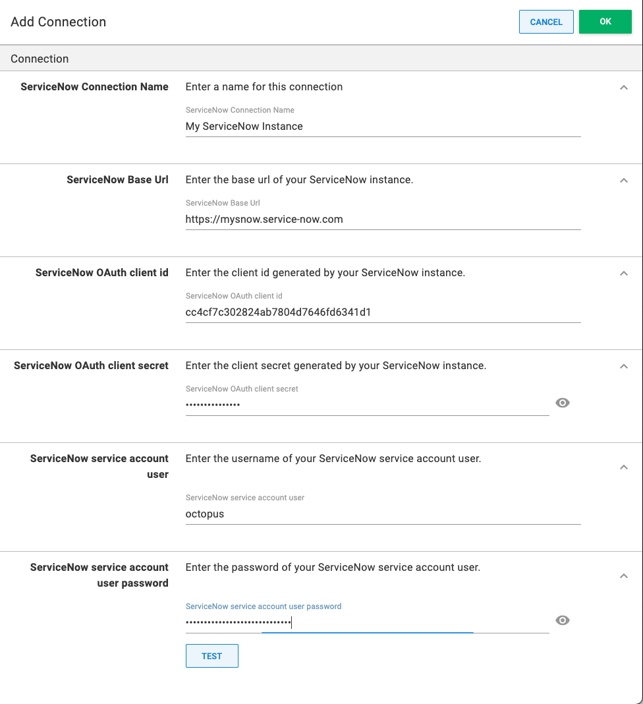

## Overview

The Octopus Deploy/ServiceNow integration allows users to block the execution of specifically configured deployments unless they have a corresponding approved ServiceNow **Change Request** (CR).

For specifically configured project and environment combinations, Octopus Deploy will create an unapproved CR in ServiceNow at deployment time, then wait for the created CR to be approved.

To enable this behavior, both systems must be configured before deployments can be managed.

## Getting started

The Service Now integration requires Octopus 2022.2.5556 or later, and an Octopus license with the Service Now integration enabled.


| Project | Environment Change Controlled | Environment **Not** Change Controlled| 
| --------|--|-- |
| Change Controlled | _Approval Required_  | No Approval Required | 
| **Not** Change Controlled | No Approval Required | No Approval Required |

## Configuring Service Now

:::hint
The instructions in this section will require a ServiceNow Administrator.
:::

The Octopus Deploy / ServiceNow integration requires security configuration in your target ServiceNow instance. 

Follow the [ServiceNow OAuth documentation](https://docs.servicenow.com/bundle/sandiego-platform-administration/page/administer/security/task/t_SettingUpOAuth.html) to configure an OAuth endpoint for Octopus to use for authentication. Take note of the OAuth client id and client secret from the configuration.

Next, the integration will require a user account on ServiceNow. The recommendation is to create a user account specifically for Octopus.
To create a new ServiceNow user, follow the ServiceNow [Create a user](https://docs.servicenow.com/en-US/bundle/sandiego-platform-administration/page/administer/users-and-groups/task/t_CreateAUser.html) documentation. 

Ensure that the new user has `Web service access only` checked. 
Take note of the password assigned or generated for this user.

### Configuring Octopus Deploy

:::hint
The instructions in this section will require an Octopus Deploy manager or administrator
:::

To connect your Octopus Deploy instance to ServiceNow, navigate to  **{{Configuration,Settings,ServiceNow Integration}}**.

:::warning
If you cannot see a **ServiceNow Integration** option under **Settings**, check that your license has ServiceNow enabled. 
:::

Check the **Enabled** option


Click on **ADD CONNECTION** and fill out the details.
The ServiceNow Base Url should be the root URL and include the protocol. 


Press **TEST** to ensure that the connection details are working.

### Licensing

For the ServiceNow approval checks to be performed as part of the deployment process, an appropriate Octopus license must be configured in your Octopus instance.

A ServiceNow enabled Octopus license must be requested from Octopus directly, and cannot be managed through the usual self-service process.

Once you have received your feature-enabled license, you can install by navigating **{{Configuration,License}}**. 

An enabled license will include a node similar to the below:

```xml
<Features>
  <ServiceNowIntegration>
    <ValidTo>...</ValidTo>
  </ServiceNowIntegration>
</Features>
```

### Project configuration

To enable a project to enforce a requirement for an approved CR, navigate to the project and then **{{Settings,General}}**.
Check the **Change-controlled** setting and select your ServiceNow connection in the **Service Now Connection** setting.


### Environment configuration

To enable an environment to enforce a requirement for an approved CR, navigate to **{{Infrastructure,Environments}}**, edit the environment via the overflow menu and check the **Change Controlled** setting, and then press **SAVE**.


## How it works

With both sides of the ServiceNow integration installed and configured, applicable deployments will query ServiceNow for an approved CR before execution can begin.

At this stage, Octopus supports Automatic-Creation of CRs - i.e. when a deployment is triggered, Octopus will automatically create an unapproved CR in ServiceNow, then block the deployment until the CR has been approved, or the ability to prompt for the CR number at deployment time.

If the deployment is scheduled to execute in the future, the CR will be created at the scheduled deployment time, and not when the deployment was requested.

The number of the CR created will appear in the Task Summary tab of the executing Octopus deployment task. Clicking on the CR number in the message will navigate you to the CR in ServiceNow.


### Supplying the CR number to a deployment

If you add a variable to your project called `Octopus.ServiceNow.Change.Number`, then a CR will not be created and only the supplied CR number will be used to check for approval. This variable can also be [Scoped](/docs/projects/variables.md#scoping-variables) or configured as a [Prompted variable](/docs/projects/variables/prompted-variables.md) 

### Standard Change Templates
By default, the CR creation will result in a `Normal` change. Setting the **Change Template Name** setting under **Project Settings** to the name of a valid, approved **Change Template** will result in a `Standard` change being created based upon the change template.

