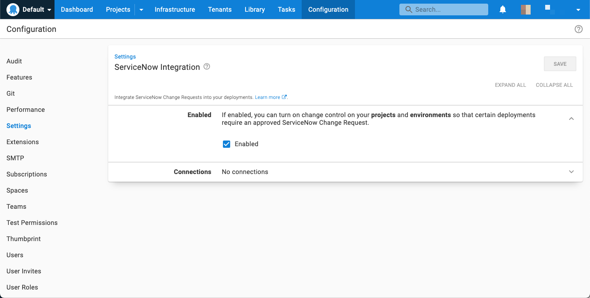
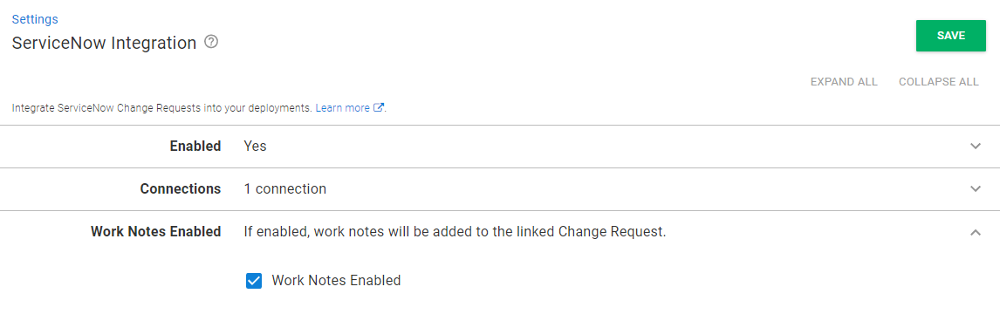
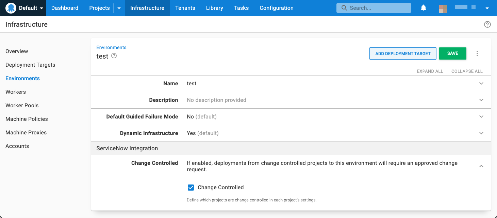
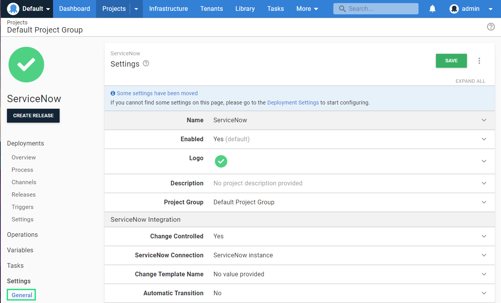
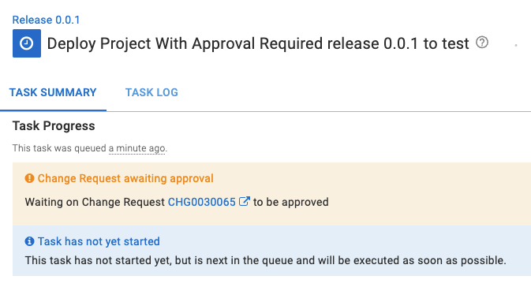

:::warning
The ServiceNow Integration feature is available from Octopus **2022.3** onwards and requires an [enterprise subscription](https://octopus.com/pricing).
:::

## Overview

The Octopus Deploy/ServiceNow integration allows users to block the execution of specifically configured deployments unless they have a corresponding approved ServiceNow **Change Request** (CR).

To enable this behavior, both the Octopus Project and Environment you are deploying to must be configured and the ServiceNow configuration is set up before deployments can be managed.

| Project | Environment | Outcome |
|--|--|--|
| Change controlled| Change controlled| Approval required for deployment |
| **_Not_** Change controlled| Change controlled| No approval required |
| Change controlled| **_Not_** Change controlled| No approval required |

## Getting started

The ServiceNow integration requires Octopus **2022.3** or later and an Octopus enterprise subscription.

Your ServiceNow instance must have the "Change Management" application installed and activated 
(typically available as part of the ServiceNow ITSM product).

Before you can use the Octopus Deploy/ServiceNow integration, you'll need to:

1. Configure ServiceNow OAuth credentials (for use by Octopus).
1. Request an enterprise license which is required to enable the ServiceNow feature.
1. Install the enterprise license (for Self-hosted customers only)
1. Configure a connection from Octopus to ServiceNow.
1. Configure which deployments require an approved CR.

### Configuring Service Now

:::hint
The instructions in this section will require a ServiceNow Administrator.
:::

The Octopus Deploy / ServiceNow integration requires security configuration in your target ServiceNow instance.

Follow the [ServiceNow OAuth documentation](https://docs.servicenow.com/bundle/sandiego-platform-administration/page/administer/security/task/t_SettingUpOAuth.html) to configure an OAuth endpoint for Octopus to use for authentication. Take note of the OAuth client id and client secret from the configuration.

Next, the integration will require a user account in ServiceNow. The recommendation is to create a service account specifically for Octopus, once created the user must be assigned the following two roles:

- `sn_change_read`
- `sn_change_write`

Ensure that the new user has the `Web service access only` checkbox checked.

Take note of the password assigned or generated for this user.

### Licensing

For the ServiceNow approval checks to be performed as part of the deployment process, an [enterprise license](https://octopus.com/pricing) must be configured in your Octopus instance. This license must be requested from Octopus directly and cannot be managed through the self-service process.

For Self-hosted customers, once you have received your enterprise license, you can install it by navigating to **{{Configuration, License}}**. For Octopus Cloud customers, the license will be applied automatically for you.

An enabled license will include a block similar to below:

```xml
<Features>
  <ServiceNowIntegration>
    <ValidTo>...</ValidTo>
  </ServiceNowIntegration>
</Features>
```

### Configuring ServiceNow connections

:::hint
The instructions in this section will require an Octopus Deploy Manager or Administrator
:::

To connect your Octopus Deploy instance to ServiceNow, navigate to **Configuration ➜ Settings ➜ ServiceNow Integration**.

Check the **Enabled** option


Click on **ADD CONNECTION** and fill out the details.
The ServiceNow Base Url should be the root URL and include the protocol e.g. `https://`


Press **TEST** to ensure that the connection details are working.

Multiple ServiceNow connections are supported, however, each project can only use one ServiceNow connection.

### Configuring Work Notes

:::warning
This feature is only available for version 2022.3.1274 and later
:::

:::hint
The instructions in this section will require an Octopus Deploy Manager or Administrator
:::

If enabled, this feature will result in a linked change request having one or more Work Notes added during the deployment lifecycle which record details about the deployment and its execution status.

To enable this feature navigate to **Configuration ➜ Settings ➜ ServiceNow Integration**, click the **Work Notes Enabled** checkbox show below then click **Save**.



## Configuring deployments

To enforce a deployment to require an approved CR, the **Change Controlled** setting needs to be enabled in **both** the project and the environment it is being deployed to.

### Setting up projects for CR approval

To enable a project to enforce a requirement for an approved CR:

1. Navigate to the project and then **{{Settings,General}}**.
2. Check the **Change-controlled** setting.
3. Select your ServiceNow connection in the **Service Now Connection** setting and click **SAVE**.


### Standard vs Normal Changes

By default deployments resulting in CR creation will produce a `Normal` change (i.e. one 
requiring explicit approval).

Setting the **Standard Change Template Name** setting under **Project Settings** to the name of an 
active, approved **Standard Change Template** (as found in the Standard Change Catalogue) will instead 
result in deployments of the project creating a `Standard` (i.e. low-risk, pre-approved) change. 

For more information on `Normal` vs `Standard` changes, see ServiceNow [Change Types](https://docs.servicenow.com/en-US/bundle/tokyo-it-service-management/page/product/change-management/concept/change-types.html) 
documentation.

### Supplying the CR number to a deployment

If you add a variable to your project named `Octopus.ServiceNow.ChangeRequest.Number`, then a CR will not be created, and instead, the supplied CR number will be used during the approval check. This variable can also be [scoped](/docs/projects/variables/index.md#scoping-variables) or configured as a [Prompted variable](/docs/projects/variables/prompted-variables.md).

### Setting up environments for CR approval

To enable an environment to enforce a requirement for an approved CR, navigate to **{{Infrastructure,Environments}}**, edit the environment via the overflow menu and check the **Change Controlled** setting, and then press **SAVE**.



### Continuous Delivery (CD) audit record

:::warning
This feature is only available for version 2022.3.7086 and later
:::

This feature allows a CD workflow using standard changes as audit records at the project level. When enabled a standard change will be created and moved to the `Implement` state, the deployment will execute and then the linked change will be moved to the `Review` state.

CD audit record functionality is enabled under **Project Settings**. First set a valid **Change Template Name** then turn on the **Automatic Transition** checkbox and click **Save** as per the following screenshot.



## How it works

Deployments where both the project and environment have **Change Controlled** enabled, will query ServiceNow for an approved CR before execution can begin.

When a **Change Controlled** deployment is evaluated for approval, the following checks are performed:

- If a specific CR number is available, via a variable named `Octopus.ServiceNow.ChangeRequest.Number`, then only this CR will be checked.
- If there is an existing CR with the specifically formatted **Short Description** available. See [Title text matching](#title-text-matching) for more information, then this CR will be evaluated.
- Create a new CR.
  - This will be a `Normal` change, or a `Standard` change if the project has a `Change Template Name` set.
  - A CR created by Octopus will have a **Short Description** in the format outlined in [Title text matching](#title-text-matching).

When re-deploying a previous deployment, the same CR will be used if it is still open. If it is closed the above process will be followed again.

Once a CR has been found, the deployment will only proceed if the **State** of the CR is `Implement`. If the **State** is either `New`, `Assess`, `Authorize`, or `Scheduled` the deployment will wait. Any other **State** will cause the deployment task to fail.

:::info
The only supported states are those defined in the default CR lifecycle
:::

If the deployment is scheduled to execute in the future, then a CR will be created at the scheduled deployment time, and not when the deployment was requested.

The number of the CR created or found will appear in the Task Summary tab of the executing Octopus deployment task. Clicking on the CR number in the message will navigate you to the CR in ServiceNow.



### Title text matching

Octopus supports matching a CR by setting the **Short Description** of the CR to a well-known format:

`Octopus: Deploy "{project name}" version {release version number} to "{environment name}"`

e.g `Octopus: Deploy "Web Site" version 1.0.1-hotfix-001 to "Dev"`

:::hint
The title must match the format **exactly**, including the double-quotes.
:::

### Respecting Change Windows

:::warning
This feature is only available for version 2022.3.3026 and later
:::

In addition to a change request being approved, a change must also be in its schedule change window in order for the deployment to execute.  The change window is controlled by the `Planned start date` and `Planned end date` on the linked change request.

::: info
The following list assumes the linked change is in an **approved** state.
:::

- If no `Planned start date` and `Planned end date` are specified there is no change window and the deployment will execute.
- If only a `Planned start date` is set the deployment will execute on or after the defined date.
- If only a `Planned end date` is set the deployment will execute on or before the defined date.
- If `Planned start date` and `Planned end date` are specified the deployment will execute on or between the defined dates.

**If at any time a `Planned end date` is exceeded and the linked change request is not approved, the deployment will be terminated.**

## Known Issues and limitations

- Once a CR is deemed to be related to a deployment, then only this CR will be evaluated for the deployment to proceed. If the CR is incorrect, you will need to cancel the deployment, close the CR and try the deployment again.
- Each project only supports a single ServiceNow connection.
- Each project only supports supplying the same **Change Template Name** across all environments in the [Lifecycle](/docs/releases/lifecycles/index.md/) attached to the project or channel.

## Troubleshooting

Errors occurring during a deployment approval checks will appear in the "Task Failed" icon's 
tooltip. Additional information will also be available in the "System Diagnostic Report".

If you are seeing errors in Octopus during deployments, ensure that the ServiceNow user account is authorized to call the required endpoints. 

The ServiceNow integration uses the following REST endpoints:

| Purpose                              | HTTP Method | Path                                            | Notes |
|--------------------------------------|-------------|-------------------------------------------------|-------|
| Authorize                            | `POST`      | `/oauth_token.do`                               |       |
| Search for changes                   | `GET`       | `/api/sn_chg_rest/change`                       |       |
| Create change                        | `POST`      | `/api/sn_chg_rest/change/normal`                |       |
| Search for Standard Change templates | `GET`       | `/api/sn_chg_rest/change/standard/template`     | Requires project **Change Template Name** configuration |
| Create Standard Change from template | `POST`      | `/api/sn_chg_rest/change/standard/{templateId}` | Requires project **Change Template Name** configuration |
|Approve Standard Change               | `PATCH`     | `/api/sn_chg_rest/change/{changeId}`            | Requires  project **Automatic Transition** configuration |
|Add work notes                        | `PATCH`     | `/api/sn_chg_rest/change/{changeId}`            | Requires  **Work Notes Enabled** **ServiceNow** global configuration |

