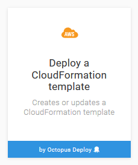
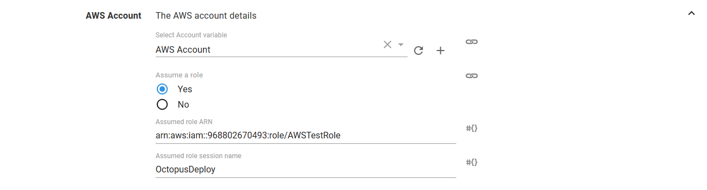

CloudFormation support was introduced to Octopus in version `2018.2`.

Octopus supports the deletion of an existing AWS CloudFormation stack through the `Delete an AWS CloudFormation stack` step. This step deletes a CloudFormation stack using AWS credentials managed by Octopus.

The proceeding instructions can be followed to configure the `Delete an AWS CloudFormation stack` step.

## Create an AWS Account

The instructions at [Creating an AWS Account](/docs/infrastructure/aws/creating-an-aws-account/index.md) detail the procedure for creating an account in Octopus. You can also choose to use a service role of an EC2 instance, in which case creating an AWS account is not required.

## Create a AWS Account Project Variable

AWS accounts are included in a project through a project variable of the type `Amazon Web Services Account`.

The `Add Variable` window is then displayed and lists all the AWS accounts.

Select the account that was created in the previous step to assign it to the variable.

## Add the CloudFormation Step

Add the `Delete an AWS CloudFormation stack` step to the project, and provide it a name.

### AWS Section

Select the variable that references the `Amazon Web Services Account` under the `AWS Account` section or choose to execute using a service role assigned to the EC2 instance.

The supplied account can optionally be used to assume a different AWS service role. This can be used to run the AWS commands with a role that limits the services that can be affected.

:::hint
If you select `Yes` to `Execute using the AWS service role for an EC2 instance`, you do not need an AWS account or account variable. Instead the AWS service role for the EC2 instance executing the deployment will be used. See the [AWS documentation](https://g.octopushq.com/AwsDocsRolesTermsAndConcepts) for more information on service roles.
:::

### CloudFormation Section

Under the `CloudFormation` section, the AWS region and stack name need to be defined.

:::hint
If the stack does not exist, this step will succeed and not attempt to delete it again.
:::

You can also optionally wait for the stack to be deleted completely before finishing the step by selecting the `Wait for completion` checkbox.

:::hint
Unselecting the `Wait for completion` checkbox will allow the step to complete once that CloudFormation deletion has been initiated. However unselecting the option means that the step will not fail if the CloudFormation stack deletion fails.
:::

