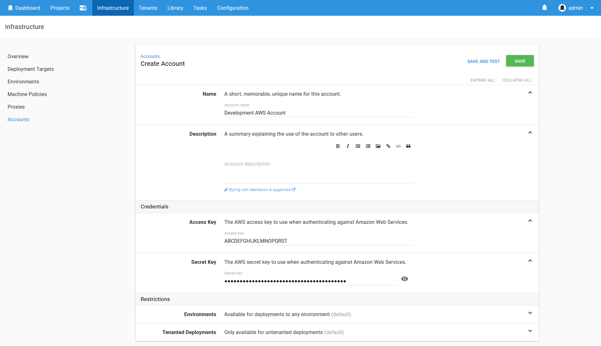

Octopus supports the deletion of an existing AWS CloudFormation stack through the `Delete a CloudFormation stack` step. This step deletes a CloudFormation stack using AWS credentials managed by Octopus.

The proceeding instructions can be followed to configure the `Delete a CloudFormation stack` step.

## Create an AWS Account

AWS steps can use an Octopus managed AWS account for authentication. This account must first be created under {{Infrastructure>Accounts}} by clicking the `ADD ACCOUNT` button in the `Amazon Web Services Account` section.

:::hint
AWS steps can also defer to the IAM role assigned to the instance that hosts the Octopus server for authentication. In this scenario there is no need to create the AWS account.
:::

And AWS account requires a `Name`, the `Access Key` and the `Secret Key`.

Clicking the `SAVE AND TEST` button will verify that the credentials are valid.

## Create a AWS Account Project Variable

AWS accounts are included in a project through a project variable of the type `Amazon Web Services Account`.

The `Add Variable` window is then displayed and lists all the AWS accounts, as well as an account called `Role Assigned to the AWS Instance Executing the Deployment`.

The `Role Assigned to the AWS Instance Executing the Deployment` account can be selected to defer to the IAM role that is assigned to the AWS EC2 instance where the deployment is executed from. This means no AWS credentials need to be stored by Octopus.

The `Role Assigned to the AWS Instance Executing the Deployment` account always exists, meaning it does not need to be created like a `Amazon Web Services Account`.

Because CloudFormation deployments are performed on the Octopus server today, the Octopus server must be installed on an EC2 instance that has an IAM role assigned to it in order to take advantage of the `Role Assigned to the AWS Instance Executing the Deployment` account.

:::hint
In future it is expected that AWS steps will be deployed from worker instances that can be hosted on separate EC2 instances with IAM roles assigned to them. This will make the `Role Assigned to the AWS Instance Executing the Deployment` account more flexible and powerful.
:::

Select the account that was created in the previous step to assign it to the variable.

## Add the CloudFormation Step

Add the `Delete a CloudFormation stack` step to the project, and provide it a name.

### AWS Section

Select the variable that references the `Amazon Web Services Account` under the `AWS Account` section.

The supplied account can optionally be used to assume a second role. This can be used to run the AWS commands with a role that limits the services that can be affected.

### Template Section

Under the `CloudFormation` section, the AWS region and stack name need to be defined.

You can also optionally wait for the stack to complete before finishing the step by selecting the `Wait for completion` checkbox.

:::hint
Unselecting the `Wait for completion` checkbox will allow the step to complete once that CloudFormation process has been started. However unselecting the option means that the step will not fail if the CloudFormation stack removal fails.
:::

