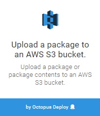
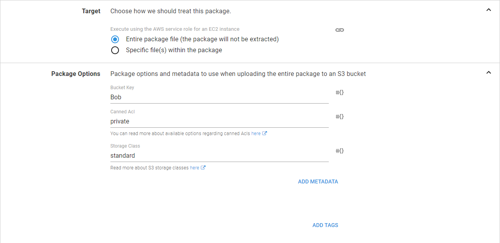
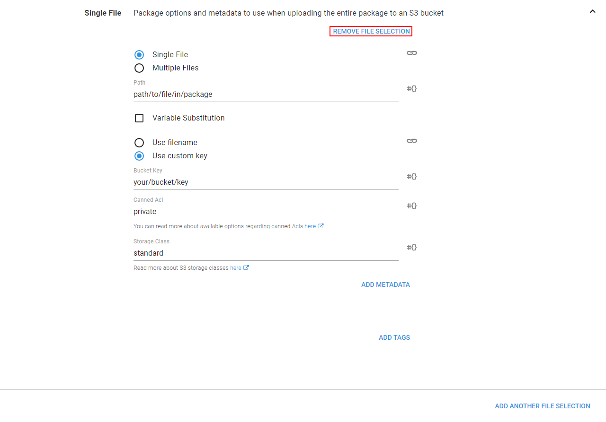
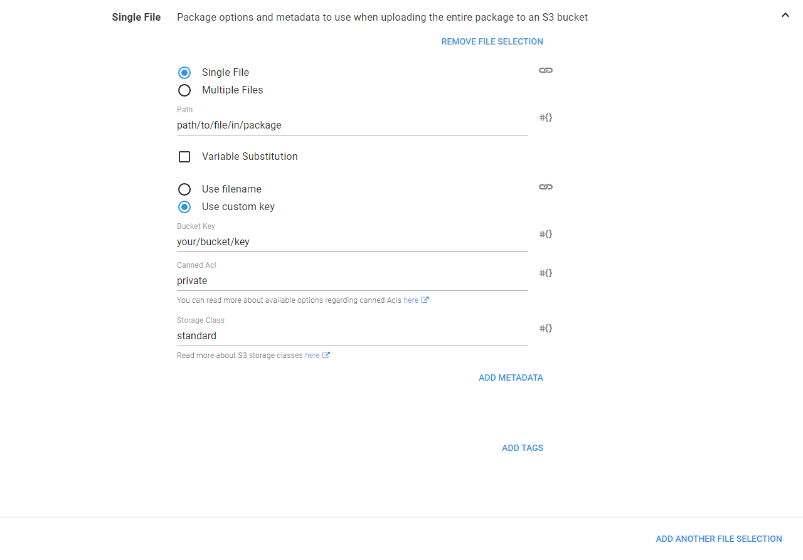

Octopus supports the uploading an entire package or the files contained within a package through the `Upload a package to an AWS S3 bucket` step. This step uploads the package or the file(s) contained within the package
using the AWS managed by Octopus.

The following instructions can be used to configure the `Upload a package to an AWS S3 bucket` step.

## Add the Upload a Package to an AWS S3 Bucket Step

Add the `Upload a package to an AWS S3 bucket` step to the project, and give it a name.

### AWS Section

Select the variable that references the `Amazon Web Services Account` under the `AWS Account` section or select whether you wish to execute using the service role of an EC2 instance. If you don't have an `AWS Account Variable` yet, check our [documentation on how to create one](/docs/deployment-process/variables/aws-account-variables.md).

The supplied account can optionally be used to assume a different AWS service role. This can be used to run the AWS commands with a role that limits the services that can be affected.

:::hint
If you select `Yes` to `Execute using the AWS service role for an EC2 instance`, you do not need an AWS account or account variable. Instead the AWS service role for the EC2 instance executing the deployment will be used. See the [AWS documentation](https://g.octopushq.com/AwsDocsRolesTermsAndConcepts) for more information on service roles.
:::

### Package Section

Under the `Package Section`, define how the target package and the associated file uploads should behave for
the step. The entire package can be uploaded or individual file(s) from the package can be specified for upload.

 

:::hint
The [Github feed](https://octopus.com/docs/packaging-applications/package-repositories/github-feeds) works well with the upload to S3 step when no build process is involved and content needs to be pushed to S3 and versioned separately.
:::

### Entire Package

By default, the entire package will be uploaded to the S3 bucket untouched with the given bucket key, metadata, and tags.

:::hint
Please note, we do not support file substitutions within the package if the entire package is going to be uploaded to the s3 bucket.
:::

### Individual Files From the Package

If you have chosen to upload individual files from the package, you will be presented with an additional `Files Section` where you can add one or more file selections where each selection can be for a single file or for multiple files depending on your the use case.

#### Adding and Removing File Selections

A new file selection can be added by clicking on the `Add Another File Selection` button located under the `Files Section`.

A file selection can be removed by expanding the appropriate selection and clicking on the `Remove File Selection` button.

:::hint
File selections aren't formally removed or added until the step has been saved.
:::

#### Single File Selection
The single file selection lets you upload a single file to an S3 bucket which must exist within the package. If the file is not found an associated error will be raised. This selection also allows for the bucket key to be explicit.

:::hint
The bucket key used for a single file selection will uniquely identify the file within the bucket and will be used verbatim. That is, if you wish for the file to have an extension you should provide it as part of the bucket key as it is effectively renaming the file as part of the upload.
:::

#### Multiple File Selections
Multiple file selections allow one or more files from the package to be uploaded to the S3 bucket using globbing patterns. The behavior is slightly different from single file selections as you have less control over the bucket key which will be used while no error will be raised if *no* files matched the globbing pattern. Files uploaded will have the bucket key prefix added to the file name. That is a file matched by the globbing pattern `path/to/file/File.template` with a prefix of `templates/` will be uploaded with the bucket key `templates/File.template`.

:::hint
Any metadata and tags provided will be applied to all files uploaded to the bucket.
:::

### Metadata and Tags
Metadata and tags can be provided for the package, for file selections for the package, or for individual files. See the [AWS documentation](https://g.octopushq.com/AwsS3UsingMetadata) for more information regarding the usage of metadata.

### Canned ACL
The canned ACL must be specified when uploading files as it dictates the permissions for a file within the S3 bucket. Please see the [AWS documentation](https://g.octopushq.com/AwsS3CannedAcl) for information regarding Canned ACLs.

### Storage Class
The storage class for files specify the performance access requirements for a file.
Please see the [AWS documentation](https://g.octopushq.com/AwsS3StorageClasses) for more information regarding Storage classes.

### Upload behaviour
Uploads are skipped if the content hash is the same as an existing object in the target bucket. This is done to avoid unncessary uploads and may require special care to be taken when using custom bucket
keys.

:::hint
This behaviour will be configurable in a future release to provide additional flexibility.
:::

## Error Messages
The AWS deployment steps include a number of unique error codes that may be displayed in the output if there was an error. Below is a list of the errors and any additional troubleshooting steps that can be taken to rectify them.

### AWS-S3-ERROR-0001
The AWS account used to perform the operation does not have the required permissions to describe the CloudFormation stack. This means that the step is not able to generate any output variables.

An exception was thrown while contacting the AWS API.

This can happen when accessing AWS via a proxy, and the response from AWS indicated an error. The response body is printed to the logs in these cases.

An incorrect AWS region can result in this error. Ensure that the region matches one from the [AWS documentation](https://g.octopushq.com/AWSRegions).

### AWS-S3-ERROR-0002
The AWS account used to perform the operation does not have the required permissions to upload to the bucket.

An exception was thrown while contacting the AWS API.

This can happen when accessing AWS via a proxy, and the response from AWS indicated an error. The response body is printed to the logs in these cases.

An incorrect AWS region can result in this error. Ensure that the region matches one from the [AWS documentation](https://g.octopushq.com/AWSRegions).

### AWS-S3-ERROR-0003
An error occurred uploading a file to a bucket possibly due to metadata. Specified value has invalid HTTP header characters.

This can happen if the metadata key and or value has invalid characters. Ensure characters as per the [AWS documentation](https://g.octopushq.com/AwsS3UsingMetadata) is not used as part of
metadata.
