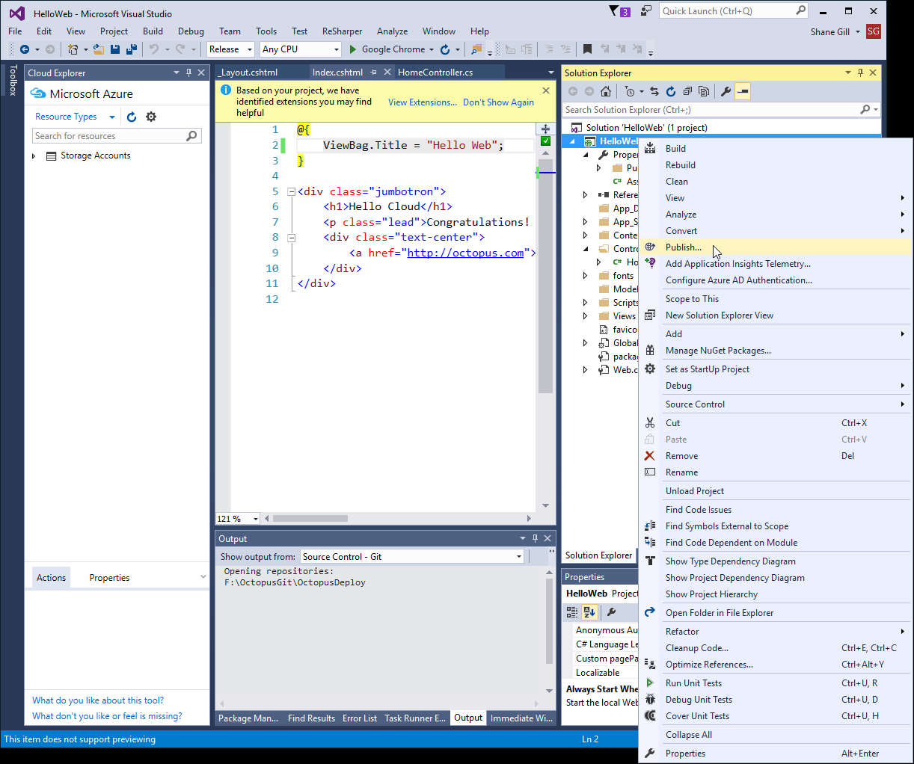

There are several core concepts involved in deploying Azure Web Apps.  Read on for more information.

## Packaging Web Apps {#WebAppConcepts-PackagingWebApps}

In order to deploy Web Apps they must be packaged into an Octopus compatible NuGet package.

### Publish your Web App {#WebAppConcepts-PublishyourWebApp}

Publish your Web App with Visual Studio to the file system:



### Generate a NuGet package {#WebAppConcepts-GenerateaNuGetpackage}

Octopus requires a Web Apps to be packaged in NuGet package for use by Octopus. The easiest way generate a NuGet package is to use the [Octo.exe](/docs/packaging-applications/creating-packages/nuget-packages/using-octo.exe.md) command line tool:

**Packaging a Cloud Service with Octo.exe**

```powershell
Octo.exe pack --id=HelloWeb --basePath=C:\PathToWebApp
```

Octo.exe will generate a NuGet package containing your Web App:


Here is a sample Web App NuGet package: [HelloWeb.1.0.0.nupkg](https://download.octopusdeploy.com/demo/HelloWeb.1.0.0.nupkg)

### Upload to a NuGet feed {#WebAppConcepts-UploadtoaNuGetfeed}

In order to make the NuGet package accessible to Octopus it needs to be uploaded to a [package repository](/docs/packaging-applications/package-repositories/index.md). The built-in Octopus package repository is accessible from {{Library,Packages}} (click the `Show examples` link) and is a suitable place to upload your Web App NuGet package:


## Web App accounts {#WebAppConcepts-WebAppAccounts}

Deploying a Web App in Octopus requires the configuration of an Azure Account.  Azure Accounts contain the details of Azure subscriptions.

### Creating the account {#WebAppConcepts-Creatingtheaccount}

To set up a new Azure account, follow the directions in [Creating an Azure Account](/docs/infrastructure/azure/creating-an-azure-account/index.md).

## Web App deployment step {#WebAppConcepts-WebAppDeploymentStep}

Octopus Deploy supports automated deployment of [Azure Web Apps](http://azure.microsoft.com/en-us/services/app-service/web/) (formerly known as Azure Web Sites).

### Deployment Step {#WebAppdeploymentstep-DeploymentStep}

Add a new 'Deploy an Azure Web App' step to your project. For information about adding a step to the deployment process, see the [add step](/docs/deploying-applications/deployment-process/steps.md) section.


Once an Account is selected, the list of Azure Web Apps available to the subscription associated with the account will populate the 'Web App' select-list.

#### Physical Path {#WebAppdeploymentstep-PhysicalPath}

Allows deployment to a physical sub-directory of the web-root.  This is useful when deploying to Virtual Directories or Web Jobs, and you don't want to deploy the root application at the same time.

#### Remove additional files {#WebAppdeploymentstep-Removeadditionalfiles}

When set, deletes files from the destination that aren't in the source package.

**Preserve App\_Data**

When set, skip Delete operations in the **App\_Data** directory.

:::hint
**Preserve Specific Paths**
If you wish to set the "Remove additional files" option but preserve specific paths, see[ this document](/docs/deploying-applications/azure-deployments/web-apps/web-app-concepts.md#WebAppConcepts-PreserveSpecificPathsWhenDeployingAzureWebApp).
:::

**Enable AppOffline**

When set, this safely brings down a website with a blank app\_offline.htm file in the root.

:::hint
For more information, see [Taking an Application Offline before Publishing](https://www.iis.net/learn/publish/deploying-application-packages/taking-an-application-offline-before-publishing).
:::

**Variable-expressions**

Any of the fields above can be switched to use a custom expression.

### Features {#WebAppdeploymentstep-Features}

The following features are available when deploying a package to an Azure Web App.

- [Custom Scripts](/docs/deploying-applications/custom-scripts/index.md)
- [Configuration Variables](/docs/deploying-applications/configuration-files/index.md)
- [Configuration Transforms](/docs/deploying-applications/configuration-files/index.md)
- [Substitute variables in files](/docs/reference/variable-substitution-syntax.md)

#### PowerShell {#WebAppdeploymentstep-PowerShell}

PowerShell custom scripts executed against an Azure Web App target will have the Azure PowerShell module loaded, and the subscription from the chosen account will be selected.

### Preserve Specific Paths When Deploying Azure Web App {#WebAppConcepts-PreserveSpecificPathsWhenDeployingAzureWebApp}

When configuring the[ Deploy an Azure Web App](/docs/deploying-applications/azure-deployments/web-apps/web-app-concepts.md#WebAppConcepts-WebAppDeploymentStep) step, if you wish to set the "Remove additional files" option but preserve specific paths (i.e. other than App\_Data) you can create a variable named `Octopus.Action.Azure.PreservePaths`.

The value should be set to a list of regexes, delimeted by `;` that will be used to select directories and files to preserve.

For example, to preserve any paths beginning with `\Component` you could use:

```powershell
\\Component.*(\\.*|$)
```
