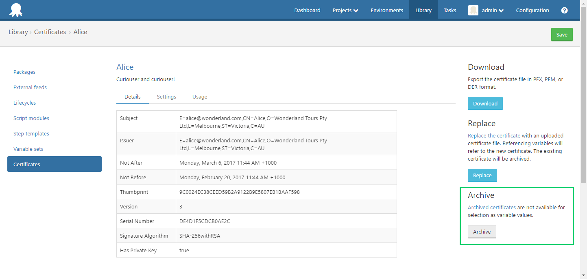

## Archiving a Certificate

Archiving a certificate will prevent it from being selected as the value of a variable, while still allowing it to be used by existing usages (projects, releases, deployments). 

Archived certificates can be viewed by navigating to {{Library,Certificates,View Archive}}.

When a certificate is [replaced](certificates/replace-certificate.md), it is automatically archived if it is not already.

## Deleting a certificate

Once a certificate has been archived, it can then be deleted.  

:::warning
This is a hard delete. Once deleted, a certificate and it's private key (if present) cannot be recovered.
:::

You will be prevented from deleting a certificate if it is the value of one or more variables. You can view a certificates usage on the 'Usage' tab of the certificate details page.

Variables snap-shotted as part of a release will not prevent deleting a certificate. Attempting to deploy a release which references a deleted certificate will result in an error.