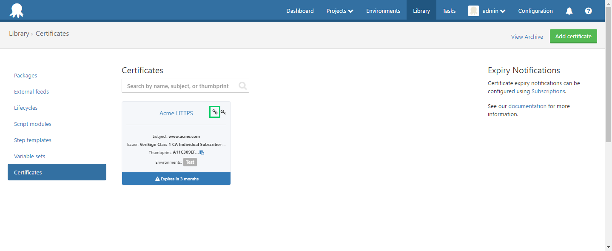
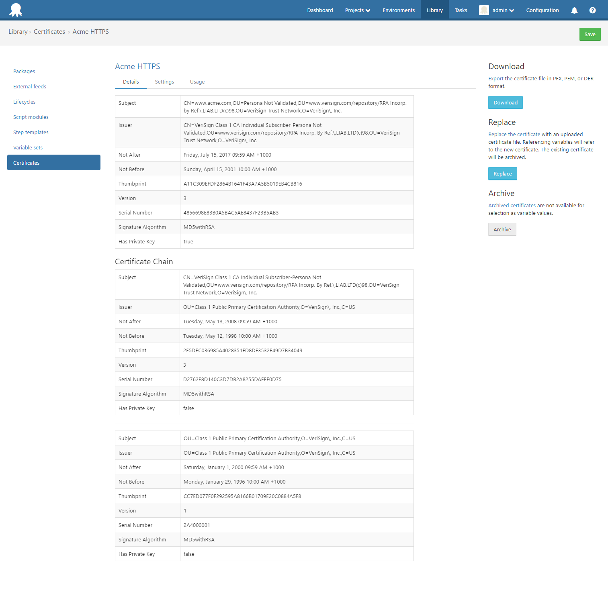

Uploaded PFX files may contain a certificate-chain. i.e. A certificate with a private-key, plus one or more authority certificates.

Certificates which contain a chain are indicated by a chain icon on the certificate card, as shown below:

The details page will show the details of all certificates in the chain.

## Importing Certificate Chains

When a certificate-chain is imported to one of the Windows Certificate Stores (either via the [Import Certificate Step](import-certificate-step.md) or by using the Certificate in an IIS HTTPS Binding) the authority certificates will be automatically imported into the CA or Root stores (Root if the authority certificate is self-signed, CA otherwise as it is an intermediate authority).   

_Note:_  Authority certificates will be always be imported to the LocalMachine location, even if the subject certificate is imported to a user-specific location.  
This is because importing to the Root store for a specific user results in a security-prompt being displayed, which obviously doesn't work with automated deployments.   

## Downloading Certificate Chains

When downloading a certificate containing a chain, only downloading to the PFX format will export the chain.  Downloading to PEM or DER formats will only export the subject certificate.