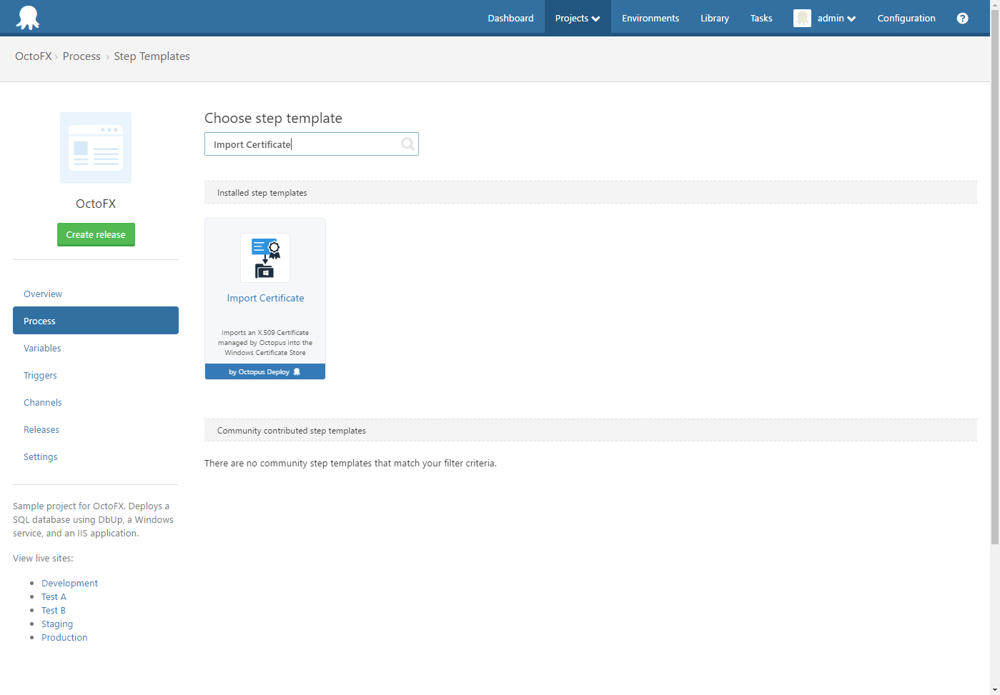
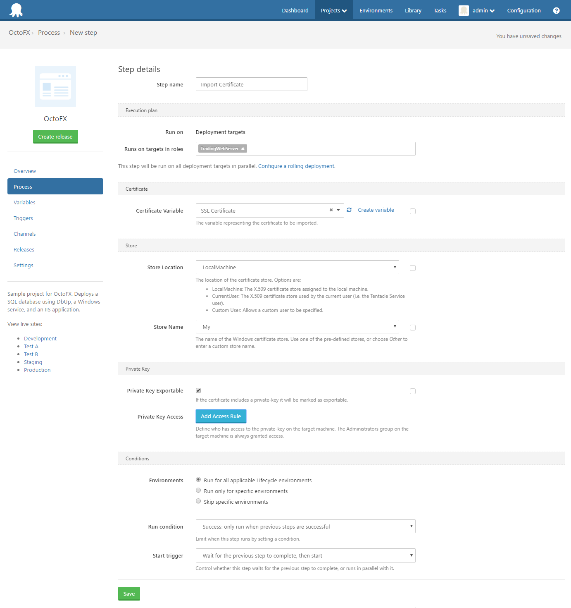

The *Import Certificate* step can be used to import a certificate managed by Octopus into a Windows Certificate Store.

The certificate can be imported to the *Local Machine* or *Current User* locations, or enter a *Custom User* to install the certificate for.

The store name can be one of the built-in Windows stores, or you can define a custom store name to use.

If the certificate has a private-key, it can be marked as exportable, and access can be granted to specific users.   

:::hint
The Administrators group on the target machine will always be granted access to the private-key.
:::

