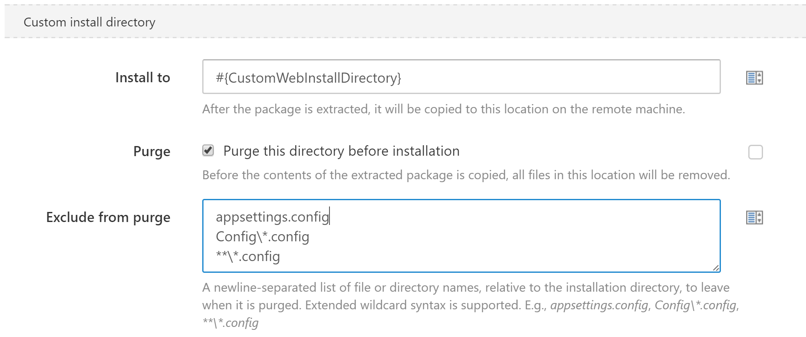

For [Package steps](/docs/deploying-applications/deploying-packages/index.md) & [IIS Steps](/docs/deploying-applications/iis-websites-and-application-pools.md), the Custom Installation Directory feature allows you to have your package deployed to a specific location on the server. This feature helps when you are using something like a Content Management System (CMS) or some other coordinating application which requires files to reside in a certain physical location.

:::success
Only use the Custom Installation Directory feature when it is truly required. Out of the box, Octopus will usually do the right thing when deploying your package. You can read more about [how packages are deployed by convention](/docs/deploying-applications/deploying-packages/index.md), and the [order of each step in the process](/docs/reference/package-deployment-feature-ordering.md). The standard convention eliminates problems caused by file locks and stale files being left in the deployment folder. It also provides smoother deployments and less downtime for Windows Services and Web Applications.
:::

In your *Package Deploy* or *IIS* steps, look for the **Configure Features** link at the bottom

Then select the feature **Custom Installation Directory**

You can either specify the full path of the folder, or make use of a variable like shown below.

The use of a variable means that you can scope different values to different environments.

The purge option will remove all files from the custom installation directory before your deployed files are copied to it.

Octopus 3.13.8 introduced an enhancement to the *purge* option, which allows you to keep some files when purging the directory. Add the files and directories you want to keep to the *Exclude from purge* list.

:::hint
Extended Wildcard syntax is supported in the same way as in [configuration transforms](https://octopus.com/docs/deploying-applications/configuration-files#Configurationfiles-Relativepath).
:::

Our Packages are extracted into a new directory each time (along the lines of C:\Octopus\Applications\\[Environment name\]\\[Package name\]\\[Package version\]\) , and this is no different for Custom Installation Directory.

We make the assumption that when you are using a Custom Installation Directory it has a working copy of an existing website or application. So to blindly extract the new package in your existing directory, without first completing any transformations, or variable substitutions could potentially break your application or website. So even when you are using the Custom Installation Directory feature, we extract the package to the above listed directory and perform all transformations and substitutions.

And after substitution and transformation your files are moved.

Read more about the [Ordering of Package Features](/docs/reference/package-deployment-feature-ordering.md).
