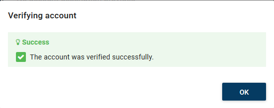
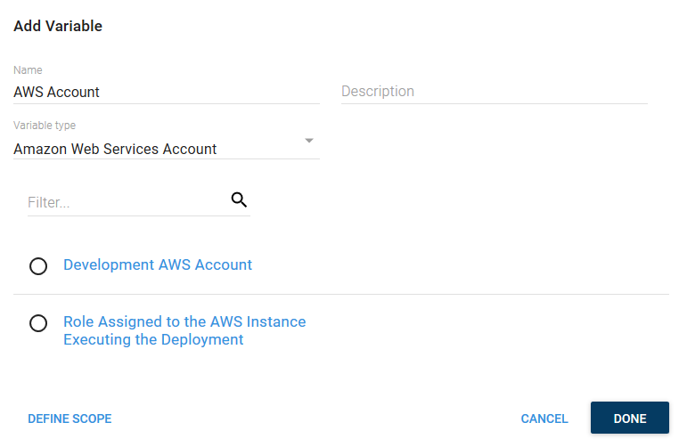
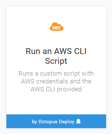
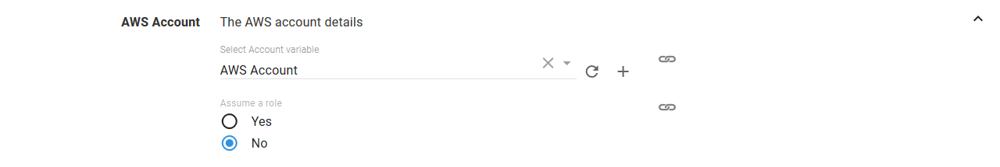
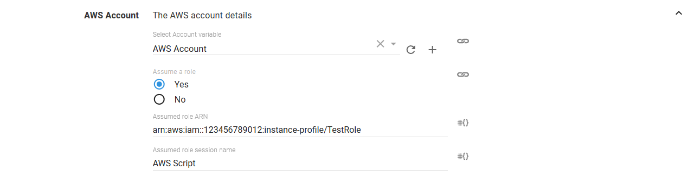
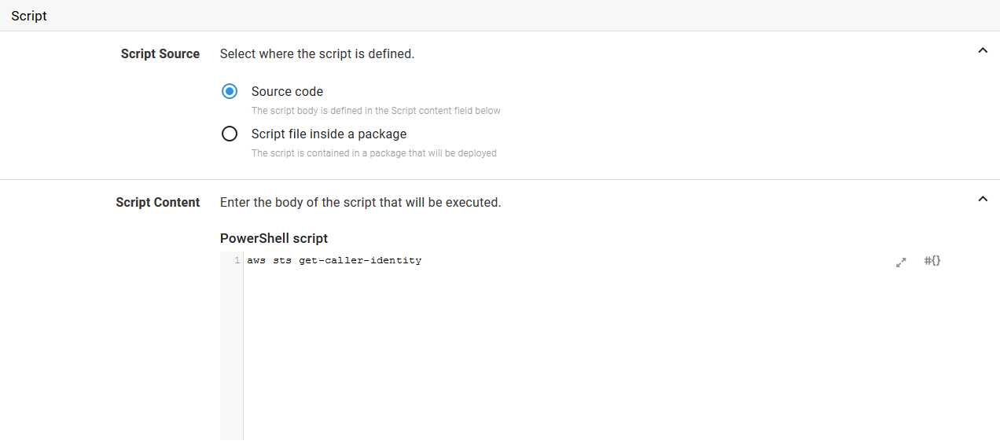

Octopus allows you to write custom Powershell scripts that have access to the AWS CLI in an environment that handles authentication using an Octopus managed AWS account. This is done via the `Run an AWS CLI Script` step.

The proceeding instructions can be followed to configure the `Run an AWS CLI Script` step.

## Create an AWS Account

AWS steps can use an Octopus managed AWS account for authentication. This account must first be created under {{Infrastructure>Accounts}} by clicking the `ADD ACCOUNT` button in the `Amazon Web Services Account` section.

::hint
AWS steps can also defer to the IAM role assigned to the instance that hosts the Octopus server for authentication. In this scenario there is no need to create the AWS account.
:::

And AWS account requires a `Name`, the `Access Key` and the `Secret Key`.

Clicking the `SAVE AND TEST` button will verify that the credentials are valid.

## Create a AWS Account Project Variable

AWS accounts are included in a project through a project variable of the type `Amazon Web Services Account`.

TODO: This check this wording

The `Add Variable` window is then displayed and lists all the AWS accounts, as well as an account called `Role Assigned to the AWS Instance Executing the Deployment`.

The `Role Assigned to the AWS Instance Executing the Deployment` account can be selected to defer to the IAM role that is assigned to the AWS EC2 instance where the deployment is executed from. This means no AWS credentials need to be stored by Octopus.

Because AWS CLI scripts are run on the Octopus server today, the Octopus server must be installed on an EC2 instance that has an IAM role assigned to it in order to take advantage of the `Role Assigned to the AWS Instance Executing the Deployment` account.

:::hint
In future it is expected that AWS steps will be deployed from worker instances that can be hosted on separate EC2 instances with IAM roles assigned to them. This will make the `Role Assigned to the AWS Instance Executing the Deployment` account more flexible and powerful.
:::

Select the account that was created in the previous step to assign it to the variable.

## Add AWS Script Step

Add the `Run an AWS CLI Script` step to the project, and provide it a name.

### AWS Section

Select the variable that references the account variable under the `AWS Account` section.

The supplied account can optionally be used to assume a second role. This can be used to run the AWS commands with a role that limits the services that can be affected.

The default AWS region in which to execute AWS CLI commands is defined in the `Region` section.

## Script Section

Scripts can be run from two different locations: source code added to the step, or a script from a package.

### Source Code

The first option is to add the script source code to the step directly. This is done by selecting the `Source code` option, and entering the source code into the textbox in the `Script Content` section.

### Package

The second option is to run a script from a package. This is done by selecting the `Script file inside a package` option, selecting the package, and entering the name of the file within the package to run as a Powershell script.

