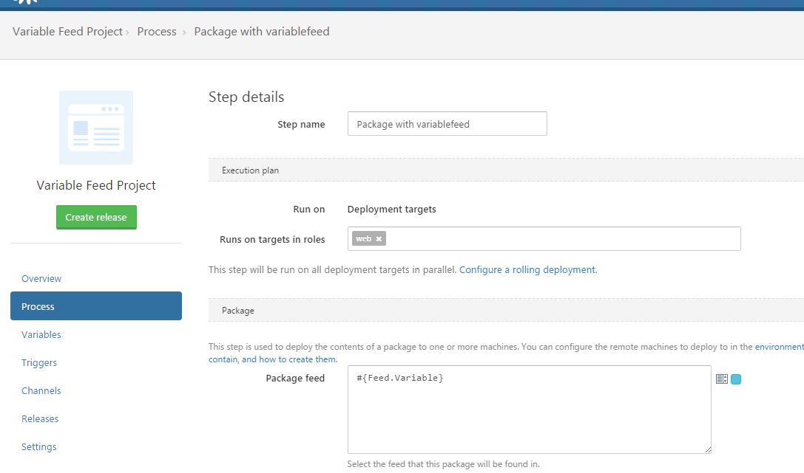
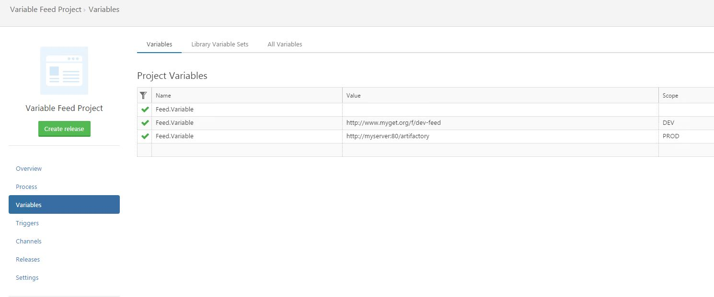

When configuring a step in Octopus which uses a package, you are able to use variables to dynamically select the Package feed and/or the Package ID when your project is deployed.

## Example scenarios

We typically recommend using a static package configuration wherever possible - this is the scenario Octopus optimizes for. However, there are some scenarios where dynamically selected packages are a perfect fit.

### Different package feed for each environment

You may want to use a different package feed for each environment. This can help when you have a slow connection between your main package feed and your deployment environments. In this case you could configure a package feed in your remote environments, and instruct Octopus to use the best package feed for each deployment.

For example, you can bind the Package Feed to `#{FeedId}` and set the following environment-scoped variables:

    FeedId = my-dev-feed;        Scope = Development Environment
    FeedId = my-test-feed;       Scope = Test Environment
    FeedId = my-production-feed; Scope = Production Environment

When deploying to the **Test Environment** Octopus will use the `my-test-feed` package feed.

When deploying to the **Production Environment** Octopus will use the `my-production-feed` package feed.

:::info
You will need to organize a way to synchronize the package feeds so when you actually deploy your project, the appropriate packages are in the correct feeds. Octopus will not do this for you.
:::

### Different package for each environment or tenant

You may want to build a different package for each environment and/or tenant. Again, we recommend avoiding this complexity where possible, but a good example of where it makes sense is when you are providing a tenanted service where each tenant can provide their own styles and assets. In this scenario you could build your common packages, and then build one package per-tenant containing their styles/assets, like this:

    MyApp.Web.Common.3.1.6.zip
    MyApp.Web.TenantA.3.1.6.zip
    MyApp.Web.TenantB.3.1.6.zip

Now you can configure Octopus to deploy your common package just like normal, but add one more step to deploy the tenant-specific package using a variable binding for the Package ID:

    Package ID = MyApp.Web.#{TenantAlias}

You can now create the `3.1.6` release for the `MyApp.Web` project, but have Octopus deploy the correct styles/assets package for each tenant at deployment time.

:::info
In this example we recommend creating a [tenant-specific variable](/docs/guides/multi-tenant-deployments/multi-tenant-deployment-guide/working-with-tenant-specific-variables.md) called something like `TenantAlias`, where each tenant will provide a value. You could have used a built-in variable like `#{Octopus.Deployment.Tenant.Name}` but then your tenant name would be tightly coupled to your Package ID, and changing the tenant's name could break your deployments.
:::

:::hint
Would you like Octopus to deploy a specific version of your application code, but just grab the latest styles/assets package for each tenant? We have an [open GitHub Issue](https://github.com/OctopusDeploy/Issues/issues/2755) discussing this right now.
:::

## Which variables can be used?

You can use any values which are either unscoped/global, or values scoped to environments, tenants, or tenant tags. Variable values scoped to other things like roles and deployment targets are not supported.

## Tradeoffs

There are some downsides to using dynamic packages. Firstly it becomes complex quite quickly and should be used only if necessary.

### Try to minimize dynamic packages

Where possible we recommend keeping the number and size of dynamic packages to a minimum. Some strategies which can help with this are:

1. Try building any environment- or tenant-specific differences using configuration instead of requiring an entirely different package.
1. Try to keep everything that is common about your application together, pushing environment- or tenant-specific differences into small satellite packages.

### Dynamic packages and retention policies

If you use a binding expression for the Package ID It becomes more difficult to look at a release and understand exactly which packages will be deployed. This prevents package retention policies from working properly for the built-in package feed, and on deployment targets.

Learn about [retention policies](/docs/administration/retention-policies/index.md).

## Troubleshooting

1. Older versions of `octo.exe` and the build server extension would fail to create releases if you are using a variable binding for your Package Feed. You would see an error message like this: `The version number for step 'Deploy' cannot be automatically resolved because the feed or package ID is dynamic.`
    - The best way to work around this is to upgrade `octo.exe` or your build server extension. Otherwise you can work around this by defining an unscoped/global variable with the same name referring to a valid package feed.
    

1. You haven't provided a version for each required package in your deployment process. You would see an error message like this: `Package versions could not be resolved for one or more of the package steps in this release. See the errors above for details. Either ensure the latest version of the package can be automatically resolved, or set the version to use specifically by using the --package argument.`
    - Make sure you specify a package version for the dynamic package. Octopus cannot select a package for you automatically since it doesn't know either the Package Feed to inspect, or the Package ID it should use to find the latest version.