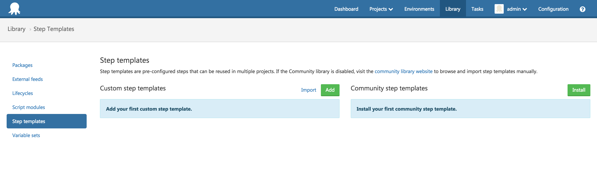
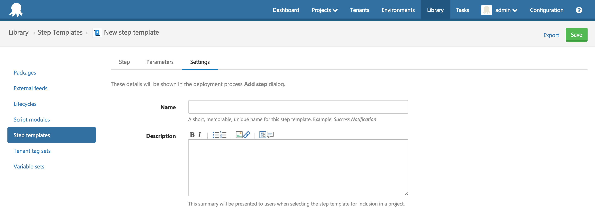

Custom step templates can be based on a built-in or an installed community step template. These step templates can be reused in projects and managed in the step template library.

## Creating custom step templates {#StepTemplates-Creatingcustomsteptemplates}

Sometimes there isn't a step template for your situation available in the [Community Library](https://library.octopusdeploy.com/). Or perhaps several of your projects have similar or identical steps. You can create your own custom step templates to share with the community, or to reuse across your projects.

To create your own step template, perform the following.

1. Navigate to the {{Library,Step templates}} area and click the **Add** button  
   
2. Select a built-in step to base your custom step template on.  
   
3. Populate the step template.   
   

:::success
You can create Step Templates for any of the built-in step types provided by Octopus.
:::

There are three parts to any step template: step details, additional parameters, and settings.

### Step {#StepTemplates-Step}

The Step tab is where you fill out the details of what the step will do. This tab gives you exactly the same fields as you would see if you added the step type directly to your project, so it will be the most familiar.

Any details that need to be specified at the project level can be handled using Parameters. Any parameters specified in the Parameters tab will be exposed to you as [variables](/docs/deploying-applications/deployment-process/variables/index.md) and can be used in the same way.

### Parameters {#StepTemplates-Parameters}

The Parameters tab allows you to specify fields that will be filled out by the users of this step.

You're required to give the parameter a variable name and label to use, as well as some optional help text and a default value.

Finally, you can choose the way the field will appear to a user with the **Control type** field. There are a number of options available, however keep in mind the end result will be a variable with a string value.

Any variables you configure as Parameters will be available as variables that can be used in the Step tab of the step template.

### Settings {#StepTemplates-Settings}

The Settings tab allows you to give your step a name and optional description.

### Usage {#StepTemplates-Usage}

After saving your step, you'll notice another tab called Usage. This tab shows where the step is being used and whether the version being used is current or a previous version.

You'll also see a handy counter next to the Usage tab so you can see at a glance how many projects are out-of-date.

!partial <logolinkrun>
