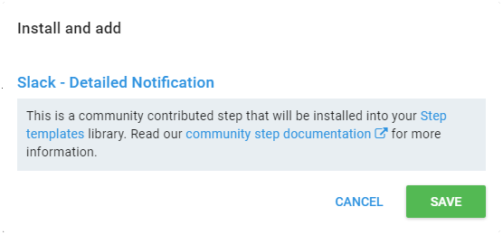

The steps that you add to your deployment process are specific actions (or sets of actions) that Octopus will execute. Steps can include more than one action, and by default, the steps in a deployment process are run in sequence.


If a step is configured to execute across multiple deployment targets, it will execute across all of those deployment targets in parallel.

Steps can include multiple actions.

Octopus strives to make it quick and easy to define your project's deployment process.  Selecting the **ADD STEP** button displays a list of built-in step templates, custom step templates, and community contributed step templates.

Built-in steps are powerful and flexible enough to handle the most common deployment scenarios.  

Custom step templates enable you to encapsulate common steps/scenarios within your team or company. 

Learn more about [Custom Step Templates](/docs/deploying-applications/deployment-process/steps/custom-step-templates.md).

Octopus community library integration makes it easy to find steps templates that work with the frameworks and technologies you use without the need for custom scripting.

Learn more about [Community Step Templates](/docs/deploying-applications/deployment-process/steps/community-step-templates.md).

 

:::hint
Octopus community step templates integration is enabled by default but this can be changed in the **Features** tab in the **Configuration** area. For more information, see [Octopus community step templates integration](/docs/administration/octopus-community-step-templates-integration.md).
:::

Learn more about [Updating Step Templates](/docs/deploying-applications/deployment-process/updating-step-templates.md) and [Exporting Step Templates](/docs/deploying-applications/deployment-process/exporting-step-templates.md)

:::success
The [Community Library](http://library.octopusdeploy.com/) is an open source [repository](https://github.com/octopusdeploy/library/) of community contributed step templates automating a diverse set of actions.  If you still don't find what you are looking for, don't forget: Octopus can do anything, as long as you can script the instructions. Maybe you could [contribute](https://github.com/OctopusDeploy/Library/blob/master/CONTRIBUTING.md) your scripts back to the community?
:::

:::hint
Prior to Octopus 3.7, selecting the add step button showed a popup list of built-in steps and any installed step templates (community contributed or custom).  Installing a community step required visiting the [Community Library](http://library.octopusdeploy.com/) and importing the step manually.  For more information, see [step templates](/docs/deploying-applications/deployment-process/steps/index.md).

:::

## Common Step Properties {#Deployingapplications-Commonstepproperties}

All steps have a name, which is used to identify the step.

:::success
**What&#39;s in a Name?**
Be careful when changing names! Octopus commonly uses names as a convenient identity or handle to things, and the steps and actions in a deployment process are special in that way. For example you can use [output variables](/docs/deploying-applications/deployment-process/variables/output-variables.md) to chain steps together, and you use the name as the indexer for the output variable. For example: `#{Octopus.Action[StepA].Output.TestResult}`
:::

## Adding an installed step {#Addingsteps-Addinganinstalledstep}

The add step page displays the built-in steps first which includes common steps to deploy IIS web sites, windows services, run scripts and more.  The built-in steps have been develop by the Octopus team to handle the most common deployment scenarios and it also.  This section also includes any custom [step templates](/docs/deploying-applications/deployment-process/steps/index.md) added in the library.  Hover over a step and click add step to go configure the step.

## Adding a community contributed step templates {#Addingsteps-Addingacommunitycontributedsteptemplates}

The add step page also displays community contributed step templates available to install and add.  You can search for a specific template or you can browse through the categories.  Installing a community step template is easy.  Hover over a step and select Install and add step.  This will display a pop-up dialog where you can confirm to install and add the step.  This will take you to the configuration page for the step template.

If you select view details, this will take you to the community step details page which shows you the complete details of the step include the source code.  You can install the step or go back to the list of steps.

## Adding an updated version of a community step template {#Addingsteps-Addinganupdatedversionofacommunitysteptemplate}

Sometimes updates are available for step templates.  In this case, you will notice the step template has an option to update the step.  If you select update, this will take you to the community step details with the option to update the latest version of the step template.  Community step templates can also be updated in the library as needed.

:::success
If a step you want isn't built-in you should check out the community contributed [step templates](/docs/deploying-applications/deployment-process/steps/index.md). If you still don't find it, don't forget: *Octopus can do anything, as long as you can script the instructions*. Maybe you could contribute your scripts back to the community?
:::

## Conditions {#Deployingapplications-Conditions}

Steps and actions can also have conditions. You can restrict a step so that it only runs when deploying to specific [environments](/docs/infrastructure/environments/index.md) (e.g., an Email step that only runs on production deployments).

If you have created some [channels](/docs/deploying-applications/deployment-process/projects/channels.md), you can also specify whether a step runs only when deploying a release through specific channels (e.g., a Script step that only runs for deployments through certain channels to configure extra telemetry). *This will only appear if you have created one or more non-default channels.*

You can also specify whether a step runs only when previous steps are successful (default), when a previous step fails, or always.

**Copied from Projects/Deployment Process**

## Example: A simple deployment process {#DeploymentProcesses-Example:Asimpledeploymentprocess}

In the example shown below there are three steps that will be executed from top to bottom. The first is a [manual intervention](/docs/deploying-applications/manual-intervention-and-approvals.md) which executes on the Octopus Server pausing the deployment until someone intervenes and allow the deployment to continue. *You may have noticed this step will only execute when targeting the Production [environment](/docs/infrastructure/environments/index.md) - we'll talk more about that below.* The remaining steps both [deploy a package](/docs/deploying-applications/deploying-packages/index.md) and execute [custom scripts](/docs/deploying-applications/custom-scripts/index.md) on all of the [deployment targets](/docs/infrastructure/index.md) with the [role](/docs/infrastructure/environments/target-roles/index.md) **web-server**.

## Example: A rolling deployment {#DeploymentProcesses-Example:Arollingdeployment} {#rolling-deployments}

Let's consider a more complex example like the one shown below. In this example we have configured Octopus to deploy a web application across one or more servers in a web farm behind a load balancer. This process has a single **step** and three **actions** which form a [rolling deployment](/docs/patterns/rolling-deployments.md).

