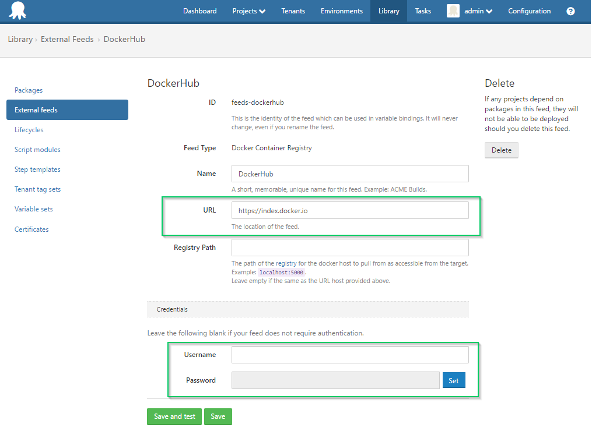

The default Docker Registry, which is maintained by the Docker organization, is the cloud-hosted [Docker Hub Registry](https://hub.docker.com/). This is the Registry which is used by docker engine when it is first installed and you call `docker search`.

Searching for official public repositories do not require credentials. However searching for repositories of a non-official repository will require you to provide your Docker Hub username and password.

:::problem
**DockerHub private repository limitations**

By design, Docker Hub **does not support** [searching for private repositories](https://docs.docker.com/docker-hub/#/explore-repositories), even with valid credentials. Additionally, while you will be able to search for a non-official repository, Docker Hub *will not return any tags for unofficial images*. If you are using an unofficial image, you will be able to select this when configuring your run step, but you will need to manually enter the version that you wish to deploy. So long as it exists in the registry, your Docker Engine will be able to pull it down.
The Docker Hub API endpoint [https://index.docker.io/v1](https://index.docker.io/v1) provides access to repositories with different levels of access

| Repository | Shows In Search | Lists Tags |
| --- | --- | --- |
| Public + Official  | Yes | Yes |
| Public + Unofficial | Yes | No |
| Private | No | No |

We suggest using alternative registry when trying to manage your own private images. See here for more details on hosting your own [Private Registry](/docs/deploying-applications/docker-containers/registries/index.md#DockerRegistriesasFeeds-PrivateRegistry).
:::

## Using Docker Hub in Octopus Deploy

To use the Docker Hub registry in Octopus Deploy, create an external feed with the following settings:

- **Feed Type:** Docker Container Registry
- **Name:** DockerHub (or anything else that makes sense to you)
- **URL:**[https://index.docker.io](https://index.docker.io)
- **Registry Path:** *leave blank*

**
