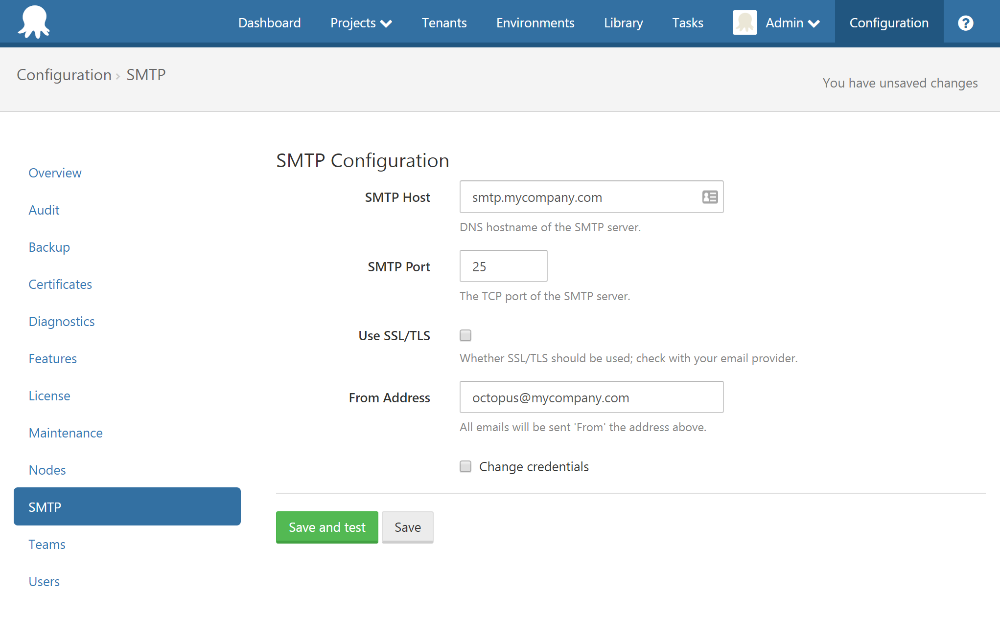
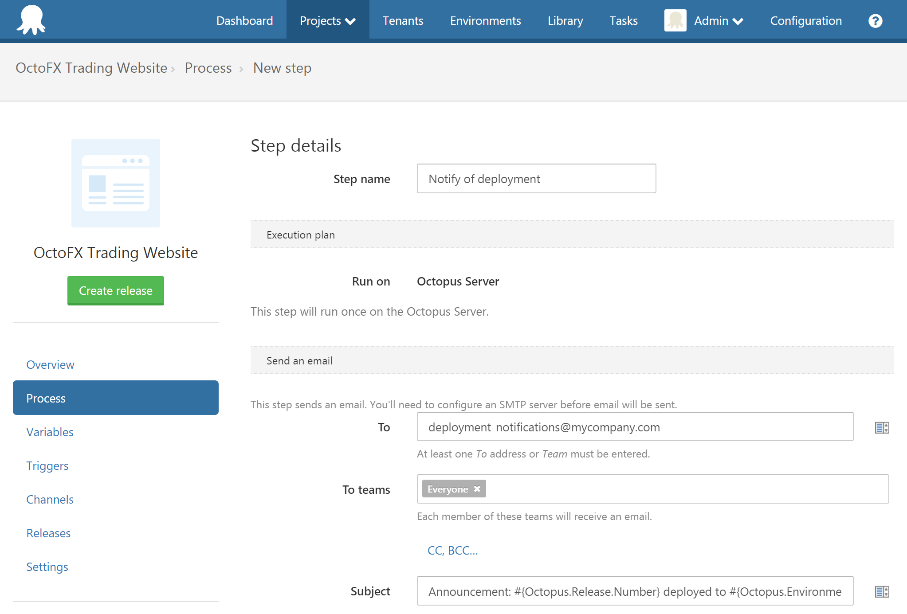
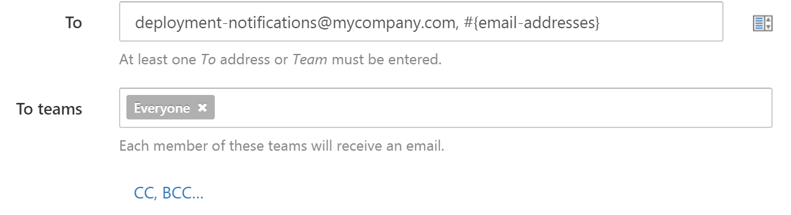
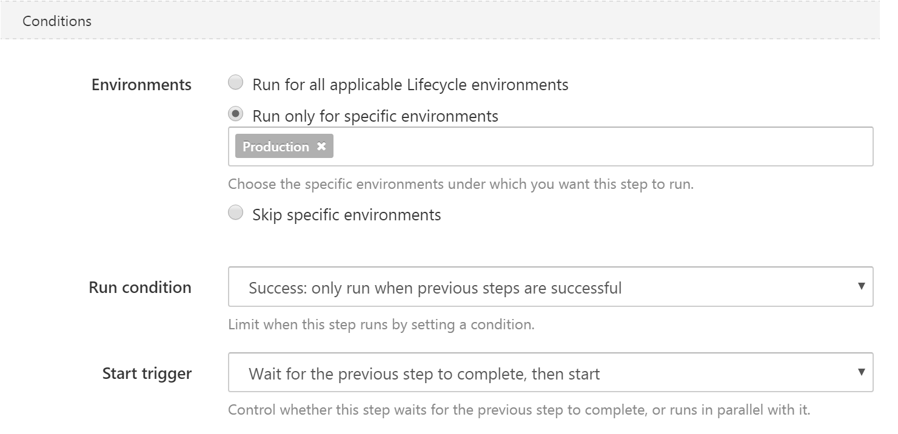

Deployments can have a strong impact on others whose work depends on the system being deployed. Great communication is an important part of a great deployment strategy, and email steps are a key way that Octopus can help you keep everyone in the loop. You may wish to:

- Notify stakeholders when a new version of an app has been deployed to production
- Let testers know when a new version is available in UAT
- Use email in conjuction with [manual approvals](/docs/deploying-applications/manual-intervention-and-approvals.md) to make sure everyone is ready for a new deployment

To support this, Octopus provides **Email Steps** in a project's deployment process.

!toc

## SMTP configuration

You'll need to enter SMTP server settings in {{Configuration,SMTP}} before Octopus will be able to send any email.



## Adding an email step {#Emailnotifications-Addinganemailstep}

Email can be chosen as the step type when you click **Add Step** in your project's **Process** tab. For information about adding a step to the deployment process, see the [add step](/docs/deploying-applications/deployment-process/steps.md) section.


When adding an email step, you can choose the subject of the email, its body, and the recipients to send it to.



## Choosing recipients

You have several options for choosing the recipients of your email:

1. Enter a comma-separated list of email addresses
2. Bind to a variable which defines a list of email addresses (this is really useful for tailoring your recipient list per-environment)
3. Choose one or more teams to include members of those teams in the recipient list
4. Use a combination of all of these options

Octopus will build the resulting recipient list during the deployment, deduplicate the list of email addresses, and send the email to each recipient.



## Choosing when to send the email notification

You can choose when to send the email notification using the same conditions as for any other step in Octopus.

- Send the email only for successful deployments to certain environments
- Send a specific email for failed deployments
- Send an email based on the value of a variable expression which works really well with [output variables](/docs/deploying-applications/variables/output-variables.md)



## Email content {#Emailnotifications-Exampleemailtemplates}

You can set the email subject and author the email body as plain text or HTML content. You can even use the Octopus [variable syntax](/docs/reference/variable-substitution-syntax.md) to include information about the deployment in the email.

:::hint
The binding helper to the right of each form field can be used to view the available variables.
:::

The template below collects basic information about the deployment, including the package versions included in each step.

**Deployment summary template**

```xml
<h1>Deployment of #{Octopus.Project.Name} #{Octopus.Release.Number} to #{Octopus.Environment.Name}</h1>
<p>
  <em>Initiated by
    #{unless Octopus.Deployment.CreatedBy.DisplayName}#{Octopus.Deployment.CreatedBy.Username}#{/unless}
    #{if Octopus.Deployment.CreatedBy.DisplayName}#{Octopus.Deployment.CreatedBy.DisplayName}#{/if}
    #{if Octopus.Deployment.CreatedBy.EmailAddress} (<a href="mailto: #{Octopus.Deployment.CreatedBy.EmailAddress}">#{Octopus.Deployment.CreatedBy.EmailAddress}</a>)#{/if}
    at #{Octopus.Deployment.Created}</em>
</p>
#{if Octopus.Release.Notes}
<h2>Release notes</h2>
<p>#{Octopus.Release.Notes}</p>
#{/if}
<h2>Deployment process</h2>
<p>The deployment included the following actions:</p>
<ul>
  #{each action in Octopus.Action}
    <li><strong>#{action.Name}</strong> #{if action.Package.NuGetPackageId}&mdash; <a href="http://nuget.org/packages/#{action.Package.NuGetPackageId}">#{action.Package.NuGetPackageId}</a> <em>version #{action.Package.NuGetPackageVersion}#{/if}</em></li>
  #{/each}
</ul>
<p>View the <a href="http://my-octopus#{Octopus.Web.DeploymentLink}">detailed deployment log</a>.</p>
```

:::hint
To use the template in your projects, replace `nuget.org` with the DNS name of your NuGet server, and `my-octopus` with the DNS name of your Octopus server. Make sure you select *Body is HTML* on the email step configuration page.
:::

The output of the template will be an HTML email like:


### Including step status {#Emailnotifications-Includingstepstatus}

The outcome of each step can be included using a template like the one below (Octopus 2.5+):

**Step status summary template**

```xml
<h3>Task summary</h3>
<ol>
#{each step in Octopus.Step}
  #{if step.Status.Code}
    <li>#{step | HtmlEscape} &mdash; <strong>#{step.Status.Code}</strong> 
    #{if step.Status.Error}
      <pre>#{step.Status.Error | HtmlEscape}</pre>
      <pre>#{step.Status.ErrorDetail | HtmlEscape}</pre>
    #{/if}  
    </li>
  #{/if}
#{/each}
</ol>
```

:::hint
**Step error detail**
`step.Status.Error` and `step.Status.ErrorDetail` will only display the exit code and Octopus stack trace for the error. As we cannot parse the deployment log, we can only extract the exit/error codes. It cannot show detailed information on what caused the error. For full information on what happened when the deployment fails, you will need to reference the logs.

See [System variables](/docs/deploying-applications/variables/system-variables.md)
:::
