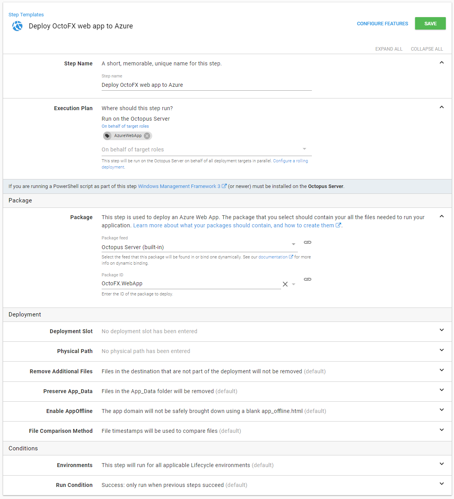

## Step 2: Create an Azure Account {#DeployingapackagetoanAzureWebApp-Step2:CreateanAzureAccount}

If you haven't already, create an [Azure Account](/docs/infrastructure/deployment-targets/azure/index.md) to grant Octopus Deploy access to your Azure Subscription.

## Step 3: Configure your Azure Web App Step. {#DeployingapackagetoanAzureWebApp-Step4:ConfigureyourAzureWebAppstep}

1. Add a new `Deploy an Azure Web App` step to your [project's deployment process](/docs/deployment-process/steps/index.md).

2. On the `Package` section of the step configuration page, select your `Package Feed` and `Package Id`

3. On the `Azure` Section, select the `Azure Account` that you created in the previous step. Once you do this, the web apps in your subscription will populate the `Web App` dropdown list for you to pick the one you want to deploy to.

For both the `Azure Account` and the `Web App` you can use [variable binding](/docs/deployment-process/variables/variable-substitutions.md) to set their values.

If you choose to run this step on behalf of target roles (maybe you are deploying to multiple geographic regions), you will need to ensure a Deployment Target exists when deploying your Azure Web App. For this, we introduced [Cloud Regions](/docs/infrastructure/deployment-targets/cloud-regions.md). If you select a role and no Deployment Targets exist at the time of deploying, Octopus will log warnings in your deployment's task log.

